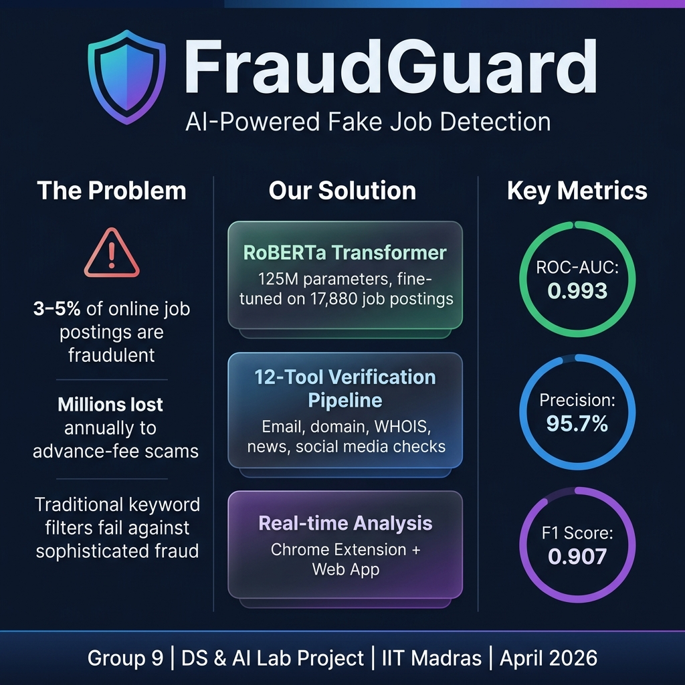
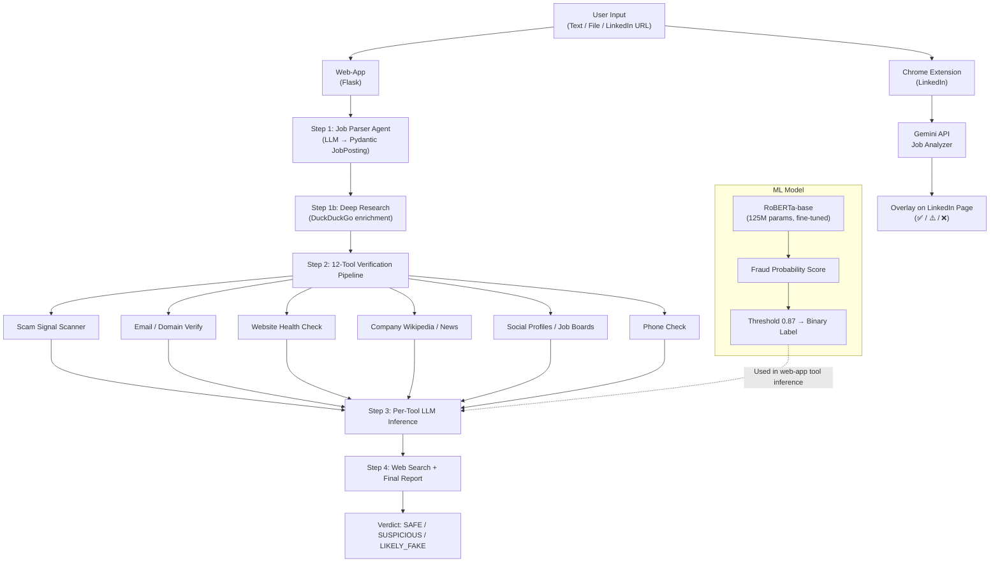
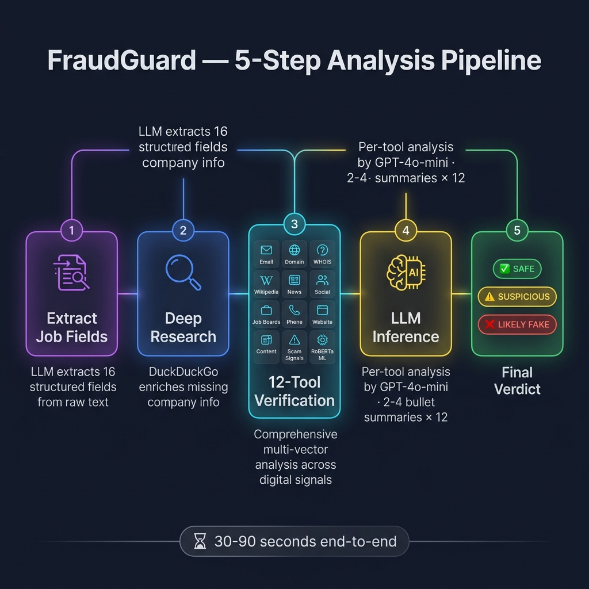
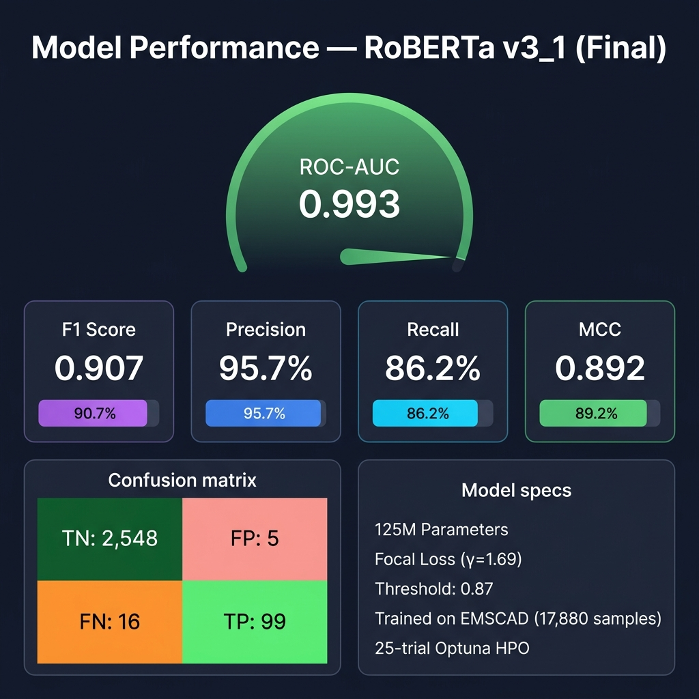

# FraudGuard — Fake Job Listing Detection using Deep Learning and Agentic AI

> **Detect fraudulent job postings in real-time using a fine-tuned RoBERTa transformer, an agentic 12-tool verification pipeline, and a Chrome extension for LinkedIn.**


---

## Abstract

Online recruitment fraud costs job seekers millions annually through advance-fee scams, phishing, and identity theft. This project delivers an end-to-end AI system that combines a fully fine-tuned **RoBERTa-base** transformer (125M parameters, trained with Focal Loss on the EMSCAD dataset of 17,880 job postings) with a **12-tool agentic verification pipeline** that cross-checks company domains, email addresses, phone numbers, and web presence in real-time. The model achieves **ROC-AUC 0.993** and **precision 0.957** on the fraud class. The system is accessible via a Flask web-app and a Chrome extension that works directly on LinkedIn job pages.

<<<<<<< HEAD
<p align="center">
  
</p>

---

## Quick Start

### Prerequisites

- Python 3.11+
- Linux/macOS (recommended; CUDA GPU optional for inference, required for training)
- A LLM API key (OpenRouter / AIPipe / OpenAI)
- Google Gemini API key (for the Chrome extension only)

### 1. Clone the repository

=======
---

## Quick Start

### Prerequisites

- Python 3.11+
- Linux/macOS (recommended; CUDA GPU optional for inference, required for training)
- A LLM API key (OpenRouter / AIPipe / OpenAI)
- Google Gemini API key (for the Chrome extension only)

### 1. Clone the repository

>>>>>>> 6cc04f6 (Restructuring project files and adding backend-api)
```bash
git clone https://github.com/hrmiitm/Group-9-DS-and-AI-Lab-Project.git
cd Group-9-DS-and-AI-Lab-Project
```

### 2. Install dependencies (web-app only — lightweight)

```bash
pip install flask langchain-openai langchain-community pydantic requests \
            beautifulsoup4 ddgs trafilatura python-whois email-validator \
            phonenumbers markupsafe
```

For the full training environment (GPU required):

```bash
pip install -r requirements.txt
```

### 3. Set environment variables

```bash
export OPENAI_API_KEY="your-api-key-here"        # or AIPipe token
export OPENAI_BASE_URL="https://aipipe.org/openrouter/v1"
export LLM_MODEL="openai/gpt-4o-mini"
```

### 4. Run the web app

```bash
python web-app/app.py
# → Open http://localhost:5000
```

### 5. Use the RoBERTa model directly

```python
from transformers import AutoModelForSequenceClassification, AutoTokenizer
import torch

model = AutoModelForSequenceClassification.from_pretrained("aditya963/fraud-job-classifier")
tokenizer = AutoTokenizer.from_pretrained("aditya963/fraud-job-classifier")

text = "Work From Home Data Entry Specialist [SEP] Earn $500/day! No experience needed."
inputs = tokenizer(text, return_tensors="pt", truncation=True, max_length=512, padding="max_length")
with torch.no_grad():
    logits = model(**inputs).logits
prob_fraud = torch.softmax(logits, dim=-1)[0][1].item()
print(f"Fraud probability: {prob_fraud:.4f}")
```

---

## Project Architecture



---

## Demo

<!-- INSERT DEMO VIDEO LINK HERE -->

<<<<<<< HEAD
<p align="center">
  
</p>

=======
>>>>>>> 6cc04f6 (Restructuring project files and adding backend-api)
> **Web App:** Run locally at `http://localhost:5000` after following Quick Start above.
> **Chrome Extension:** Load unpacked from `web-extension/` — see [web-extension/SETUP.md](web-extension/SETUP.md).

<!-- INSERT SCREENSHOT: web-app home page showing the 3-tab input form -->
<!-- INSERT SCREENSHOT: web-app results page showing verdict card and tool grid -->
<!-- INSERT SCREENSHOT: Chrome extension overlay on a LinkedIn job page -->

---

## Results

| Metric | Score | Target | Status |
|---|---|---|---|
| F1 (fraud class) | 0.9069 | ≥ 0.91 | Narrow Miss |
| Recall (fraud) | 0.8615 | ≥ 0.89 | Narrow Miss |
| Precision (fraud) | 0.9573 | ≥ 0.93 | ✅ Met |
| ROC-AUC | 0.9930 | ≥ 0.95 | ✅ Met |
| MCC | 0.8917 | — | — |

> Threshold 0.87 selected via validation-set calibration. Validation metrics at best epoch: F1=0.920, Precision=0.958, Recall=0.884.

<<<<<<< HEAD
<p align="center">
  
</p>

=======
>>>>>>> 6cc04f6 (Restructuring project files and adding backend-api)
**Model weights on HuggingFace Hub:** [aditya963/fraud-job-classifier](https://huggingface.co/aditya963/fraud-job-classifier)

---

## Folder Structure

```
Group-9-DS-and-AI-Lab-Project/
│
├── web-app/                    # Flask web application (self-contained)
│   ├── app.py                  # Flask factory
│   ├── config.py               # All env vars, paths, LLM config
│   ├── core/                   # Pydantic JobPosting schema + loaders
│   ├── routes/                 # HTTP routes (main.py, api.py)
│   ├── services/               # Pipeline orchestration (analyzer, tool_runner)
│   ├── tools/                  # 12 investigative tools
│   ├── templates/              # Jinja2 HTML templates
│   ├── static/                 # CSS + JS
│   └── WEBAPP.md               # Full web-app documentation
│
├── web-extension/              # Chrome extension (MV3)
│   ├── manifest.json           # Extension manifest
│   ├── background.js           # Pipeline orchestrator
│   ├── content.js              # LinkedIn DOM scraping + overlay UI
│   ├── tools/                  # Extension tools (link-detector, job-analyzer)
│   ├── lib/                    # LangChain-inspired JS framework
│   └── README.md               # Extension documentation
│
├── notebook/                   # Training & experimentation notebooks
│   ├── transformer_fraud_classifier_v3_1.ipynb  # Full training pipeline
│   └── rule_discovery_ebm.ipynb                 # EBM interpretable rules
│
├── testing_work/               # Development/testing artifacts
│   ├── src/                    # Source training scripts (train.py, eval.py)
│   │   ├── utils/              # data.py, focal_loss.py, metrics.py
│   │   └── tools/              # metadata_detector module
│   └── AgenticWork/            # LLM job parser agent (CLI)
│
├── docs/                       # All milestone documentation
│   ├── Milestone-0/ through Milestone-5/
│   ├── overview.md             # System architecture overview
│   ├── technical_doc.md        # Full technical documentation
│   ├── user_guide.md           # Non-technical user guide
│   ├── api_doc.md              # REST API documentation
│   ├── licenses.md             # All licenses and citations
│   ├── future_work.md          # Known limitations and extensions
│   ├── contribution_summary.md # Team contributions table
│   ├── Final_Project_Report.md # Academic-style final report
│   ├── GAPS_FIXED.md           # Gaps found and fixed (Milestone 6 audit)
│   └── REPO_AUDIT.md           # Repository structure audit
│
├── requirements.txt            # Full frozen environment (GPU)
├── .gitignore                  # Ignores models/, data/, __pycache__, .env
└── README.md                   # This file
```

---

## Team & Contributions

| Team Member | M1 | M2 | M3 | M4 | M5 | M6 |
|---|---|---|---|---|---|---|
| **Arun Dutta** | Literature Review & Gap Analysis | Data preprocessing, split strategy, project documentation | Pipeline verification, EDA | HPO analysis, report writing | Documentation, results synthesis | Final report, contribution summary |
| **Hritik Roshan Maurya** | Problem framing, architecture design | LangChain agent (`job_parser_agent.py`), structured extraction | Model design, training strategies | Model validation, system integration | LangChain ReAct agent, real-world testing | API docs, deployment documentation |
| **Vivek Bajaj** | Dataset identification, DL pipeline design | Primary dataset curation, baseline classifier, HuggingFace deploy | Training pipeline, Focal Loss | Optuna HPO (25 trials), threshold calibration | Threshold tuning (0.87), final eval scripts | Technical doc, architecture review |
| **Vishwas Mehta** | Fraud pattern research | Chrome extension development | Metadata anomaly detector | Chrome extension integration | Extension-LinkedIn integration, inference debugging | User guide, extension docs |

---

## Documentation

| Document | Description |
|---|---|
| [docs/overview.md](docs/overview.md) | System architecture and data flow |
| [docs/technical_doc.md](docs/technical_doc.md) | Full technical reference (environment, model, training, inference, deployment) |
| [docs/user_guide.md](docs/user_guide.md) | Non-technical guide for end users |
| [docs/api_doc.md](docs/api_doc.md) | REST API endpoint reference |
| [docs/licenses.md](docs/licenses.md) | All licenses and dataset citations |
| [docs/future_work.md](docs/future_work.md) | Known limitations and planned extensions |
| [docs/Final_Project_Report.md](docs/Final_Project_Report.md) | Academic-style final project report |
| [web-app/WEBAPP.md](web-app/WEBAPP.md) | Web-app architecture and maintenance log |
| [web-extension/README.md](web-extension/README.md) | Chrome extension full documentation |

---

## License

This project is licensed under the **MIT License**. See [docs/licenses.md](docs/licenses.md) for full details including dataset and pre-trained model licenses.

---

## Dataset

[Fake Job Postings (EMSCAD)](https://www.kaggle.com/datasets/shivamb/real-or-fake-fake-jobposting-prediction) — 17,880 job postings, 4.84% fraudulent. University of the Aegean.
