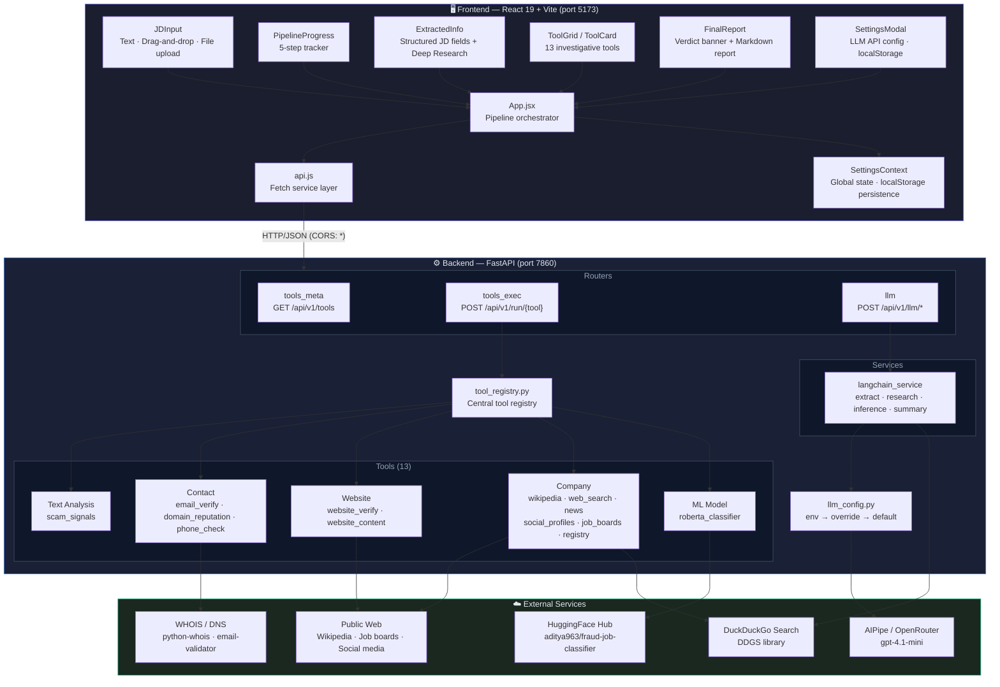
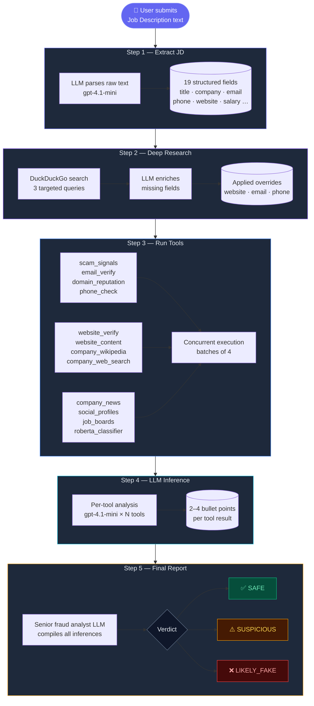
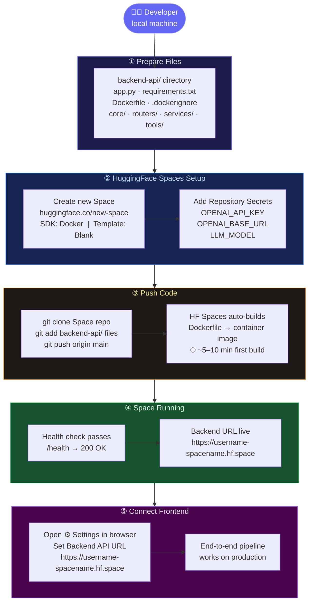
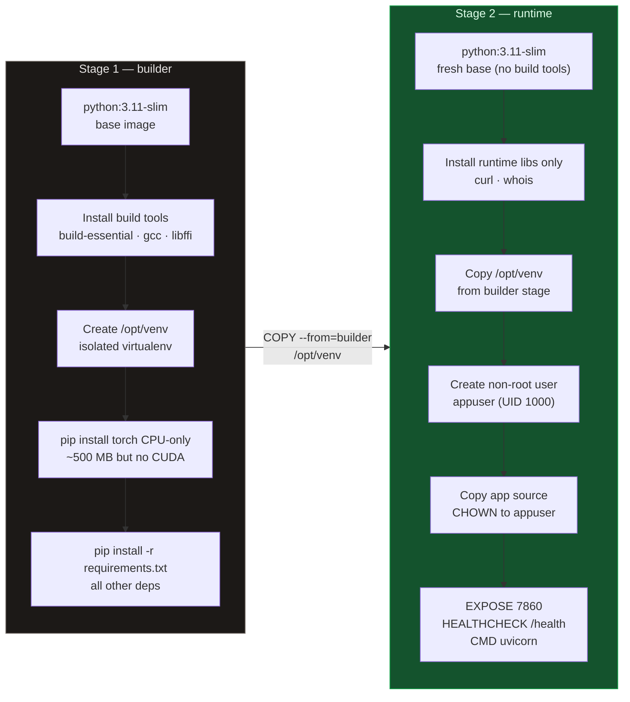
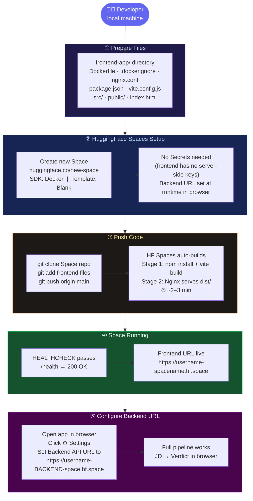
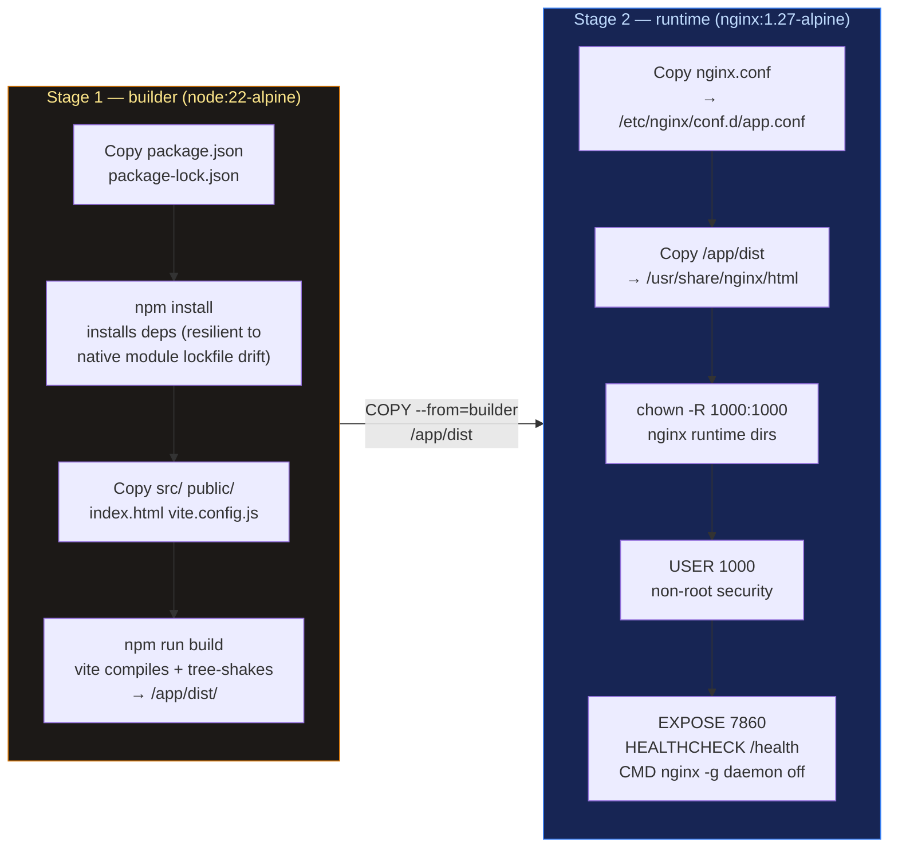
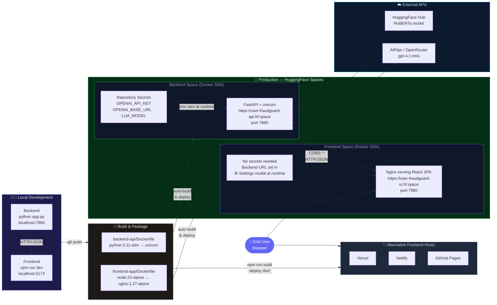

# FraudGuard — Deployment & Developer Guide

FraudGuard is an AI-powered fake job posting detector. It uses 13 investigative tools (WHOIS, email/phone validation, DuckDuckGo search, Wikipedia, social profiles, job boards, website content extraction) plus a fine-tuned RoBERTa classifier and a 5-step LLM pipeline to produce a structured fraud-risk report for any job description.

---

## Architecture Overview



### Analysis Pipeline (5 Steps)



---

## Prerequisites

| Requirement | Version | Notes |
|-------------|---------|-------|
| Python | 3.10+ | Backend |
| Node.js | 18+ | Frontend |
| AIPipe account | — | Free at [aipipe.org](https://aipipe.org) — provides OpenRouter access |
| Git | any | — |

> **No GPU required.** The RoBERTa classifier runs on CPU. HuggingFace Spaces free tier is sufficient.

---

## Backend — Local Development

### 1. Install dependencies

```bash
cd backend-api
pip install -r requirements.txt
```

> First run downloads the RoBERTa model (~500 MB) from HuggingFace Hub. Subsequent runs use the local cache.

### 2. Set environment variables

```bash
export OPENAI_API_KEY=<your-aipipe-token>
export OPENAI_BASE_URL=https://aipipe.org/openrouter/v1
export LLM_MODEL=openai/gpt-4.1-mini
```

> If you have a regular OpenAI key, set `OPENAI_BASE_URL=https://api.openai.com/v1` instead.

### 3. Start the server

```bash
python app.py
# or explicitly:
uvicorn app:app --host 0.0.0.0 --port 7860 --reload
```

Server starts at **http://localhost:7860**

### 4. Verify

```bash
curl http://localhost:7860/
# → {"status":"ok","version":"1.1.0","llm_settings":{...}}

curl http://localhost:7860/api/v1/llm/status
# → {"ok":true,"api_key_from_env":true,"effective_model":"openai/gpt-4.1-mini",...}

curl http://localhost:7860/docs
# → Opens Swagger UI in browser
```

---

## Frontend — Local Development

### 1. Install dependencies

```bash
cd frontend-app
npm install
```

### 2. Start dev server

```bash
npm run dev
# → http://localhost:5173
```

### 3. Connect to backend

Open the app in your browser → click **⚙️ Settings** → confirm:
- **Backend API URL**: `http://localhost:7860`
- **API Key**: your AIPipe token (only needed if backend env vars are not set)
- **Models**: all four default to `openai/gpt-4.1-mini`

> Settings are stored in `localStorage`. Click **Reset to defaults** if you need to clear them.

---

## Backend — HuggingFace Spaces Deployment

HuggingFace Spaces runs the backend as a Docker container. The free CPU tier is sufficient — no GPU needed.

### Deployment Flow



---

### Step-by-Step Instructions

#### Step 1 — Create a HuggingFace Space

1. Go to **[huggingface.co/new-space](https://huggingface.co/new-space)**
2. Fill in:
   - **Owner**: your username or org
   - **Space name**: e.g. `fraudguard-api`
   - **License**: MIT (or your choice)
   - **SDK**: **Docker**
   - **Docker template**: **Blank**
   - **Visibility**: Public (free) or Private (requires Pro)
3. Click **Create Space** — you'll be taken to the Space page.

#### Step 2 — Clone the Space repository

```bash
# Install git-lfs first (required by HuggingFace)
git lfs install

# Clone your new Space (replace USERNAME and SPACENAME)
git clone https://huggingface.co/spaces/USERNAME/SPACENAME
cd SPACENAME
```

#### Step 3 — Copy backend files into the Space repo

Copy **only the contents of `backend-api/`** (not the folder itself) into the cloned Space directory:

```bash
# From the project root
cp -r backend-api/. SPACENAME/

# Verify the structure at the root of SPACENAME/:
# app.py
# requirements.txt
# Dockerfile
# .dockerignore
# core/
# routers/
# services/
# tools/
```

> The `Dockerfile` must be at the **root** of the Space repository, not inside a subdirectory.

#### Step 4 — Configure Repository Secrets

Secrets are environment variables injected at container startup — **never put API keys in code or `requirements.txt`**.

1. Go to your Space page on HuggingFace
2. Click **Settings** (top-right gear icon)
3. Scroll to **Repository Secrets**
4. Add each secret:

| Secret Name | Value | Required |
|-------------|-------|----------|
| `OPENAI_API_KEY` | Your AIPipe or OpenAI token | **Yes** |
| `OPENAI_BASE_URL` | `https://aipipe.org/openrouter/v1` | No (has default) |
| `LLM_MODEL` | `openai/gpt-4.1-mini` | No (has default) |
| `LLM_TEMPERATURE` | `0.3` | No (has default) |

#### Step 5 — Push code and trigger the build

```bash
cd SPACENAME

git add .
git commit -m "Deploy FraudGuard backend API"
git push origin main
```

HuggingFace Spaces detects the push and automatically builds the Docker image.

- **First build**: ~5–10 minutes (downloads RoBERTa model ~500 MB + PyTorch CPU wheel)
- **Subsequent builds**: ~2–3 minutes (Docker layer cache reused)

Monitor progress in the **Logs** tab on your Space page.

#### Step 6 — Verify the deployment

Once the Space shows **Running** (green dot):

```bash
# Replace with your actual Space URL
export SPACE_URL=https://USERNAME-SPACENAME.hf.space

# Health check
curl $SPACE_URL/health
# → {"status":"ok"}

# Full status with LLM config
curl $SPACE_URL/
# → {"status":"ok","version":"1.1.0","llm_settings":{"api_key_from_env":true,...}}

# Confirm model is gpt-4.1-mini
curl $SPACE_URL/api/v1/llm/status
# → {"ok":true,"effective_model":"openai/gpt-4.1-mini","api_key_from_env":true,...}

# Browse all tool metadata
curl $SPACE_URL/api/v1/tools | python3 -m json.tool
```

Swagger UI is also available at: `https://USERNAME-SPACENAME.hf.space/docs`

#### Step 7 — Connect the frontend

Open the FraudGuard frontend → click **⚙️ Settings** → set:

```
Backend API URL:  https://USERNAME-SPACENAME.hf.space
API Key:          (leave blank — the Space has it from env)
```

---

### Dockerfile Explained

The production `Dockerfile` uses a **two-stage build** for a smaller, more secure image:



**Why two stages?**
- The `builder` stage installs `gcc`, `build-essential`, etc. — needed to compile Python wheels
- The `runtime` stage discards all those tools, keeping the final image lean (~800 MB vs ~1.6 GB)
- Build tools are a common attack surface; removing them reduces the security footprint

**Key Dockerfile features:**

| Feature | Purpose |
|---------|---------|
| `torch CPU-only wheel` | Avoids pulling CUDA (~3 GB) — free Spaces have no GPU |
| Requirements copied before source | Docker caches the expensive pip install layer; only invalidated when `requirements.txt` changes |
| Non-root user `appuser` (UID 1000) | Security best practice; HF Spaces also runs as UID 1000 by default |
| `HEALTHCHECK` | Docker/HF Spaces polls `/health` every 30s; 120s grace for cold-start model download |
| `PYTHONUNBUFFERED=1` | Log output appears immediately in HF Spaces Logs tab |
| `HF_HOME` env var | RoBERTa model cached in `/app/.cache` — persists if a storage volume is mounted |

---

## Frontend — Production Deployment

The frontend is a React SPA built with Vite. The production output is a folder of static files (`dist/`) that can be served by any static host or a containerised Nginx server.

### Build locally first (all options)

```bash
cd frontend-app
npm install
npm run build
# → dist/  (index.html + hashed JS/CSS bundles)
```

Verify the build works before deploying:

```bash
npm run preview
# → http://localhost:4173  (serves dist/ exactly as production would)
```

---

## Frontend — HuggingFace Spaces Deployment (Docker + Nginx)

> **Recommended** when you want both backend and frontend on HuggingFace Spaces for a fully self-contained demo.

HuggingFace's **Static SDK** cannot serve a React SPA — it has no fallback route for client-side navigation. The Docker + Nginx approach solves this and gives you gzip compression, cache headers, and a health endpoint too.

### Deployment Flow



---

### Step-by-Step Instructions

#### Step 1 — Create a HuggingFace Space

1. Go to **[huggingface.co/new-space](https://huggingface.co/new-space)**
2. Fill in:
   - **Owner**: your username or org
   - **Space name**: e.g. `fraudguard-ui`
   - **License**: MIT (or your choice)
   - **SDK**: **Docker**
   - **Docker template**: **Blank**
   - **Visibility**: Public (free) or Private (Pro)
3. Click **Create Space**

> No Secrets are needed for the frontend — it has no server-side API keys. The backend URL is configured at runtime by the user in the ⚙️ Settings modal.

#### Step 2 — Clone the Space repository

```bash
git lfs install

# Replace USERNAME and SPACENAME
git clone https://huggingface.co/spaces/USERNAME/SPACENAME
cd SPACENAME
```

#### Step 3 — Copy frontend files into the Space repo

Copy **the contents of `frontend-app/`** (not the folder itself) into the cloned Space directory:

```bash
# From the project root
cp -r frontend-app/. SPACENAME/

# The root of SPACENAME/ must contain:
# Dockerfile
# .dockerignore
# nginx.conf
# package.json
# package-lock.json
# vite.config.js
# index.html
# src/
# public/
```

> `node_modules/` and `dist/` are excluded by `.dockerignore` — Docker rebuilds them inside the container.

#### Step 4 — Push code and trigger the build

```bash
cd SPACENAME

git add .
git commit -m "Deploy FraudGuard frontend"
git push origin main
```

HuggingFace Spaces detects the push and builds automatically. Monitor progress in the **Logs** tab:

- **Stage 1 (builder)**: `npm install` + `vite build` — ~1–2 min
- **Stage 2 (runtime)**: Nginx starts — ~10 sec
- **Total**: ~2–3 min (much faster than the backend — no model download)

#### Step 5 — Verify the deployment

Once the Space shows **Running** (green dot):

```bash
export FRONTEND_URL=https://USERNAME-SPACENAME.hf.space

# Health check (served by Nginx directly)
curl $FRONTEND_URL/health
# → ok

# Main page loads (returns index.html)
curl -sI $FRONTEND_URL/ | grep "HTTP/"
# → HTTP/1.1 200 OK

# Any SPA sub-route also returns index.html (React Router handles it)
curl -sI $FRONTEND_URL/some-route | grep "HTTP/"
# → HTTP/1.1 200 OK  (not 404)
```

#### Step 6 — Connect to the backend Space

Open `https://USERNAME-SPACENAME.hf.space` in your browser:

1. Click **⚙️ Settings** (top-right)
2. Set **Backend API URL** to your backend Space URL:
   ```
   https://USERNAME-BACKEND-SPACENAME.hf.space
   ```
3. Optionally set an **API Key** if needed
4. Click **Save Settings**
5. Paste a job description and click **Analyse Job Posting** — the full pipeline runs end-to-end

---

### Dockerfile Explained (Frontend)



**Key decisions:**

| Feature | Why |
|---------|-----|
| `node:22-alpine` builder | Required by vite@8, @vitejs/plugin-react@6, and rolldown which all need `^20.19.0 \|\| >=22.12.0`; Node 18 is incompatible |
| `package.json` copied before `src/` | Docker caches the `npm install` layer — only re-runs when dependencies change, not on every code edit |
| `npm install` not `npm ci` | Resilient to native module lockfile drift (e.g. rolldown's `@emnapi/core`); `npm ci` fails when these platform entries are missing from the lockfile |
| `nginx:1.27-alpine` runtime | ~23 MB image; no Node runtime in production |
| `try_files $uri /index.html` | React SPA fallback — all unknown URLs return `index.html` so client-side routing works |
| Port 7860 in `nginx.conf` | HuggingFace Spaces requires the container to listen on 7860 |
| Hashed asset cache headers (`1y`) | Vite adds a content hash to every JS/CSS filename; safe to cache forever |
| `index.html` no-cache header | Forces browser to fetch fresh `index.html` after every redeployment |
| Non-root user UID 1000 | Security best practice; matches HF Spaces default UID |
| `HEALTHCHECK` via `wget` | Alpine's Nginx image includes `wget` but not `curl` |

---

## Other Frontend Deployment Options

### Option B: Vercel (simplest for frontend)

```bash
npm install -g vercel
cd frontend-app
vercel deploy --prod
```

Or connect the GitHub repo to Vercel via the dashboard — it auto-detects Vite and configures:
- **Build command**: `npm run build`
- **Output directory**: `dist`
- **Framework preset**: Vite

No additional configuration needed. Vercel handles SPA routing automatically.

### Option C: Netlify

```bash
npm install -g netlify-cli
cd frontend-app
npm run build
netlify deploy --prod --dir=dist
```

Create a `frontend-app/public/_redirects` file to enable SPA routing:

```
/*  /index.html  200
```

Or via `netlify.toml` at the project root:

```toml
[[redirects]]
  from = "/*"
  to   = "/index.html"
  status = 200
```

### Option D: GitHub Pages

1. In `frontend-app/vite.config.js`, change `base`:
   ```javascript
   base: '/Group-9-DS-and-AI-Lab-Project/'
   ```
2. Build and deploy:
   ```bash
   cd frontend-app
   npm run build
   npm install -g gh-pages
   gh-pages -d dist
   ```
3. GitHub Pages does not support SPA routing out of the box. Add a `404.html` that redirects to `index.html`, or use a [hash router](https://reactrouter.com/en/main/routers/create-hash-router).

### Connecting Any Frontend Deployment to the HuggingFace Backend

After deploying the frontend anywhere, configure the backend URL once in the Settings modal — no rebuild required:

```
⚙️ Settings → Backend API URL → https://USERNAME-BACKEND-SPACENAME.hf.space
```

Settings persist in `localStorage`. Users only need to set this once per browser.

---

## Environment Variables Reference

### Backend (`backend-api/`)

| Variable | Default | Description |
|----------|---------|-------------|
| `OPENAI_API_KEY` | *(required)* | AIPipe or OpenAI API token |
| `OPENAI_BASE_URL` | `https://aipipe.org/openrouter/v1` | LLM proxy endpoint |
| `LLM_MODEL` | `openai/gpt-4.1-mini` | Model identifier passed to LangChain |
| `LLM_TEMPERATURE` | `0.3` | Sampling temperature (0.0–1.0) |
| `PORT` | `7860` | Server listen port |
| `ROBERTA_MODEL_ID` | `aditya963/fraud-job-classifier` | HuggingFace model ID for RoBERTa |
| `ROBERTA_THRESHOLD` | `0.87` | Fraud probability threshold (0.0–1.0) |

### Frontend (`frontend-app/`)

All settings are configurable at runtime via the **⚙️ Settings** modal. No build-time env vars needed. Defaults (in `src/contexts/SettingsContext.jsx`):

| Setting | Default |
|---------|---------|
| Backend URL | `http://localhost:7860` |
| LLM Base URL | `https://aipipe.org/openrouter/v1` |
| All 4 models | `openai/gpt-4.1-mini` |

---

## API Endpoints Reference

All endpoints served by the FastAPI backend. Swagger UI available at `/docs`, ReDoc at `/redoc`.

### Health & Status

| Method | Path | Description |
|--------|------|-------------|
| `GET` | `/` | Health check + version + LLM config status |
| `GET` | `/health` | Simple `{"status":"ok"}` probe |
| `GET` | `/api/v1/llm/status` | Current LLM configuration (which settings come from env) |

### Tool Registry

| Method | Path | Description |
|--------|------|-------------|
| `GET` | `/api/v1/tools` | List all 13 tools with metadata (label, icon, description, input_schema) |
| `GET` | `/api/v1/tools/{tool_name}` | Single tool metadata |

### Tool Execution

| Method | Path | Description |
|--------|------|-------------|
| `POST` | `/api/v1/run/{tool_name}` | Execute any tool. Body: free-form JSON matching the tool's `input_schema` |
| `POST` | `/api/v1/run-batch` | Execute multiple tools concurrently. Body: `[{"tool_name": str, ...kwargs}]` |

**Tool execution response format:**
```json
{
  "ok": true,
  "tool": "email_verify",
  "label": "Email Verification",
  "result": {
    "ok": true,
    "data": { "is_syntax_valid": true, "has_mx_record": true, ... }
  }
}
```

### LLM Services

| Method | Path | Description |
|--------|------|-------------|
| `POST` | `/api/v1/llm/extract` | Parse raw JD text → 19 structured fields |
| `POST` | `/api/v1/llm/deep-research` | DuckDuckGo + LLM to recover missing email/phone/website |
| `POST` | `/api/v1/llm/tool-inference` | Generate 2–4 bullet analysis of one tool's output |
| `POST` | `/api/v1/llm/final-summary` | Compile all inferences → fraud verdict + markdown report |

All LLM endpoints accept an optional `llm_config` block to override the server's default model:
```json
{
  "llm_config": {
    "api_key": "sk-...",
    "base_url": "https://aipipe.org/openrouter/v1",
    "model": "openai/gpt-4.1-mini"
  }
}
```

### Final Summary Response

```json
{
  "ok": true,
  "verdict": "SAFE | SUSPICIOUS | LIKELY_FAKE",
  "report": "## Executive Summary\n..."
}
```

---

## Tools Reference

| Tool Name | Category | Description |
|-----------|----------|-------------|
| `scam_signals` | text_analysis | Keyword-based scam pattern detection |
| `email_verify` | contact | Syntax + DNS MX record validation |
| `domain_reputation` | contact | WHOIS domain age and risk scoring |
| `website_verify` | website | HTTP/HTTPS liveness + SSL check |
| `website_content` | website | Text/metadata extraction via trafilatura |
| `company_wikipedia` | company | Wikipedia REST API company lookup |
| `company_web_search` | company | Multi-angle DuckDuckGo company search |
| `company_news` | company | DuckDuckGo news articles about company |
| `social_profiles` | company | 7-platform social media presence check |
| `job_boards` | company | Presence on LinkedIn, Indeed, Glassdoor, etc. |
| `phone_check` | contact | Phone number parsing and validation |
| `roberta_classifier` | ml_model | Fine-tuned RoBERTa fraud classifier (threshold: 0.87) |
| `company_registry` | company | Company registry lookup *(stub — not yet implemented)* |

---

## Troubleshooting

### "Cannot reach backend" in the UI

1. Check that the backend is running: `curl http://localhost:7860/health`
2. Open ⚙️ Settings and verify the Backend API URL matches the actual port
3. Check for CORS issues — the backend allows all origins by default
4. If deployed on HF Spaces, wait for the Space to finish building (check Logs tab)

### "LLM inference unavailable" on tool cards

1. Verify `OPENAI_API_KEY` is set (check `GET /api/v1/llm/status`)
2. Test the key: try a simple curl to the AIPipe endpoint
3. Check AIPipe account credits at [aipipe.org](https://aipipe.org)

### 401 Unauthorized from LLM

- AIPipe token expired or revoked — generate a new one at aipipe.org
- Wrong `OPENAI_BASE_URL` — confirm it is `https://aipipe.org/openrouter/v1`

### Tool returns empty or error

- **email_verify / domain_reputation**: requires internet access; fails in sandboxed environments
- **WHOIS timeouts**: some registrars block WHOIS queries — the tool degrades gracefully
- **RoBERTa slow on first run**: model downloads ~500 MB; subsequent calls use cache

### Frontend Settings not updating

- Previous settings are stored in `localStorage` — click **Reset to defaults** in ⚙️ Settings
- Clear `localStorage` in browser DevTools → Application → Storage → `fraudguard_settings`

### HuggingFace Space stuck building

- Check the Build logs in the Space dashboard
- Ensure `Dockerfile` and `requirements.txt` are at the repo root of the Space
- The `torch` package makes the first build slow (~10 min) — this is normal

---

## Project Structure

```mermaid
graph TD
    ROOT["📁 Group-9-DS-and-AI-Lab-Project"]

    ROOT --> BA["📁 backend-api\nFastAPI · Python 3.11"]
    ROOT --> FA["📁 frontend-app\nReact 19 · Vite · Node 22"]
    ROOT --> RD["📄 README_Deployment.md"]

    BA --> APP["app.py\nEntry point · CORS · Router registration"]
    BA --> REQ["requirements.txt\nPip dependencies"]
    BA --> DOCK["Dockerfile\nHuggingFace Spaces image"]
    BA --> CORE["📁 core/"]
    BA --> ROUT["📁 routers/"]
    BA --> SERV["📁 services/"]
    BA --> TDIR["📁 tools/  ×13 modules"]

    CORE --> LC["llm_config.py\nenv → override → default resolution"]
    CORE --> TR["tool_registry.py\nCentral tool catalogue"]

    ROUT --> RM["tools_meta.py\nGET /api/v1/tools"]
    ROUT --> RE["tools_exec.py\nPOST /api/v1/run/{tool}"]
    ROUT --> RL["llm.py\nPOST /api/v1/llm/* · GET /llm/status"]

    SERV --> LS["langchain_service.py\nextract · research · inference · summary"]

    FA --> SRC["📁 src/"]
    FA --> PKG["package.json"]
    FA --> VCFG["vite.config.js"]
    FA --> FDF["Dockerfile\nNode build → Nginx runtime"]
    FA --> FDIG[".dockerignore\nExcludes node_modules · dist · .env"]
    FA --> NGX["nginx.conf\nPort 7860 · SPA fallback · gzip · cache"]

    SRC --> AJSX["App.jsx\nPipeline orchestrator · All state"]
    SRC --> CTX["📁 contexts/\nSettingsContext.jsx — localStorage"]
    SRC --> APIS["📁 services/\napi.js — fetch wrappers"]
    SRC --> COMP["📁 components/"]

    COMP --> C1["Header.jsx\nLogo · Settings trigger"]
    COMP --> C2["JDInput.jsx\nText area · Drag-and-drop"]
    COMP --> C3["PipelineProgress.jsx\n5-step tracker"]
    COMP --> C4["ExtractedInfo.jsx\nJD fields · Deep Research"]
    COMP --> C5["ToolGrid.jsx\nCategory filter · Card grid"]
    COMP --> C6["ToolCard.jsx\nRun · Inference · Copy JSON"]
    COMP --> C7["FinalReport.jsx\nVerdict banner · Markdown"]
    COMP --> C8["SettingsModal.jsx\nLLM API configuration"]

    style ROOT fill:#1e1b4b,stroke:#6366f1,color:#e0e7ff
    style BA fill:#172554,stroke:#3b82f6,color:#bfdbfe
    style FA fill:#14532d,stroke:#22c55e,color:#bbf7d0
    style CORE fill:#0f172a,stroke:#475569,color:#94a3b8
    style ROUT fill:#0f172a,stroke:#475569,color:#94a3b8
    style SERV fill:#0f172a,stroke:#475569,color:#94a3b8
    style TDIR fill:#0f172a,stroke:#475569,color:#94a3b8
    style SRC fill:#0f172a,stroke:#475569,color:#94a3b8
    style CTX fill:#0f172a,stroke:#475569,color:#94a3b8
    style APIS fill:#0f172a,stroke:#475569,color:#94a3b8
    style COMP fill:#0f172a,stroke:#475569,color:#94a3b8
```



## Deployment Flow


