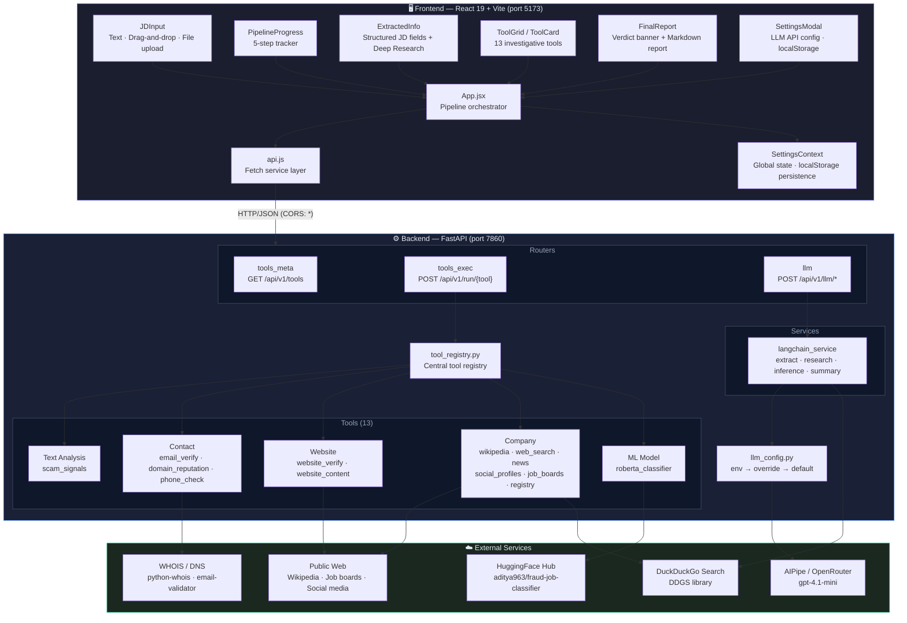
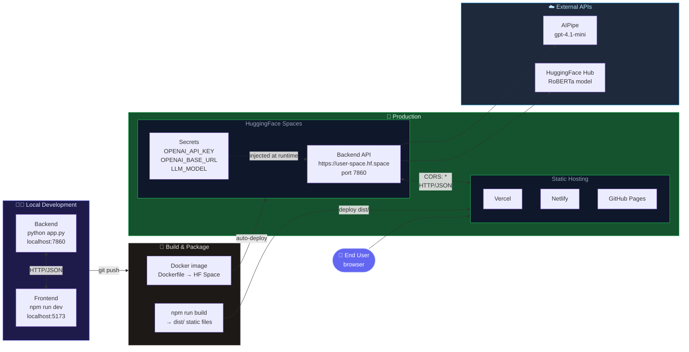

# FraudGuard — Deployment & Developer Guide

FraudGuard is an AI-powered fake job posting detector. It uses 13 investigative tools (WHOIS, email/phone validation, DuckDuckGo search, Wikipedia, social profiles, job boards, website content extraction) plus a fine-tuned RoBERTa classifier and a 5-step LLM pipeline to produce a structured fraud-risk report for any job description.

---

## Architecture Overview



### Analysis Pipeline (5 Steps)


---

## Prerequisites

| Requirement | Version | Notes |
|-------------|---------|-------|
| Python | 3.10+ | Backend |
| Node.js | 18+ | Frontend |
| AIPipe account | — | Free at [aipipe.org](https://aipipe.org) — provides OpenRouter access |
| Git | any | — |

> **No GPU required.** The RoBERTa classifier runs on CPU. HuggingFace Spaces free tier is sufficient.

---

## Backend — Local Development

### 1. Install dependencies

```bash
cd backend-api
pip install -r requirements.txt
```

> First run downloads the RoBERTa model (~500 MB) from HuggingFace Hub. Subsequent runs use the local cache.

### 2. Set environment variables

```bash
export OPENAI_API_KEY=<your-aipipe-token>
export OPENAI_BASE_URL=https://aipipe.org/openrouter/v1
export LLM_MODEL=openai/gpt-4.1-mini
```

> If you have a regular OpenAI key, set `OPENAI_BASE_URL=https://api.openai.com/v1` instead.

### 3. Start the server

```bash
python app.py
# or explicitly:
uvicorn app:app --host 0.0.0.0 --port 7860 --reload
```

Server starts at **http://localhost:7860**

### 4. Verify

```bash
curl http://localhost:7860/
# → {"status":"ok","version":"1.1.0","llm_settings":{...}}

curl http://localhost:7860/api/v1/llm/status
# → {"ok":true,"api_key_from_env":true,"effective_model":"openai/gpt-4.1-mini",...}

curl http://localhost:7860/docs
# → Opens Swagger UI in browser
```

---

## Frontend — Local Development

### 1. Install dependencies

```bash
cd frontend-app
npm install
```

### 2. Start dev server

```bash
npm run dev
# → http://localhost:5173
```

### 3. Connect to backend

Open the app in your browser → click **⚙️ Settings** → confirm:
- **Backend API URL**: `http://localhost:7860`
- **API Key**: your AIPipe token (only needed if backend env vars are not set)
- **Models**: all four default to `openai/gpt-4.1-mini`

> Settings are stored in `localStorage`. Click **Reset to defaults** if you need to clear them.

---

## Backend — HuggingFace Spaces Deployment

### 1. Create a Space

1. Go to [huggingface.co/new-space](https://huggingface.co/new-space)
2. Choose **Docker** SDK, **Blank** template
3. Set visibility (public or private)

### 2. Upload backend files

Upload the entire `backend-api/` directory contents to the Space repository:

```
app.py
requirements.txt
Dockerfile
core/
routers/
services/
tools/
```

### 3. Configure Secrets

In your Space → **Settings** → **Repository Secrets**, add:

| Secret Name | Value |
|-------------|-------|
| `OPENAI_API_KEY` | your AIPipe token |
| `OPENAI_BASE_URL` | `https://aipipe.org/openrouter/v1` |
| `LLM_MODEL` | `openai/gpt-4.1-mini` |

> Secrets are injected as environment variables at runtime — never hardcode keys.

### 4. Dockerfile

The included `Dockerfile` is already configured for HuggingFace Spaces:

```dockerfile
FROM python:3.11-slim
# Installs whois + curl system deps, then pip installs requirements.txt
# Exposes port 7860, runs uvicorn
```

The Space will build automatically on push. First build takes ~5 minutes (model download).

### 5. Your backend URL

After the Space is running, your URL is:
```
https://<username>-<space-name>.hf.space
```

---

## Frontend — Production Deployment

### Build

```bash
cd frontend-app
npm run build
# → Creates dist/ folder with static files
```

### Option A: Vercel (recommended)

```bash
npm install -g vercel
vercel deploy --prod
```

Or connect the GitHub repo to Vercel via the dashboard — it auto-detects Vite and sets `build command: npm run build`, `output dir: dist`.

### Option B: Netlify

Drag and drop the `dist/` folder at [app.netlify.com](https://app.netlify.com), or use:

```bash
npm install -g netlify-cli
netlify deploy --prod --dir=dist
```

### Option C: GitHub Pages

1. In `frontend-app/vite.config.js`, set:
   ```javascript
   base: '/your-repo-name/'
   ```
2. Build: `npm run build`
3. Push `dist/` to `gh-pages` branch

### Connecting to HuggingFace Backend

After deploying the frontend, users set the Backend URL in ⚙️ Settings:
```
https://<username>-<space-name>.hf.space
```

No build-time environment variables are needed — all settings are runtime via the Settings modal.

---

## Environment Variables Reference

### Backend (`backend-api/`)

| Variable | Default | Description |
|----------|---------|-------------|
| `OPENAI_API_KEY` | *(required)* | AIPipe or OpenAI API token |
| `OPENAI_BASE_URL` | `https://aipipe.org/openrouter/v1` | LLM proxy endpoint |
| `LLM_MODEL` | `openai/gpt-4.1-mini` | Model identifier passed to LangChain |
| `LLM_TEMPERATURE` | `0.3` | Sampling temperature (0.0–1.0) |
| `PORT` | `7860` | Server listen port |
| `ROBERTA_MODEL_ID` | `aditya963/fraud-job-classifier` | HuggingFace model ID for RoBERTa |
| `ROBERTA_THRESHOLD` | `0.87` | Fraud probability threshold (0.0–1.0) |

### Frontend (`frontend-app/`)

All settings are configurable at runtime via the **⚙️ Settings** modal. No build-time env vars needed. Defaults (in `src/contexts/SettingsContext.jsx`):

| Setting | Default |
|---------|---------|
| Backend URL | `http://localhost:7860` |
| LLM Base URL | `https://aipipe.org/openrouter/v1` |
| All 4 models | `openai/gpt-4.1-mini` |

---

## API Endpoints Reference

All endpoints served by the FastAPI backend. Swagger UI available at `/docs`, ReDoc at `/redoc`.

### Health & Status

| Method | Path | Description |
|--------|------|-------------|
| `GET` | `/` | Health check + version + LLM config status |
| `GET` | `/health` | Simple `{"status":"ok"}` probe |
| `GET` | `/api/v1/llm/status` | Current LLM configuration (which settings come from env) |

### Tool Registry

| Method | Path | Description |
|--------|------|-------------|
| `GET` | `/api/v1/tools` | List all 13 tools with metadata (label, icon, description, input_schema) |
| `GET` | `/api/v1/tools/{tool_name}` | Single tool metadata |

### Tool Execution

| Method | Path | Description |
|--------|------|-------------|
| `POST` | `/api/v1/run/{tool_name}` | Execute any tool. Body: free-form JSON matching the tool's `input_schema` |
| `POST` | `/api/v1/run-batch` | Execute multiple tools concurrently. Body: `[{"tool_name": str, ...kwargs}]` |

**Tool execution response format:**
```json
{
  "ok": true,
  "tool": "email_verify",
  "label": "Email Verification",
  "result": {
    "ok": true,
    "data": { "is_syntax_valid": true, "has_mx_record": true, ... }
  }
}
```

### LLM Services

| Method | Path | Description |
|--------|------|-------------|
| `POST` | `/api/v1/llm/extract` | Parse raw JD text → 19 structured fields |
| `POST` | `/api/v1/llm/deep-research` | DuckDuckGo + LLM to recover missing email/phone/website |
| `POST` | `/api/v1/llm/tool-inference` | Generate 2–4 bullet analysis of one tool's output |
| `POST` | `/api/v1/llm/final-summary` | Compile all inferences → fraud verdict + markdown report |

All LLM endpoints accept an optional `llm_config` block to override the server's default model:
```json
{
  "llm_config": {
    "api_key": "sk-...",
    "base_url": "https://aipipe.org/openrouter/v1",
    "model": "openai/gpt-4.1-mini"
  }
}
```

### Final Summary Response

```json
{
  "ok": true,
  "verdict": "SAFE | SUSPICIOUS | LIKELY_FAKE",
  "report": "## Executive Summary\n..."
}
```

---

## Tools Reference

| Tool Name | Category | Description |
|-----------|----------|-------------|
| `scam_signals` | text_analysis | Keyword-based scam pattern detection |
| `email_verify` | contact | Syntax + DNS MX record validation |
| `domain_reputation` | contact | WHOIS domain age and risk scoring |
| `website_verify` | website | HTTP/HTTPS liveness + SSL check |
| `website_content` | website | Text/metadata extraction via trafilatura |
| `company_wikipedia` | company | Wikipedia REST API company lookup |
| `company_web_search` | company | Multi-angle DuckDuckGo company search |
| `company_news` | company | DuckDuckGo news articles about company |
| `social_profiles` | company | 7-platform social media presence check |
| `job_boards` | company | Presence on LinkedIn, Indeed, Glassdoor, etc. |
| `phone_check` | contact | Phone number parsing and validation |
| `roberta_classifier` | ml_model | Fine-tuned RoBERTa fraud classifier (threshold: 0.87) |
| `company_registry` | company | Company registry lookup *(stub — not yet implemented)* |

---

## Troubleshooting

### "Cannot reach backend" in the UI

1. Check that the backend is running: `curl http://localhost:7860/health`
2. Open ⚙️ Settings and verify the Backend API URL matches the actual port
3. Check for CORS issues — the backend allows all origins by default
4. If deployed on HF Spaces, wait for the Space to finish building (check Logs tab)

### "LLM inference unavailable" on tool cards

1. Verify `OPENAI_API_KEY` is set (check `GET /api/v1/llm/status`)
2. Test the key: try a simple curl to the AIPipe endpoint
3. Check AIPipe account credits at [aipipe.org](https://aipipe.org)

### 401 Unauthorized from LLM

- AIPipe token expired or revoked — generate a new one at aipipe.org
- Wrong `OPENAI_BASE_URL` — confirm it is `https://aipipe.org/openrouter/v1`

### Tool returns empty or error

- **email_verify / domain_reputation**: requires internet access; fails in sandboxed environments
- **WHOIS timeouts**: some registrars block WHOIS queries — the tool degrades gracefully
- **RoBERTa slow on first run**: model downloads ~500 MB; subsequent calls use cache

### Frontend Settings not updating

- Previous settings are stored in `localStorage` — click **Reset to defaults** in ⚙️ Settings
- Clear `localStorage` in browser DevTools → Application → Storage → `fraudguard_settings`

### HuggingFace Space stuck building

- Check the Build logs in the Space dashboard
- Ensure `Dockerfile` and `requirements.txt` are at the repo root of the Space
- The `torch` package makes the first build slow (~10 min) — this is normal

---

## Project Structure

```mermaid
graph TD
    ROOT["📁 Group-9-DS-and-AI-Lab-Project"]

    ROOT --> BA["📁 backend-api\nFastAPI · Python 3.11"]
    ROOT --> FA["📁 frontend-app\nReact 19 · Vite · Node 18"]
    ROOT --> RD["📄 README_Deployment.md"]

    BA --> APP["app.py\nEntry point · CORS · Router registration"]
    BA --> REQ["requirements.txt\nPip dependencies"]
    BA --> DOCK["Dockerfile\nHuggingFace Spaces image"]
    BA --> CORE["📁 core/"]
    BA --> ROUT["📁 routers/"]
    BA --> SERV["📁 services/"]
    BA --> TDIR["📁 tools/  ×13 modules"]

    CORE --> LC["llm_config.py\nenv → override → default resolution"]
    CORE --> TR["tool_registry.py\nCentral tool catalogue"]

    ROUT --> RM["tools_meta.py\nGET /api/v1/tools"]
    ROUT --> RE["tools_exec.py\nPOST /api/v1/run/{tool}"]
    ROUT --> RL["llm.py\nPOST /api/v1/llm/* · GET /llm/status"]

    SERV --> LS["langchain_service.py\nextract · research · inference · summary"]

    FA --> SRC["📁 src/"]
    FA --> PKG["package.json"]
    FA --> VCFG["vite.config.js"]

    SRC --> AJSX["App.jsx\nPipeline orchestrator · All state"]
    SRC --> CTX["📁 contexts/\nSettingsContext.jsx — localStorage"]
    SRC --> APIS["📁 services/\napi.js — fetch wrappers"]
    SRC --> COMP["📁 components/"]

    COMP --> C1["Header.jsx\nLogo · Settings trigger"]
    COMP --> C2["JDInput.jsx\nText area · Drag-and-drop"]
    COMP --> C3["PipelineProgress.jsx\n5-step tracker"]
    COMP --> C4["ExtractedInfo.jsx\nJD fields · Deep Research"]
    COMP --> C5["ToolGrid.jsx\nCategory filter · Card grid"]
    COMP --> C6["ToolCard.jsx\nRun · Inference · Copy JSON"]
    COMP --> C7["FinalReport.jsx\nVerdict banner · Markdown"]
    COMP --> C8["SettingsModal.jsx\nLLM API configuration"]

    style ROOT fill:#1e1b4b,stroke:#6366f1,color:#e0e7ff
    style BA fill:#172554,stroke:#3b82f6,color:#bfdbfe
    style FA fill:#14532d,stroke:#22c55e,color:#bbf7d0
    style CORE fill:#0f172a,stroke:#475569,color:#94a3b8
    style ROUT fill:#0f172a,stroke:#475569,color:#94a3b8
    style SERV fill:#0f172a,stroke:#475569,color:#94a3b8
    style TDIR fill:#0f172a,stroke:#475569,color:#94a3b8
    style SRC fill:#0f172a,stroke:#475569,color:#94a3b8
    style CTX fill:#0f172a,stroke:#475569,color:#94a3b8
    style APIS fill:#0f172a,stroke:#475569,color:#94a3b8
    style COMP fill:#0f172a,stroke:#475569,color:#94a3b8
```



## Deployment Flow


