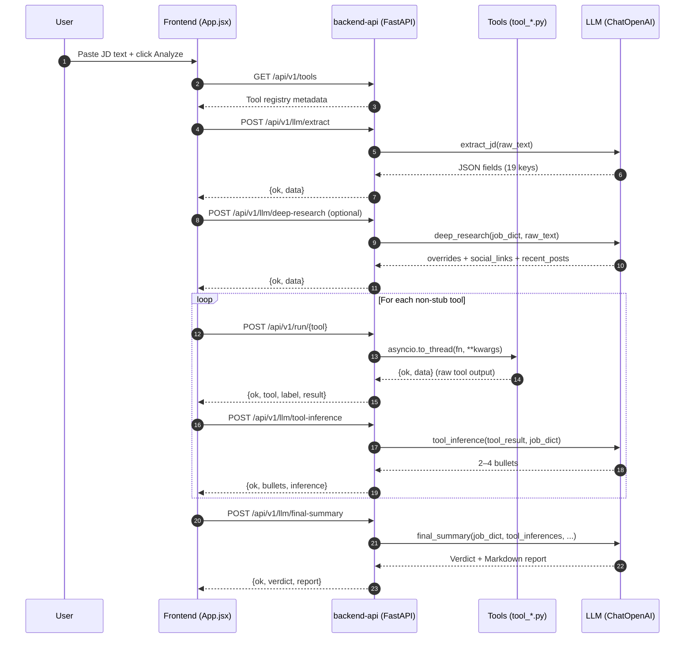

# FraudGuard Backend API — Design & Architecture

Date: 2026-04-20

## 1. Scope
This document focuses on the **backend-api/** service (FastAPI) and how the **frontend-app/** uses it when a user **pastes a Job Description (JD)** in the UI.

> Note: The UI text may say “resume” in conversation, but the current implemented pipeline processes **job posting / job description text**, not a CV/resume parser.

### 1.1 Deployed demo URLs (HuggingFace Spaces)

- Frontend: https://hrmhrmhrm-company-frontend-app.hf.space
- Backend API: https://hrmhrmhrm-company-backend-api.hf.space
- Swagger UI (backend): https://hrmhrmhrm-company-backend-api.hf.space/docs
- OpenAPI JSON (backend): https://hrmhrmhrm-company-backend-api.hf.space/openapi.json

All “captured” response snippets in the API section below were sanity-checked against the deployed backend on **2026-04-20**.

---

## 2. Backend Folder Structure (and what each file/folder does)

### 2.1 High-level tree

```text
backend-api/
  .dockerignore                  # Docker ignore rules (HF Spaces build)
  Dockerfile                      # Production container build (HF Spaces, CPU torch)
  README.md                       # How to run + endpoint summary
  app.py                          # FastAPI app entrypoint + CORS + router registration
  pytest.ini                      # Pytest configuration
  requirements.txt                # Python dependencies

  .venv/                          # Local uv virtualenv (created in dev; not committed)

  core/
    __init__.py                   # Package marker
    llm_config.py                 # LLM env/override resolution (ChatOpenAI config)
    tool_registry.py              # Registry for all tools (metadata + callable)

  routers/
    __init__.py                   # Package marker
    llm.py                        # LLM endpoints (extract, deep-research, inference, summary)
    tools_exec.py                 # Tool execution endpoints (/run, /run-batch)
    tools_meta.py                 # Tool metadata endpoints (/tools)

  services/
    __init__.py                   # Package marker
    langchain_service.py          # LLM business logic + prompts (LangChain)

  tools/
    __init__.py                   # Package marker
    tools_config.py               # Shared timeouts, headers, defaults
    tool_company_news.py          # DDG news about company
    tool_company_registry.py      # STUB (planned official registry integrations)
    tool_company_web_search.py    # DDG multi-angle web search
    tool_company_wikipedia.py     # Wikipedia summary lookup
    tool_domain_reputation.py     # WHOIS domain age + liveness
    tool_email_verify.py          # Email syntax + DNS MX check
    tool_job_boards.py            # DDG job board presence checks
    tool_phone_check.py           # Phone validation/parsing (phonenumbers)
    tool_roberta.py               # Local RoBERTa classifier (HF model download)
    tool_scam_signals.py          # Keyword fraud signals (pure Python)
    tool_social_profiles.py       # DDG social profile presence checks
    tool_website_content.py       # Website text extraction (trafilatura)
    tool_website_verify.py        # Website liveness/SSL/redirect checks

  tests/
    __init__.py                   # Package marker
    test_api_health.py            # Health endpoint tests (with mocked deps)
    test_tool_registry.py         # Registry shape tests (with mocked deps)

  scripts/
    capture_samples.py            # Helper: call endpoints + store samples + export OpenAPI

  samples/                         # Generated: request/response samples (created by scripts/capture_samples.py)
    api/                           # Non-tool endpoint captures
    tools/                         # Per-tool request/response captures
    llm/                           # Optional: created if CAPTURE_LLM=1 (or SAMPLE_LLM_API_KEY is set)

  openapi.json                     # Generated: exported OpenAPI spec (Swagger compatible)
```

### 2.2 Runtime responsibilities

- **[app.py](app.py)**
  - Creates FastAPI app (title/version/docs URLs)
  - Adds permissive CORS (`*`) for GitHub Pages + local dev
  - Includes routers:
    - [routers/tools_meta.py](routers/tools_meta.py)
    - [routers/tools_exec.py](routers/tools_exec.py)
    - [routers/llm.py](routers/llm.py)
  - Health endpoints:
    - `GET /` (includes LLM config availability)
    - `GET /health`

- **[core/tool_registry.py](core/tool_registry.py)**
  - **Source of truth** for all tool keys (`TOOL_REGISTRY`) and their:
    - label/icon/description
    - `input_schema` (used by frontend for auto-fill and by `/run/{tool}` for validation)
    - callable function (`fn`)

- **[routers/tools_exec.py](routers/tools_exec.py)**
  - Dynamic dispatch:
    - `POST /api/v1/run/{tool_name}` validates required fields using `input_schema`
    - Runs the sync tool function in a thread pool (`asyncio.to_thread`) to avoid blocking the event loop
  - Batch:
    - `POST /api/v1/run-batch` runs multiple tools concurrently
    - Important: it **does not** validate tool `input_schema` (it passes provided kwargs directly)

- **[core/llm_config.py](core/llm_config.py)**
  - Resolves LangChain `ChatOpenAI` config using (env → request override → default):
    - Env vars: `OPENAI_API_KEY`, `OPENAI_BASE_URL`, `LLM_MODEL`, `LLM_TEMPERATURE`
    - Default fallback: `https://aipipe.org/openrouter/v1` + `openai/gpt-4.1-mini`
    - The server reports effective values on `GET /` and `GET /api/v1/llm/status`

- **[services/langchain_service.py](services/langchain_service.py)**
  - Implements LLM prompts + logic for:
    - extract JD → structured fields
    - deep research via DuckDuckGo + LLM
    - tool inference bullets
    - final summary report + verdict

---

## 3. Execution Model (How a request is processed)

### 3.1 Tool execution lifecycle

1. Frontend calls `POST /api/v1/run/{tool_name}` with JSON body.
2. Backend:
   - Looks up tool in `TOOL_REGISTRY`
   - Validates required fields (only for `/run/{tool}`)
   - Calls the tool’s Python function in a thread: `await asyncio.to_thread(fn, **kwargs)`
3. Tool returns **tool-level** JSON:

```json
{ "ok": true, "data": {"...": "..."} }
```

If a tool fails (or is a stub), it typically returns:

```json
{ "ok": false, "error": "...", "data": {"...": "..."} }
```

4. API wraps it into a **route-level** response:

```json
{ "ok": true, "tool": "scam_signals", "label": "Scam Signal Scanner", "result": {"ok": true, "data": {"...": "..."} } }
```

Important:
- Route-level `ok` mirrors `result.ok` (so it can be `false`).
- HTTP status is still `200` for tool-level failures (tool reports failure in JSON).

Example (stub tool):

```json
{ "ok": false, "tool": "company_registry", "label": "Company Registry", "result": {"ok": false, "error": "Company registry lookup not yet implemented"} }
```

### 3.2 LLM services lifecycle

LLM endpoints accept optional `llm_config` so the frontend can provide an API key and model if server env vars are not set.

---

## 4. Frontend → Backend Flow (Paste Job Description)

### 4.1 Entry component
- Frontend input component: `frontend-app/src/components/JDInput.jsx`
  - Paste text OR upload file (txt/md/pdf/docx)
  - Calls `onAnalyze(text)` when user clicks Analyze

### 4.2 Pipeline orchestration (frontend)
Orchestrated in `frontend-app/src/App.jsx` using fetch helpers from `frontend-app/src/services/api.js`.

Pipeline steps and backend endpoints:

1. **Fetch tool registry**
   - `GET /api/v1/tools`

2. **LLM Extract** (requires API key)
   - `POST /api/v1/llm/extract` with `{raw_text, llm_config}`

3. **LLM Deep Research** (optional; requires API key)
   - `POST /api/v1/llm/deep-research` with `{job_dict, raw_text, llm_config}`
   - Merges `applied_overrides` back into extracted fields

4. **Run tools** (sequential in frontend for progressive UI updates)
   - For each tool (excluding stubs): `POST /api/v1/run/{tool_name}`

5. **LLM Tool Inference** (per tool; requires API key)
   - `POST /api/v1/llm/tool-inference`

6. **LLM Final Summary** (requires API key)
   - `POST /api/v1/llm/final-summary`

---

## 5. Mermaid Diagrams (Full Flow)

### 5.1 Architecture flowchart

```mermaid
flowchart TD
  U[User pastes Job Description] --> FE[frontend-app\nJDInput.jsx → App.jsx]
  FE -->|GET /api/v1/tools| META[backend-api\nrouters/tools_meta.py]

  FE -->|POST /api/v1/run/{tool}| EXEC[backend-api\nrouters/tools_exec.py]
  EXEC --> REG[core/tool_registry.py\nTOOL_REGISTRY + get_tool_fn]
  REG --> T1[tools/tool_scam_signals.py]
  REG --> T2[tools/tool_email_verify.py]
  REG --> T3[tools/tool_domain_reputation.py]
  REG --> T4[tools/tool_website_verify.py]
  REG --> T5[tools/tool_website_content.py]
  REG --> T6[tools/tool_company_wikipedia.py]
  REG --> T7[tools/tool_company_web_search.py]
  REG --> T8[tools/tool_company_news.py]
  REG --> T9[tools/tool_social_profiles.py]
  REG --> T10[tools/tool_job_boards.py]
  REG --> T11[tools/tool_phone_check.py]
  REG --> T12[tools/tool_company_registry.py\nSTUB]
  REG --> T13[tools/tool_roberta.py]

  T2 --> DNS[(DNS MX lookup)]
  T3 --> WHOIS[(WHOIS servers)]
  T3 --> WEB[(HTTPS liveness probe)]
  T4 --> WEB
  T5 --> WEB
  T7 --> DDG[(DuckDuckGo via ddgs)]
  T8 --> DDG
  T9 --> DDG
  T10 --> DDG
  T6 --> WIKI[(Wikipedia REST API)]
  T13 --> HF[(HuggingFace Hub\nmodel download + cache)]

  FE -->|POST /api/v1/llm/extract\n/deep-research\n/tool-inference\n/final-summary| LLMR[backend-api\nrouters/llm.py]
  LLMR --> SVC[services/langchain_service.py]
  SVC --> LC[LangChain ChatOpenAI\n(core/llm_config.py)]
  LC --> LLM[(LLM provider\nAIPipe/OpenRouter/OpenAI)]
```

### 5.2 End-to-end sequence diagram



---

## 6. Tools — Full Deep Dive (All 13)

### Shared properties (all tools)
- **All tools are “free”**: no paid API keys are required.
  - They use open-source libraries (email-validator, phonenumbers, trafilatura, python-whois)
  - Public endpoints (Wikipedia REST)
  - Public search via `ddgs` (DuckDuckGo)
  - Local ML inference via Transformers + CPU Torch (RoBERTa)
- Shared config: [tools/tools_config.py](tools/tools_config.py)
  - `REQUEST_TIMEOUT = 20`
  - `DEFAULT_PHONE_REGION = "IN"`
  - `REQUEST_HEADERS` with browser-like user-agent

For each tool below:
- API endpoint is `POST /api/v1/run/<tool_key>`
- Frontend auto-fill mapping is implemented in `frontend-app/src/services/api.js` (`buildToolDefaults`).

> Captured samples are written by `scripts/capture_samples.py` into `samples/tools/`.

Sample file format (so you know what you’re looking at):
- Each `*.response.json` is a capture wrapper: `{url, status_code, elapsed_ms, body}`
- `body` is the actual JSON you’d see from `curl`.

---

### 6.1 `scam_signals` — Scam Signal Scanner
- Source: [tools/tool_scam_signals.py](tools/tool_scam_signals.py)
- Inputs:
  - `job_text` (string)
- Processing:
  - Lowercases text and checks keyword lists across 7 rules
  - Each hit contributes `weight × number_of_hits`
  - Score capped to 100; risk: high (>=60), medium (>=25), low (<25)
- Why it’s free:
  - Pure Python string matching (no network calls)
- What it extracts:
  - A weighted fraud-risk score + exactly which signals/keywords matched
- What we infer from it:
  - High `scam_score` is strong evidence of a likely-fake posting, especially if it includes “pay money”, “WhatsApp only”, “guaranteed income”, or “urgent/limited seats” style signals.
- Output `data` keys:
  - `scam_score`, `risk_level`, `signals_found`, `signals_count`, `matched_signals`, `is_clean`
- Raw output example (trimmed `result.data`):

```json
{
  "scam_score": 100,
  "risk_level": "high",
  "signals_found": [
    "asks_for_money",
    "high_pressure",
    "unrealistic_promises",
    "unofficial_contact"
  ],
  "signals_count": 4,
  "is_clean": false
}
```
- Example files:
  - Request: [samples/tools/scam_signals.request.json](samples/tools/scam_signals.request.json)
  - Response: [samples/tools/scam_signals.response.json](samples/tools/scam_signals.response.json)

---

### 6.2 `email_verify` — Email Verification
- Source: [tools/tool_email_verify.py](tools/tool_email_verify.py)
- Inputs:
  - `email` (string)
- Processing:
  1. Syntax validation (offline)
  2. DNS MX lookup (deliverability)
  3. Flags disposable domains + role accounts
- Why it’s free:
  - Uses `email_validator` + DNS MX lookup (no paid verification APIs)
- What it extracts:
  - Domain + deliverability indicators (MX host) + quality flags (disposable / role account)
- What we infer from it:
  - A deliverable email on an established company domain is a positive signal.
  - Disposable domains or undeliverable MX often correlate with scam postings.
  - Role accounts (e.g., `hr@...`) are common and not automatically suspicious.
- Output `data` keys:
  - `email`, `local_part`, `domain`, `is_syntax_valid`, `is_deliverable`, `mx_host`, `is_disposable`, `is_role_account`, `overall_status`
- Raw output example (trimmed `result.data`):

```json
{
  "email": "hr@infosys.com",
  "domain": "infosys.com",
  "is_syntax_valid": true,
  "is_deliverable": true,
  "mx_host": "infosyslimited.in.tmes.trendmicro.eu",
  "is_disposable": false,
  "is_role_account": true,
  "overall_status": "deliverable"
}
```
- Example files:
  - Request: [samples/tools/email_verify.request.json](samples/tools/email_verify.request.json)
  - Response: [samples/tools/email_verify.response.json](samples/tools/email_verify.response.json)

---

### 6.3 `domain_reputation` — Domain Reputation
- Source: [tools/tool_domain_reputation.py](tools/tool_domain_reputation.py)
- Inputs:
  - `domain_or_email` (domain/email/url)
- Processing:
  - Extracts bare domain
  - WHOIS lookup with hard timeout (15s)
  - Calculates domain age → risk (`<180` high, `<730` medium, else low)
  - Optional HTTPS liveness probe (8s)
- Why it’s free:
  - Uses public WHOIS servers + a plain HTTPS probe (no commercial reputation feeds)
- What it extracts:
  - Registrar + key timestamps + computed `domain_age_days` + simple liveness
- What we infer from it:
  - Very new domains (days/weeks old) are a strong scam signal.
  - A long-lived, live domain is a strong legitimacy signal.
- Output `data` keys:
  - `domain`, `registrar`, `creation_date`, `expiration_date`, `updated_date`, `domain_age_days`, `is_live`, `live_url`, `risk_level`
- Raw output example (trimmed `result.data`):

```json
{
  "domain": "example.com",
  "domain_age_days": 11207,
  "risk_level": "low",
  "is_live": true,
  "live_url": "https://example.com/",
  "registrar": "RESERVED-Internet Assigned Numbers Authority"
}
```
- Example files:
  - Request: [samples/tools/domain_reputation.request.json](samples/tools/domain_reputation.request.json)
  - Response: [samples/tools/domain_reputation.response.json](samples/tools/domain_reputation.response.json)

---

### 6.4 `website_verify` — Website Health Check
- Source: [tools/tool_website_verify.py](tools/tool_website_verify.py)
- Inputs:
  - `url`
- Processing:
  - Adds `https://` if missing
  - `requests.get(..., allow_redirects=True)`
  - Records redirect chain
- Why it’s free:
  - Plain HTTP(S) request + response header inspection
- What it extracts:
  - Liveness, SSL flag, redirect chain, server/content-type hints, response time
- What we infer from it:
  - Dead sites, HTTP-only sites, excessive redirects, or redirects to unrelated domains are red flags.
- Output `data` keys:
  - `input_url`, `final_url`, `status_code`, `is_live`, `ssl_valid`, `redirect_count`, `redirect_chain`, `response_time_ms`, `server`, `content_type`
- Raw output example (trimmed `result.data`):

```json
{
  "input_url": "https://example.com",
  "final_url": "https://example.com/",
  "status_code": 200,
  "is_live": true,
  "ssl_valid": true,
  "redirect_count": 0,
  "response_time_ms": 157,
  "server": "cloudflare",
  "content_type": "text/html"
}
```
- Example files:
  - Request: [samples/tools/website_verify.request.json](samples/tools/website_verify.request.json)
  - Response: [samples/tools/website_verify.response.json](samples/tools/website_verify.response.json)

---

### 6.5 `website_content` — Website Content Analysis
- Source: [tools/tool_website_content.py](tools/tool_website_content.py)
- Inputs:
  - `url`
- Processing:
  - Fetches HTML (`trafilatura.fetch_url`)
  - Extracts main text (`trafilatura.extract`)
  - Extracts metadata (`trafilatura.extract_metadata`)
- Why it’s free:
  - Uses `trafilatura` on fetched HTML (no paid scraping/extraction APIs)
- What it extracts:
  - `extracted_text` (main content), `metadata` (title/description/tags), `word_count`
- What we infer from it:
  - Legit companies usually have consistent branding, contact pages, and non-empty informative content.
  - Very thin pages, mismatched names, or “parking / placeholder” pages are suspicious.
- Output `data` keys:
  - `url`, `extracted_text`, `word_count`, `metadata`
- Raw output example (trimmed `result.data`):

```json
{
  "url": "https://example.com",
  "word_count": 17,
  "metadata": { "title": "Example Domain" },
  "extracted_text": "This domain is for use in documentation examples..."
}
```
- Example files:
  - Request: [samples/tools/website_content.request.json](samples/tools/website_content.request.json)
  - Response: [samples/tools/website_content.response.json](samples/tools/website_content.response.json)

---

### 6.6 `company_wikipedia` — Wikipedia Lookup
- Source: [tools/tool_company_wikipedia.py](tools/tool_company_wikipedia.py)
- Inputs:
  - `company_name`
- Processing:
  - Wikipedia REST summary lookup
  - Fallback OpenSearch if 404
- Why it’s free:
  - Uses Wikipedia’s public REST/OpenSearch endpoints
- What it extracts:
  - Company summary snippet + canonical Wikipedia URL (+ optional thumbnail)
- What we infer from it:
  - A Wikipedia entry is strong evidence the company is established.
  - No entry is not automatically suspicious (many SMEs won’t have one).
- Output `data` keys:
  - `title`, `description`, `extract`, `wikipedia_url`, `thumbnail_url`

- Raw output example (trimmed `result.data`):

```json
{
  "title": "Infosys",
  "description": "Indian multinational technology company",
  "wikipedia_url": "https://en.wikipedia.org/wiki/Infosys"
}
```

- Example files:
  - Request: [samples/tools/company_wikipedia.request.json](samples/tools/company_wikipedia.request.json)
  - Response: [samples/tools/company_wikipedia.response.json](samples/tools/company_wikipedia.response.json)

---

### 6.7 `company_web_search` — Company Web Search
- Source: [tools/tool_company_web_search.py](tools/tool_company_web_search.py)
- Inputs:
  - `company_name`
- Processing:
  - Runs 5 DuckDuckGo searches (general, reviews, scam/fraud, Glassdoor, LinkedIn)
  - Sleeps 0.4s between searches to reduce rate-limits
- Why it’s free:
  - Uses the `ddgs` library to query DuckDuckGo (no API key), with a small built-in delay to reduce rate limiting
- What it extracts:
  - Web snippets across 5 “angles” so the UI/LLM can compare legitimacy signals vs scam reports
- What we infer from it:
  - Strong legitimate results (official site, Wikipedia, recognized review sites) are positive.
  - Many “scam/fraud” results or mismatched company identity is suspicious.
- Output `data` keys:
  - `company_name`, `searches` (angle → results)

- Raw output example (trimmed `result.data`):

```json
{
  "company_name": "Infosys",
  "searches": {
    "general_info": [
      {
        "title": "Infosys - Wikipedia",
        "url": "https://en.wikipedia.org/wiki/Infosys"
      }
    ],
    "scam_fraud": [
      {
        "title": "Fake Infosys CSR funds scam: ₹6.3 crore fraud exposed, one arrested...",
        "url": "https://newsfirstprime.com/bengaluru/fake-infosys-csr-funds-scam-63-crore-fraud-exposed-one-arrested-in-devanahalli-11452570"
      }
    ]
  }
}
```

- Example files:
  - Request: [samples/tools/company_web_search.request.json](samples/tools/company_web_search.request.json)
  - Response: [samples/tools/company_web_search.response.json](samples/tools/company_web_search.response.json)

---

### 6.8 `company_news` — Recent Company News
- Source: [tools/tool_company_news.py](tools/tool_company_news.py)
- Inputs:
  - `company_name`
  - `max_results` (default 8)
- Processing:
  - DuckDuckGo News query for the company
- Why it’s free:
  - Uses `ddgs` DuckDuckGo News search (no paid news APIs)
- What it extracts:
  - A list of recent articles (title, date, source, snippet, url)
- What we infer from it:
  - Recent coverage from reputable sources suggests an active, real organization.
  - News about “recruitment scam”, “impersonation”, or similar is a high-risk signal.
- Output `data` keys:
  - `company_name`, `total_articles`, `articles[]`

- Raw output example (trimmed `result.data`):

```json
{
  "company_name": "Infosys",
  "total_articles": 5,
  "articles": [
    {
      "title": "Carlos Alcaraz Partners With Infosys as Global Brand Ambassador",
      "source": "Sports Illustrated",
      "url": "https://www.si.com/onsi/serve/news/carlos-alcaraz-partners-with-infosys-as-global-brand-ambassador"
    }
  ]
}
```

- Example files:
  - Request: [samples/tools/company_news.request.json](samples/tools/company_news.request.json)
  - Response: [samples/tools/company_news.response.json](samples/tools/company_news.response.json)

---

### 6.9 `social_profiles` — Social Media Presence
- Source: [tools/tool_social_profiles.py](tools/tool_social_profiles.py)
- Inputs:
  - `company_name`
- Processing:
  - DuckDuckGo searches with site filters across 7 platforms
  - Sleeps 0.4s between platforms
- Why it’s free:
  - Uses `ddgs` DuckDuckGo search (site: filters) with a small delay to reduce rate limits
- What it extracts:
  - Presence/links/snippets per platform: LinkedIn, X/Twitter, GitHub, Facebook, Instagram, YouTube, Glassdoor
- What we infer from it:
  - Official profiles across multiple platforms are a positive legitimacy signal.
  - A complete absence of any presence can be suspicious (depending on company size/industry).
- Output `data` keys:
  - `company_name`, `platforms_found`, `profiles{platform → found, links, snippets}`

- Raw output example (trimmed `result.data`):

```json
{
  "company_name": "Infosys",
  "platforms_found": 7,
  "profiles": {
    "linkedin": {
      "found": true,
      "links": ["https://www.linkedin.com/company/infosys"]
    }
  }
}
```

- Example files:
  - Request: [samples/tools/social_profiles.request.json](samples/tools/social_profiles.request.json)
  - Response: [samples/tools/social_profiles.response.json](samples/tools/social_profiles.response.json)

---

### 6.10 `job_boards` — Job Board Verification
- Source: [tools/tool_job_boards.py](tools/tool_job_boards.py)
- Inputs:
  - `job_title`
  - `company_name`
  - `location` (optional)
- Processing:
  - DuckDuckGo searches across 8 job boards (site filters)
  - Verdict:
    - `strong_presence` if >=3 boards
    - `moderate_presence` if >=1
    - `not_found_on_boards` otherwise
- Why it’s free:
  - Uses DuckDuckGo search via `ddgs` (site: filters) instead of paid job-board APIs
- What it extracts:
  - Which boards show matching results + a coarse `verdict`
- What we infer from it:
  - Listings showing up across multiple well-known boards is a strong legitimacy signal.
  - A “not found” result is not conclusive (some roles are only posted on company sites).
- Output `data` keys:
  - `boards_found`, `verdict`, `boards` (+ echo fields)

- Raw output example (trimmed `result.data`):

```json
{
  "boards_found": 8,
  "verdict": "strong_presence",
  "boards": {
    "linkedin_jobs": {
      "found": true,
      "results": [
        {
          "title": "27,000+ Software Engineer jobs in Greater Bengaluru Area",
          "url": "https://in.linkedin.com/jobs/software-engineer-jobs-greater-bengaluru-area?position=1&pageNum=0"
        }
      ]
    }
  }
}
```

- Example files:
  - Request: [samples/tools/job_boards.request.json](samples/tools/job_boards.request.json)
  - Response: [samples/tools/job_boards.response.json](samples/tools/job_boards.response.json)

---

### 6.11 `phone_check` — Phone Number Check
- Source: [tools/tool_phone_check.py](tools/tool_phone_check.py)
- Inputs:
  - `phone`
  - `region` (default `IN`)
- Processing:
  - Parses with `phonenumbers.parse(phone, region)`
  - Returns formatting + validity + carrier + timezone data
- Why it’s free:
  - Uses the open-source `phonenumbers` library (offline parsing; no carrier verification APIs)
- What it extracts:
  - Normalized E.164 format + validity/possibility + inferred region/carrier/location
- What we infer from it:
  - Invalid/impossible numbers are a strong red flag.
  - A valid number doesn’t prove legitimacy, but it improves contact credibility.
- Output `data` keys:
  - `e164`, `international`, `national`, `is_possible`, `is_valid`, `carrier`, `region_code`, `timezones`, ...

- Raw output example (trimmed `result.data`):

```json
{
  "e164": "+919876543210",
  "is_possible": true,
  "is_valid": true,
  "region_code": "IN",
  "carrier": "Airtel",
  "location": "India",
  "timezones": ["Asia/Calcutta"]
}
```

- Example files:
  - Request: [samples/tools/phone_check.request.json](samples/tools/phone_check.request.json)
  - Response: [samples/tools/phone_check.response.json](samples/tools/phone_check.response.json)

---

### 6.12 `company_registry` — Company Registry (STUB)
- Source: [tools/tool_company_registry.py](tools/tool_company_registry.py)
- Status:
  - Not implemented; returns `ok:false` + a “planned sources” note.
- Why it’s free (planned):
  - Intended to query official public registries (e.g., Companies House UK, MCA21 India, SEC EDGAR) instead of paid company-database APIs.
- What it would extract (planned):
  - Legal registration identifiers + incorporation status + registered address + filings.
- What we infer from it:
  - Currently: no inference (treat as “not available”).

- Raw output example (current stub, trimmed `result`):

```json
{
  "ok": false,
  "error": "Company registry lookup not yet implemented",
  "data": {
    "company_name": "Infosys",
    "note": "Planned: Companies House (UK), MCA21 (India), SEC EDGAR (US)"
  }
}
```

- Example files:
  - Request: [samples/tools/company_registry.request.json](samples/tools/company_registry.request.json)
  - Response: [samples/tools/company_registry.response.json](samples/tools/company_registry.response.json)

---

### 6.13 `roberta_classifier` — RoBERTa Fraud Classifier
- Source: [tools/tool_roberta.py](tools/tool_roberta.py)
- Inputs:
  - `job_text`
  - `threshold` (optional; default from env `ROBERTA_THRESHOLD` or 0.87)
- Processing:
  - Loads HF pipeline once (thread-safe module cache)
  - Runs text-classification; computes fraud vs legit probability
  - Flags fraud if `fraud_probability >= threshold`
- Why it’s free:
  - Runs locally using HuggingFace Transformers + CPU PyTorch.
  - The only network dependency is the one-time model download from HuggingFace Hub (cached).
- What it extracts:
  - A probabilistic ML score (`fraud_probability`) + binary label (`REAL`/`FAKE`) + confidence band.
- What we infer from it:
  - High probability is strong evidence, but not definitive (treat as one signal among tools + heuristics).
  - The threshold is configurable; higher thresholds reduce false positives but may miss scams.
- Output `data` keys:
  - `model_id`, `threshold_used`, `fraud_probability`, `legit_probability`, `is_fraud`, `label`, `confidence`, `raw_scores`
- Note:
  - First call may be slow (downloads model from HuggingFace Hub)

- Raw output example (trimmed `result.data`):

```json
{
  "model_id": "aditya963/fraud-job-classifier",
  "threshold_used": 0.87,
  "fraud_probability": 0.9358,
  "legit_probability": 0.0642,
  "is_fraud": true,
  "label": "FAKE",
  "confidence": "high"
}
```

- Example files:
  - Request: [samples/tools/roberta_classifier.request.json](samples/tools/roberta_classifier.request.json)
  - Response: [samples/tools/roberta_classifier.response.json](samples/tools/roberta_classifier.response.json)

---

## 7. API Reference (curl + responses)

Base URL (deployed): `https://hrmhrmhrm-company-backend-api.hf.space`

Convenience for shell examples:

```bash
BASE='https://hrmhrmhrm-company-backend-api.hf.space'
```

Captured response samples:
- [samples/api](samples/api)
- [samples/tools](samples/tools)

### 7.1 Health

**GET /**
```bash
curl -sS "$BASE/" \
  | python3 -m json.tool
```
**Example response (captured):**

```json
{
  "status": "ok",
  "service": "FraudGuard Backend API",
  "version": "1.1.0",
  "docs": "/docs",
  "llm_settings": {
    "api_key_from_env": false,
    "base_url_from_env": false,
    "model_from_env": false,
    "effective_base_url": "https://aipipe.org/openrouter/v1",
    "effective_model": "openai/gpt-4.1-mini"
  }
}
```

Full capture: [samples/api/root.response.json](samples/api/root.response.json)

**GET /health**
```bash
curl -sS "$BASE/health"
```

**Example response (captured):**

```json
{ "status": "ok" }
```

Full capture: [samples/api/health.response.json](samples/api/health.response.json)

### 7.2 Tools metadata

**GET /api/v1/tools**
```bash
curl -sS "$BASE/api/v1/tools" \
  | python3 -m json.tool
```

**Example response (trimmed, captured):**

```json
{
  "ok": true,
  "total": 13,
  "llm_settings": {
    "api_key_from_env": false,
    "base_url_from_env": false,
    "model_from_env": false,
    "effective_base_url": "https://aipipe.org/openrouter/v1",
    "effective_model": "openai/gpt-4.1-mini"
  },
  "tools": {
    "scam_signals": {
      "label": "Scam Signal Scanner",
      "input_schema": { "job_text": { "type": "string", "required": true } },
      "category": "text_analysis"
    }
  }
}
```

Full capture: [samples/api/tools.response.json](samples/api/tools.response.json)

**GET /api/v1/tools/{tool_name}**
```bash
curl -sS "$BASE/api/v1/tools/scam_signals" \
  | python3 -m json.tool
```

**Example response (captured):**

```json
{
  "ok": true,
  "tool": {
    "label": "Scam Signal Scanner",
    "icon": "🚨",
    "description": "Keyword-based weighted scoring of the raw job text to detect common fraud signals (money demands, fake urgency, unofficial contacts, etc.). Pure Python — no API.",
    "input_schema": {
      "job_text": {
        "type": "string",
        "required": true,
        "description": "Raw job posting text to scan"
      }
    },
    "output_fields": [
      "scam_score",
      "risk_level",
      "signals_found",
      "signals_count",
      "matched_signals"
    ],
    "category": "text_analysis"
  }
}
```

Full capture: [samples/api/tool_scam_signals.response.json](samples/api/tool_scam_signals.response.json)

### 7.3 Run a tool

**POST /api/v1/run/{tool_name}**
```bash
curl -sS -X POST "$BASE/api/v1/run/scam_signals" \
  -H 'Content-Type: application/json' \
  -d @samples/tools/scam_signals.request.json
```

**Example response (trimmed, captured):**

```json
{
  "ok": true,
  "tool": "scam_signals",
  "label": "Scam Signal Scanner",
  "result": {
    "ok": true,
    "data": {
      "scam_score": 100,
      "risk_level": "high",
      "signals_count": 4,
      "is_clean": false
    }
  }
}
```

Full capture: [samples/tools/scam_signals.response.json](samples/tools/scam_signals.response.json)

- `404` if tool does not exist
- `422` if a required input_schema field is missing
- `200` even if the tool itself returns `{ok:false}` (tool-level failure — the JSON contains the error)

### 7.4 Run multiple tools (batch)

**POST /api/v1/run-batch**
```bash
curl -sS -X POST "$BASE/api/v1/run-batch" \
  -H 'Content-Type: application/json' \
  -d @samples/api/run_batch.request.json
```

**Example response (trimmed, captured):**

```json
{
  "ok": true,
  "results": [
    { "ok": true, "tool": "scam_signals" },
    { "ok": true, "tool": "email_verify" },
    { "ok": true, "tool": "website_verify" },
    { "ok": true, "tool": "company_wikipedia" }
  ]
}
```

Full capture: [samples/api/run_batch.response.json](samples/api/run_batch.response.json)

### 7.5 LLM endpoints

**GET /api/v1/llm/status**
```bash
curl -sS "$BASE/api/v1/llm/status" \
  | python3 -m json.tool
```

**Example response (captured):**

```json
{
  "ok": true,
  "api_key_from_env": false,
  "base_url_from_env": false,
  "model_from_env": false,
  "effective_base_url": "https://aipipe.org/openrouter/v1",
  "effective_model": "openai/gpt-4.1-mini"
}
```

Full capture: [samples/api/llm_status.response.json](samples/api/llm_status.response.json)

> LLM endpoints require either:
> - Server env var `OPENAI_API_KEY`, OR
> - Per-request `llm_config.api_key` in the JSON body.

On the deployed backend (as of 2026-04-20), `api_key_from_env=false`, so you must provide `llm_config` from the frontend Settings modal or via API calls.

Model note (important):
- If you pass `llm_config.base_url=https://aipipe.org/openai/v1`, use model `gpt-4.1-mini` (no `openai/` prefix).
- If you omit `llm_config.base_url`, backend defaults to `https://aipipe.org/openrouter/v1` and model `openai/gpt-4.1-mini`.

**POST /api/v1/llm/extract**
```bash
python3 -c 'import os, json; print(json.dumps({
  "raw_text": "...",
  "llm_config": {
    "api_key": os.environ.get("OPENAI_API_KEY"),
    "base_url": os.environ.get("OPENAI_BASE_URL"),
    "model": "gpt-4.1-mini"
  }
}))' \
  | curl -sS -X POST "$BASE/api/v1/llm/extract" \
    -H 'Content-Type: application/json' \
    -d @-
```

**Example response (captured, trimmed):**

```json
{
  "ok": true,
  "data": {
    "title": "Senior Data Entry Specialist (Work From Home)",
    "company_name": "Global Solutions Inc.",
    "company_website": "http://globalsolutions-careers.net",
    "contact_email": "globalsolns@gmail.com",
    "contact_phone": "+1-555-0198",
    "salary_range": "$500/day",
    "telecommuting": 1
  }
}
```

Other LLM endpoints:

**POST /api/v1/llm/deep-research**
```bash
curl -sS -X POST "$BASE/api/v1/llm/deep-research" \
  -H 'Content-Type: application/json' \
  -d '{"job_dict":{},"raw_text":"...","llm_config":{"api_key":"YOUR_KEY"}}'
```
Example success shape:
```json
{ "ok": true, "data": { "missing_from_jd": [], "applied_overrides": {}, "summary": "..." } }
```

**POST /api/v1/llm/tool-inference**
```bash
curl -sS -X POST "$BASE/api/v1/llm/tool-inference" \
  -H 'Content-Type: application/json' \
  -d '{"tool_name":"scam_signals","tool_result":{},"job_dict":{},"llm_config":{"api_key":"YOUR_KEY"}}'
```
Example response (captured):
```json
{
  "ok": true,
  "bullets": [
    "The job posting has a very high scam score of 100, indicating a strong likelihood of being fraudulent.",
    "It requests money upfront, which is a common tactic used by scammers to steal from applicants."
  ]
}
```

**POST /api/v1/llm/final-summary**
```bash
curl -sS -X POST "$BASE/api/v1/llm/final-summary" \
  -H 'Content-Type: application/json' \
  -d '{"job_dict":{},"tool_results":{},"tool_inferences":{},"llm_config":{"api_key":"YOUR_KEY"}}'
```
Example response fields (captured):
```json
{ "ok": true, "verdict": "LIKELY_FAKE", "report": "(markdown report...)" }
```

Report excerpt (captured):

```markdown
## Executive Summary
This job posting for a "Senior Data Entry Specialist (Work From Home)" from "Global Solutions Inc." exhibits multiple strong indicators of fraud, including upfront payment requests, unrealistic salary promises, and unofficial contact methods.

## Key Risk Factors
- Requests a $50 registration fee upfront, which is a common scam tactic.
- Promises an unusually high salary ($500/day) for minimal work (2 hours daily) with no experience required.
- Uses a generic Gmail address (globalsolns@gmail.com) rather than a corporate email.
```

To capture LLM responses into `samples/llm/`, use the capture script with `CAPTURE_LLM=1` (it reads `OPENAI_API_KEY`/`OPENAI_BASE_URL` from your shell). Saved request JSON is automatically redacted (see [scripts/capture_samples.py](scripts/capture_samples.py)).

---

## 8. Swagger / OpenAPI (Swagger-compatible documentation)

- Interactive Swagger UI: `GET /docs`
- ReDoc UI: `GET /redoc`
- Runtime OpenAPI JSON: `GET /openapi.json`
  - Capture wrapper: [samples/api/openapi.response.json](samples/api/openapi.response.json)
  - Exported spec (the `body` from the capture): [openapi.json](openapi.json)

Quick check:
```bash
curl -sS "$BASE/openapi.json" | head
```

---

## 9. Running & Demo

### 9.1 Demo (recommended: deployed)

- Open the frontend: https://hrmhrmhrm-company-frontend-app.hf.space
- Backend Swagger UI: https://hrmhrmhrm-company-backend-api.hf.space/docs
- If the UI asks for an API key, provide one via the Settings modal (the deployed backend reports `api_key_from_env=false`).

### 9.2 Local dev (optional)

1. Create venv + install deps:
```bash
cd backend-api
uv venv
uv pip install --upgrade pip
uv pip install torch==2.5.1+cpu --index-url https://download.pytorch.org/whl/cpu
uv pip install -r requirements.txt
```

2. Run server:
```bash
.venv/bin/uvicorn app:app --host 127.0.0.1 --port 8000
```

3. Capture samples + export OpenAPI:
```bash
.venv/bin/python scripts/capture_samples.py
```

4. Run tests:
```bash
uv pip install pytest
.venv/bin/pytest -q
```
