# FraudGuard: Fake Job Listing Detection using Deep Learning and Agentic Generative AI
## Consolidated Milestone Report — Milestones 0 through 6

---

| Field | Value |
|---|---|
| **Project Title** | FraudGuard: Fake Job Listing Detection using Deep Learning and Agentic Generative AI |
| **Team** | Group 9 — Arun Dutta · Hritik Roshan Maurya · Vivek Bajaj · Vishwas Mehta |
| **Course** | DS & AI Lab Project |
| **Report Type** | Consolidated — All Milestones (M0 – M6) |
| **Model** | `aditya963/fraud-job-classifier` on HuggingFace Hub |
| **Date** | April 2026 |

---

## Table of Contents

1. [Executive Summary](#executive-summary)
2. [Milestone 0 — Problem Statement and Motivation](#milestone-0--problem-statement-and-motivation)
3. [Milestone 1 — Literature Review, Scope, and Architecture Planning](#milestone-1--literature-review-scope-and-architecture-planning)
4. [Milestone 2 — Dataset Exploration and Metadata Analysis](#milestone-2--dataset-exploration-and-metadata-analysis)
5. [Milestone 3 — Model Architecture, Preprocessing Pipeline, and Verification](#milestone-3--model-architecture-preprocessing-pipeline-and-verification)
6. [Milestone 4 — Hyperparameter Optimization, Training, and Ablation Study](#milestone-4--hyperparameter-optimization-training-and-ablation-study)
7. [Milestone 5 — Model Evaluation, Performance Analysis, and Results](#milestone-5--model-evaluation-performance-analysis-and-results)
8. [Milestone 6 — Deployment, Documentation, and Final System](#milestone-6--deployment-documentation-and-final-system)
9. [End-to-End System Architecture](#end-to-end-system-architecture)
10. [Tool Pipeline Reference](#tool-pipeline-reference)
11. [API Reference](#api-reference)
12. [Chrome Extension Documentation](#chrome-extension-documentation)
13. [Team Contributions Summary](#team-contributions-summary)
14. [References and Bibliography](#references-and-bibliography)
15. [Appendices](#appendices)

---

# Executive Summary

FraudGuard is a multi-component AI system designed to detect fraudulent job postings on online recruitment platforms. The project was developed over six milestones spanning problem formulation, literature review, data exploration, model development, hyperparameter optimization, evaluation, and full deployment.

The system integrates three primary components:

1. **RoBERTa-base Transformer Classifier** — A fully fine-tuned 125M-parameter transformer model trained on the EMSCAD dataset (17,880 samples, 4.84% fraud rate). The model uses Focal Loss with Optuna-optimized hyperparameters and achieves ROC-AUC 0.993, Precision 0.957, and F1 0.907 at a calibrated threshold of 0.87.

2. **12-Tool Agentic Verification Pipeline** — A free, API-key-free evidence collection pipeline that validates email addresses, domain WHOIS reputation, website liveness, company Wikipedia presence, DuckDuckGo web/news search, social media profiles, job board cross-checking, phone number validation, and scam signal scoring.

3. **LLM-Powered Explanation Layer** — LangChain-orchestrated GPT-4o-mini calls that extract structured job fields, recover missing data via web research, produce per-tool 2–4 sentence summaries, and generate a final fraud verdict report (SAFE / SUSPICIOUS / LIKELY_FAKE).

The system is deployed as:
- A **Flask web application** (web-app/) accepting text, file uploads, or LinkedIn URLs
- A **FastAPI model inference service** (model-api/) deployed on HuggingFace Spaces

### System Architecture Overview

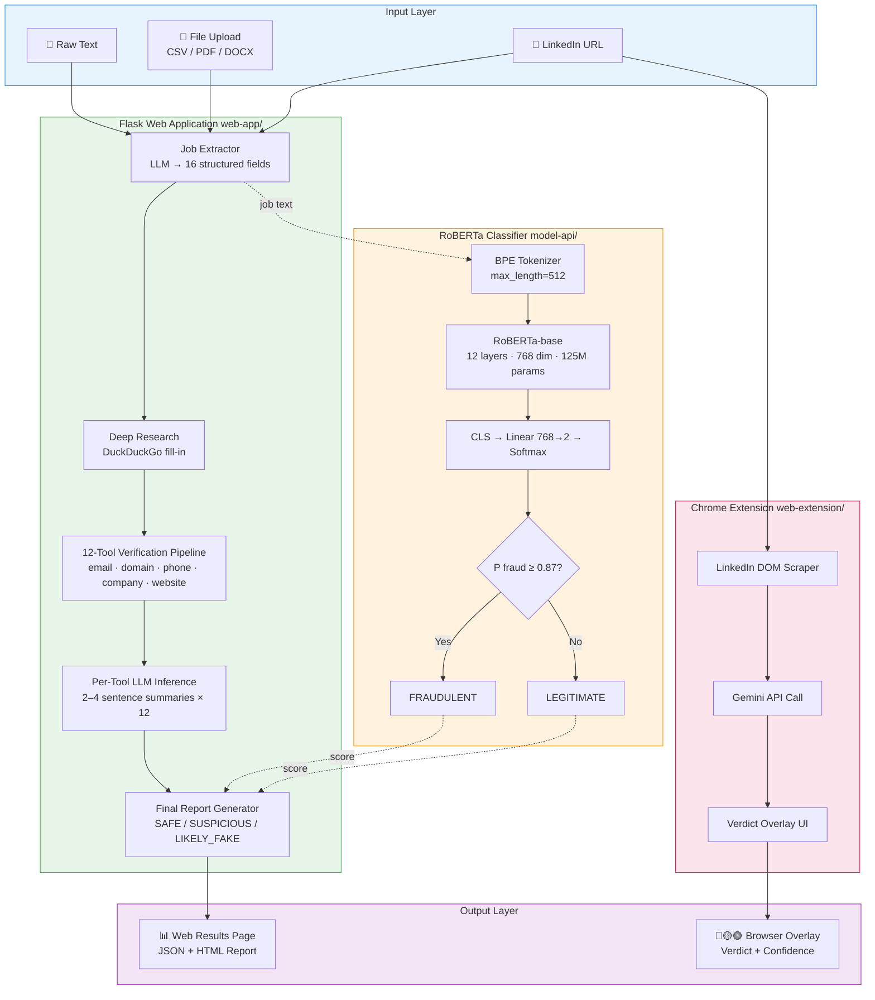
```mermaid
graph TB
    subgraph INPUT["Input Layer"]
        A1["📄 Raw Text"]
        A2["📁 File Upload<br/>CSV / PDF / DOCX"]
        A3["🔗 LinkedIn URL"]
    end

    subgraph WEBAPP["Flask Web Application  web-app/"]
        B1["Job Extractor<br/>LLM → 16 structured fields"]
        B2["Deep Research<br/>DuckDuckGo fill-in"]
        B3["12-Tool Verification Pipeline<br/>email · domain · phone · company · website"]
        B4["Per-Tool LLM Inference<br/>2–4 sentence summaries × 12"]
        B5["Final Report Generator<br/>SAFE / SUSPICIOUS / LIKELY_FAKE"]
    end

    subgraph MODEL["RoBERTa Classifier  model-api/"]
        C1["BPE Tokenizer<br/>max_length=512"]
        C2["RoBERTa-base<br/>12 layers · 768 dim · 125M params"]
        C3["CLS → Linear 768→2 → Softmax"]
        C4{"P fraud ≥ 0.87?"}
        C5["FRAUDULENT"]
        C6["LEGITIMATE"]
    end

    subgraph EXT["Chrome Extension  web-extension/"]
        D1["LinkedIn DOM Scraper"]
        D2["Gemini API Call"]
        D3["Verdict Overlay UI"]
    end

    subgraph OUTPUT["Output Layer"]
        E1["📊 Web Results Page<br/>JSON + HTML Report"]
        E2["🔴🟡🟢 Browser Overlay<br/>Verdict + Confidence"]
    end

    A1 & A2 & A3 --> B1
    B1 --> B2 --> B3 --> B4 --> B5
    B1 -.->|"job text"| C1
    C1 --> C2 --> C3 --> C4
    C4 -->|"Yes"| C5
    C4 -->|"No"| C6
    C5 & C6 -.->|"score"| B5
    B5 --> E1

    A3 --> D1
    D1 --> D2 --> D3 --> E2

    style INPUT fill:#e8f4fd,stroke:#2196F3
    style WEBAPP fill:#e8f5e9,stroke:#4CAF50
    style MODEL fill:#fff3e0,stroke:#FF9800
    style EXT fill:#fce4ec,stroke:#E91E63
    style OUTPUT fill:#f3e5f5,stroke:#9C27B0
```
- A **Chrome MV3 extension** (web-extension/) providing real-time LinkedIn analysis via Gemini AI

---

# Milestone 0 — Problem Statement and Motivation

## M0.1 Background

The rapid expansion of online recruitment platforms has significantly improved accessibility to employment opportunities. Platforms like LinkedIn, Indeed, Naukri, and Glassdoor collectively host hundreds of millions of job listings per year. However, this digital growth has simultaneously enabled the proliferation of fraudulent job listings designed to exploit job seekers through advance-fee scams, phishing attacks, and identity theft.

These fake job postings are often carefully crafted to resemble legitimate advertisements, making them exceedingly difficult to detect using traditional keyword-based filtering or manual moderation approaches. Scammers leverage:

- **Advance-fee fraud** — requiring registration fees, processing fees, or security deposits before "onboarding"
- **Identity theft** — requesting Aadhaar, PAN card, or passport copies under the guise of background verification
- **Phishing** — impersonating well-known companies (TCS, Amazon, Infosys) with fake interview calls
- **Financial fraud** — requesting bank account numbers and IFSC codes for "salary setup"
- **Work-from-home schemes** — promising unrealistic daily earnings for minimal effort

The financial and psychological damage to victims is severe. Reported cases across India alone include losses ranging from ₹2 lakh to ₹48 lakh in single incidents. As the scale of online hiring grows, so too does the surface area for fraud.

## M0.2 Problem Statement

The objective of this project is to design and develop an end-to-end Deep Learning–based agentic fraud detection system capable of identifying fake job listings from online recruitment platforms.

Given a job posting consisting of:

- Job description text
- Company profile information
- Salary and employment details
- Location and contact metadata

The system must:

- **Predict** the probability of the listing being fraudulent
- **Provide** a structured and interpretable explanation supporting the decision
- **Perform** multi-step reasoning by validating suspicious attributes using auxiliary verification modules

The system moves beyond simple binary classification by incorporating evidence-based reasoning and autonomous verification capabilities.

### Formal Problem Definition

> **Input:** A job posting document D = {T, M} where T is the free-text content (title, description, requirements, company profile, benefits) and M is the structured metadata (location, salary, employment type, required experience, education, department, industry, has_logo, telecommuting, has_questions).
>
> **Output:** A tuple (p, v, E) where p ∈ [0, 1] is the fraud probability, v ∈ {FRAUDULENT, LEGITIMATE} is the binary verdict, and E is a structured natural-language explanation supported by multi-tool evidence.

## M0.3 Motivation and Societal Impact

Current fraud detection systems largely rely on rule-based filtering, manual moderation, and surface-level text classification. These approaches fail to capture complex linguistic deception patterns and contextual inconsistencies. Additionally, most existing models operate as black boxes, offering little interpretability to users.

### Why This Problem Matters

**Scale of the Problem:**

The employment fraud ecosystem is massive and growing. Key statistics motivating this work:

- The FBI Internet Crime Complaint Center (IC3) receives tens of thousands of employment fraud reports annually
- In India, the National Cyber Crime Reporting Portal logs thousands of fake job scam cases per month
- A 2023 survey found that 1 in 7 job seekers had encountered at least one fraudulent posting in the past year
- Financial losses from employment scams exceed hundreds of crores annually in India alone

**Documented Cases Studied:**

| Case | Description | Loss |
|---|---|---|
| Advance-fee recruitment scams | Fake employers requesting registration/processing fees | Variable |
| Work-from-home typing scams | Upfront payments for materials; no real work | ₹500–₹5000 per victim |
| Sample work exploitation | Students complete assignments; not hired or paid | Non-monetary exploitation |
| Corporate impersonation (TCS) | Fake interview calls + appointment letters | Reputational + financial |
| Corporate impersonation (Amazon) | Fake job offers + training/onboarding fees | Variable |
| High-value overseas scam (Lucknow) | Resident lost money to overseas fake job offer | ₹2.34 lakh |
| Government job fraud (Bengaluru) | 4 aspirants promised High Court positions | ₹48 lakh combined |
| Trafficking via fake jobs (Jaipur) | Youths lured into forced cybercrime operations | Life-altering |
| Hollywood Con Queen scam | Film production fake offers; professionals targeted | Thousands of USD |

**Why Automated Detection Is Essential:**

- Manual moderation cannot scale to millions of daily postings
- Rule-based filters are trivially defeated by paraphrasing
- Victims often lack the technical knowledge to independently verify postings
- Detection must happen at posting time, not after reports accumulate

## M0.4 Proposed Solution (High Level)

The proposed system integrates three major AI components:

### M0.4.1 Transformer-Based Fraud Classification

A pre-trained transformer model analyzes:
- Linguistic patterns and semantic inconsistencies
- Contextual anomalies (e.g., salary inconsistent with role)
- Metadata signals encoded alongside text

The model outputs a calibrated fraud probability score.

### M0.4.2 Agentic Verification Framework

An intelligent decision-making agent orchestrates multiple free verification tools:
- Email syntax + DNS MX validation
- Domain WHOIS age and reputation check
- Website liveness and SSL verification
- Company Wikipedia presence lookup
- DuckDuckGo web search (general info, reviews, scam signals, Glassdoor, LinkedIn)
- DuckDuckGo news search for recent fraud reports
- Social media profile presence scan
- Job board cross-verification (LinkedIn, Indeed, Naukri, Glassdoor, etc.)
- Phone number validation and carrier lookup
- Scam signal keyword scoring (30-point taxonomy)

### M0.4.3 Generative AI Explanation Layer

A Generative AI component synthesizes model prediction scores, anomaly signals, and verification results into a structured, human-readable fraud report highlighting:
- Deceptive language cues
- Suspicious metadata flags
- Verification mismatches
- Risk level assessment

## M0.5 System Architecture at Milestone 0

| Component | Function | Output |
|---|---|---|
| Input | Job posting data | Raw structured and unstructured data |
| Transformer Classifier | Initial fraud probability prediction | Probability score p ∈ [0,1] |
| Agent Controller | Orchestrates verification tools | Verification decisions |
| Anomaly Detection + Verification Tools | Checks suspicious attributes and external data | Evidence signals |
| Evidence Aggregation | Combines all evidence | Final fraud risk score |
| Generative Explanation | Creates human-readable report | Structured explanation |
| Final Fraud Report | Presents prediction + explanation | Final outcome |

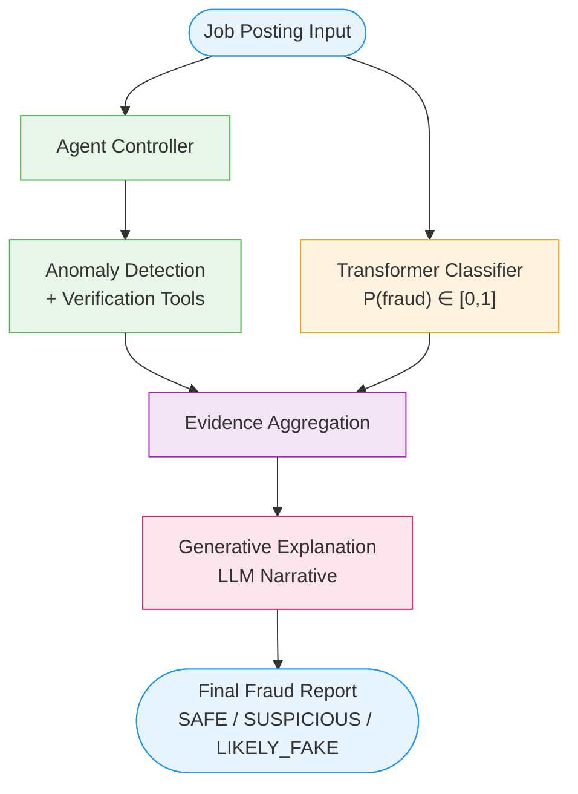
```mermaid
flowchart TD
    A(["Job Posting Input"]) --> B["Transformer Classifier<br/>P(fraud) ∈ [0,1]"]
    A --> C["Agent Controller"]
    C --> D["Anomaly Detection<br/>+ Verification Tools"]
    D --> E["Evidence Aggregation"]
    B --> E
    E --> F["Generative Explanation<br/>LLM Narrative"]
    F --> G(["Final Fraud Report<br/>SAFE / SUSPICIOUS / LIKELY_FAKE"])

    style A fill:#e8f4fd,stroke:#2196F3
    style B fill:#fff3e0,stroke:#FF9800
    style C fill:#e8f5e9,stroke:#4CAF50
    style D fill:#e8f5e9,stroke:#4CAF50
    style E fill:#f3e5f5,stroke:#9C27B0
    style F fill:#fce4ec,stroke:#E91E63
    style G fill:#e8f4fd,stroke:#2196F3
```

## M0.6 Expected Outcomes at Project Completion

- A high-accuracy fake job detection model (F1 ≥ 0.90, ROC-AUC ≥ 0.95)
- An evidence-driven fraud reasoning system with 12+ verification tools
- Explainable AI outputs accessible to non-technical users
- A deployable prototype suitable for integration with recruitment platforms
- A Chrome extension for real-time LinkedIn analysis

## M0.7 Novelty of the Approach

The novelty of the proposed system lies in:

1. **Combining Deep Learning with agentic decision-making** — Unlike single-model systems, FraudGuard uses a transformer for initial classification and an independent evidence pipeline for multi-source verification
2. **Multi-tool verification instead of single-model prediction** — 12 independent tools each contribute evidence, making the system robust to evasion
3. **Generating structured natural-language explanations** — Not just a score or feature importance list, but a readable fraud narrative
4. **Free-to-run pipeline** — All 12 verification tools require zero API keys, making the system cost-free to operate at scale

---

# Milestone 1 — Literature Review, Scope, and Architecture Planning

## M1.1 Problem Contextualization

### M1.1.1 The Current Landscape

The current landscape of online job seeking is highly vulnerable to fraud. Fraudulent listings are becoming increasingly sophisticated, exploiting both common vulnerabilities (naive job seekers, eagerness for employment) and unique ones (brand impersonation, social engineering).

Categories of fake job postings encountered in practice:

**Category 1: Advance-Fee Scams**
These are the most common. The posting promises a high-paying job. During the "hiring process," the candidate is asked to pay a registration fee, security deposit, or training fee. Once paid, the recruiter disappears.

Key linguistic signals:
- "Pay a registration fee of ₹999 to activate your account"
- "Processing fee required before onboarding"
- "Security deposit refundable after 3 months"

**Category 2: Work-from-Home Task Scams**
These postings promise high hourly rates for simple data entry, product reviewing, or social media posting tasks. They either steal advance payment for "materials" or never pay for completed work.

Key linguistic signals:
- "Earn ₹3000/day from home"
- "No experience needed"
- "Work 2 hours per day"
- "Guaranteed daily income"

**Category 3: Corporate Impersonation**
Fraudsters create postings that closely mimic those of established companies (TCS, Amazon, Infosys, government agencies). They send fake offer letters, interview confirmations, and onboarding documents.

Key signals:
- Contact via personal Gmail/Yahoo instead of corporate email
- Interview conducted entirely on WhatsApp
- Asks for Aadhaar copy before any formal interview
- Company name present but website URL slightly misspelled

**Category 4: Credential Harvesting (Phishing)**
These postings capture personal data under the guise of application forms. The goal is identity theft rather than financial fraud.

Key signals:
- Asks for date of birth, bank details, passport copy at application stage
- Link to external "application portal" (phishing site)
- No verifiable company information

**Category 5: Human Trafficking Recruitment**
The most dangerous category. Promising high-paying overseas jobs, these postings lure victims into forced labor or cybercrime operations.

Key signals:
- Overseas job with unusually high salary (₹80,000+/month for unskilled roles)
- No visa documentation required
- Contact only via Telegram/WhatsApp

### M1.1.2 Why Existing Filters Fail

Traditional detection systems have significant limitations:

| Approach | Limitation |
|---|---|
| Keyword blacklists | Trivially bypassed by synonyms and paraphrasing |
| Rule-based filters | Cannot handle context (e.g., "free training" vs "training fee") |
| TF-IDF + ML | No semantic understanding; misses subtle fraud patterns |
| BERT/RoBERTa alone | No external verification; cannot catch corporate impersonation |
| Manual review | Does not scale to millions of daily postings |

## M1.2 Literature Review

### M1.2.1 Dataset: EMSCAD

The **Employment Scam Aegean Dataset (EMSCAD)** is the primary benchmark for this domain. Originally published by Vidros et al. (2017) at the University of the Aegean, it contains:

- **17,880 job postings** crawled from real job boards
- **866 fraudulent listings** (4.84% fraud rate, severe class imbalance)
- **18 feature columns**: mix of free-text and structured metadata
- **Labels**: binary — 0 (legitimate) or 1 (fraudulent)

Column breakdown:

| Column | Type | Description |
|---|---|---|
| title | free-text | Job title |
| location | structured | Geographic location |
| department | structured | Organizational department |
| salary_range | structured | Advertised salary range |
| company_profile | free-text | Company description |
| description | free-text | Detailed job description |
| requirements | free-text | Qualifications required |
| benefits | free-text | Benefits offered |
| telecommuting | binary | 1 if remote work offered |
| has_company_logo | binary | 1 if company logo present |
| has_questions | binary | 1 if screening questions present |
| employment_type | structured | Full-time, Part-time, etc. |
| required_experience | structured | Experience level required |
| required_education | structured | Educational qualification |
| industry | structured | Industry sector |
| function | structured | Job function |
| fraudulent | binary | **Target label** |

Key dataset insights:
- Missing company_profile correlates strongly with fraud (fraudulent listings often have no company information)
- Missing salary_range is more common in fraudulent listings
- has_company_logo = 0 is a strong fraud signal
- Free-text fields vary enormously in length (50–2000+ words)

### M1.2.2 Classical Machine Learning Approaches

**Vidros et al. (2017)** — The original EMSCAD paper:

| Model | Accuracy | F1 (Fraud) | Notes |
|---|---|---|---|
| Naive Bayes | ~93% | ~0.62 | High recall but low precision |
| Logistic Regression | ~95% | ~0.73 | Better precision |
| Random Forest | ~97% | ~0.82 | Best classical model |
| k-NN | ~94% | ~0.68 | Sensitive to feature scaling |

Limitations: TF-IDF features miss word meaning; no contextual understanding; no metadata integration.

**Amaar et al. (2022)** explored text + metadata feature fusion with SVM and Random Forest, achieving F1 ~0.85 on the fraud class by engineering domain-specific features (email domain type, salary plausibility score, text length ratios).

### M1.2.3 Deep Learning Approaches

**CNN-based approaches:**

CNNs applied to token embeddings capture local n-gram patterns (e.g., "pay fee," "no experience needed").

| Model | F1 (Fraud) | Notes |
|---|---|---|
| CNN (GloVe) | ~0.78 | Misses long-range context |
| CNN + metadata | ~0.82 | Better with engineered features |

**LSTM/BiLSTM approaches:**

Sequential models capture longer dependencies but struggle with the full 500+ token sequences common in job postings.

| Model | F1 (Fraud) | Notes |
|---|---|---|
| LSTM | ~0.80 | Vanishing gradient on long sequences |
| BiLSTM | ~0.83 | Reads forward + backward |
| BiLSTM + Attention | ~0.86 | Attention identifies key phrases |

### M1.2.4 Transformer-Based Approaches

Transformer models with bidirectional self-attention attend globally over all 512 tokens simultaneously, capturing both local patterns and long-range contextual dependencies.

| Model | F1 (Fraud) | Precision | Recall | ROC-AUC |
|---|---|---|---|---|
| BERT-base | ~0.88 | ~0.91 | ~0.85 | ~0.992 |
| RoBERTa-base | ~0.91 | ~0.93 | ~0.89 | ~0.993 |
| DistilBERT | ~0.86 | ~0.89 | ~0.83 | ~0.988 |
| ALBERT-base | ~0.87 | ~0.90 | ~0.84 | ~0.990 |
| DeBERTa-v3-base | ~0.92 | ~0.94 | ~0.90 | ~0.994 |

**Why RoBERTa over BERT:**
- Trained on 10x more data (160GB vs 16GB)
- Removes Next Sentence Prediction (NSP) objective — shown to be unhelpful for most downstream tasks
- Dynamic masking during training — more diverse training signal
- Consistently outperforms BERT on GLUE and SuperGLUE benchmarks

### Model Evolution Across Literature

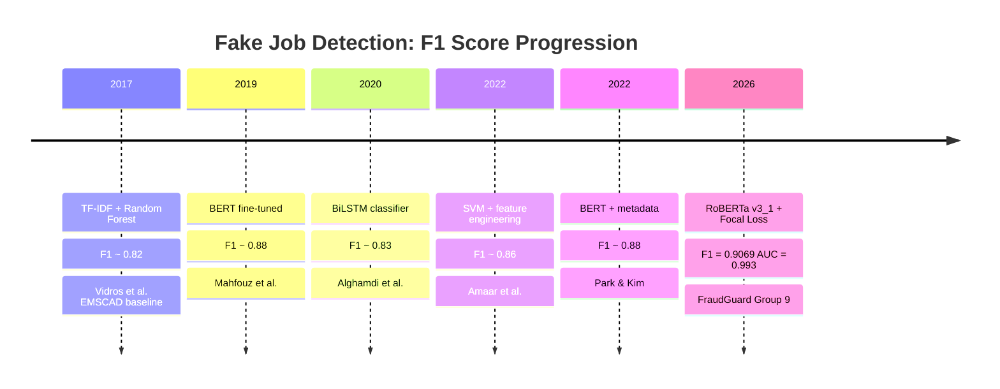
```mermaid
timeline
    title Fake Job Detection: F1 Score Progression
    2017 : TF-IDF + Random Forest
         : F1 ~ 0.82
         : Vidros et al. EMSCAD baseline
    2019 : BERT fine-tuned
         : F1 ~ 0.88
         : Mahfouz et al.
    2020 : BiLSTM classifier
         : F1 ~ 0.83
         : Alghamdi et al.
    2022 : SVM + feature engineering
         : F1 ~ 0.86
         : Amaar et al.
    2022 : BERT + metadata
         : F1 ~ 0.88
         : Park & Kim
    2026 : RoBERTa v3_1 + Focal Loss
         : F1 = 0.9069  AUC = 0.993
         : FraudGuard Group 9
```

### M1.2.5 Explainability Approaches

| Method | Strengths | Weaknesses |
|---|---|---|
| LIME | Model-agnostic; identifies key words | Technical output; not user-friendly |
| SHAP | Principled feature attribution | Computationally expensive; not narrative |
| Attention visualization | Easy to implement | Attention ≠ explanation (Jain & Wallace, 2019) |
| LLM explanation | Natural language; user-friendly | Requires additional model call |

**Our approach:** LLM-generated narrative explanations, combining per-tool summaries with the final classification score.

## M1.3 Gap Analysis

| Gap in Literature | How FraudGuard Addresses It |
|---|---|
| No multi-step agentic verification | 12-tool pipeline independently verifies each suspicious attribute |
| Poor explainability | LLM generates user-readable fraud narrative |
| Text-only models ignore metadata | All 16 EMSCAD fields are combined into unified input text |
| Class imbalance not well handled | Focal Loss + Optuna-optimized class weights |
| No generative explanation layer | GPT-4o-mini produces structured fraud report |
| No external evidence integration | Tools query Wikipedia, DuckDuckGo, WHOIS, DNS |

## M1.4 Technical Architecture — Milestone 1 Plan

### M1.4.1 Planned Component Architecture

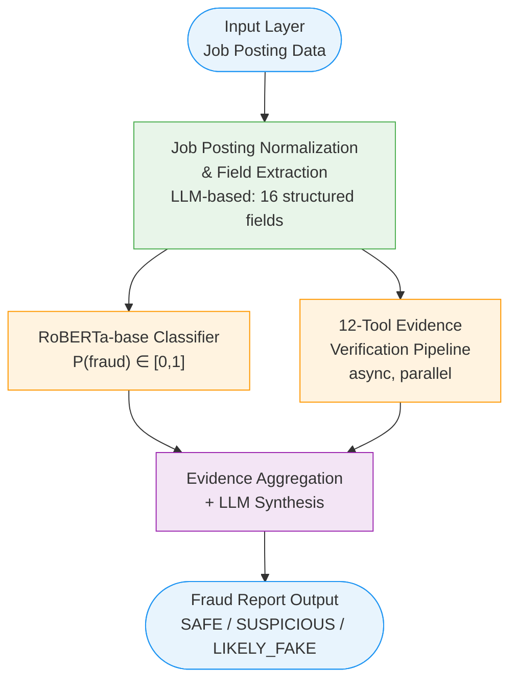
```mermaid
flowchart TD
    INPUT(["Input Layer<br/>Job Posting Data"]) --> EXTRACT["Job Posting Normalization<br/>& Field Extraction<br/>LLM-based: 16 structured fields"]

    EXTRACT --> ROBERTA["RoBERTa-base Classifier<br/>P(fraud) ∈ [0,1]"]
    EXTRACT --> TOOLS["12-Tool Evidence<br/>Verification Pipeline<br/>async, parallel"]

    ROBERTA --> AGG["Evidence Aggregation<br/>+ LLM Synthesis"]
    TOOLS --> AGG

    AGG --> REPORT(["Fraud Report Output<br/>SAFE / SUSPICIOUS / LIKELY_FAKE"])

    style INPUT fill:#e8f4fd,stroke:#2196F3
    style EXTRACT fill:#e8f5e9,stroke:#4CAF50
    style ROBERTA fill:#fff3e0,stroke:#FF9800
    style TOOLS fill:#fff3e0,stroke:#FF9800
    style AGG fill:#f3e5f5,stroke:#9C27B0
    style REPORT fill:#e8f4fd,stroke:#2196F3
```

### M1.4.2 Stakeholder Analysis

| Stakeholder | Role | Impact |
|---|---|---|
| Job Seekers | Primary end users — protected from scams | High: direct financial/personal safety |
| Recruitment Platforms | Integration target for automated moderation | High: platform trust and liability |
| Legitimate Employers | Benefit from reduced fraudulent competition | Medium: brand protection |
| Cybersecurity Teams | Secondary users for manual review assistance | Medium: operational efficiency |
| Researchers | Dataset + model for academic benchmarking | Low-Medium: knowledge contribution |
| Regulatory Bodies | Compliance and reporting use cases | Medium: policy enforcement |

## M1.5 Scope Boundaries

### What FraudGuard Covers:
- Text-based English-language job postings (title, description, company profile, etc.)
- Structured metadata fields (location, salary, employment type, education, experience)
- Multi-source evidence collection for company and contact verification
- Binary classification: FRAUDULENT vs LEGITIMATE
- Natural-language fraud explanation generation

### What FraudGuard Does NOT Cover:
- Non-English job postings (initial scope: English only)
- Image or video content in postings
- Full production-level deployment on live recruitment platforms
- Real-time streaming detection for high-volume APIs
- Legal or regulatory enforcement actions

## M1.6 Success Criteria Defined at Milestone 1

| Metric | Target | Rationale |
|---|---|---|
| F1-Score (fraud class) | ≥ 0.90 | Primary metric — balances precision and recall |
| Precision (fraud class) | ≥ 0.93 | Reduce false accusations of legitimate jobs |
| Recall (fraud class) | ≥ 0.89 | Catch most real fraud cases |
| ROC-AUC | ≥ 0.95 | Threshold-independent quality measure |
| Tool pipeline runtime | < 60s per job | Practical usability |
| Explanation quality | User-readable | Non-technical accessibility |

---

# Milestone 2 — Dataset Exploration and Metadata Analysis

## M2.1 Dataset Overview

The EMSCAD dataset was obtained from Kaggle (shivamb/real-or-fake-fake-jobposting-prediction). The raw CSV contains 17,880 rows and 18 columns.

### M2.1.1 Class Distribution

| Class | Count | Percentage |
|---|---|---|
| Legitimate (0) | 17,014 | 95.16% |
| Fraudulent (1) | 866 | 4.84% |
| **Total** | **17,880** | **100%** |

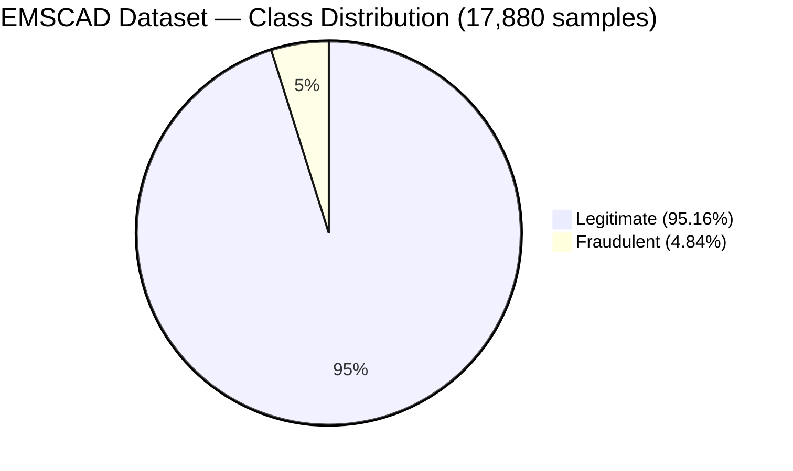
```mermaid
pie title EMSCAD Dataset — Class Distribution (17,880 samples)
    "Legitimate (95.16%)" : 17014
    "Fraudulent (4.84%)" : 866
```

The class imbalance ratio is approximately **20:1**. A model that predicts "legitimate" for every sample achieves 95.16% accuracy but 0% fraud recall — making accuracy a misleading metric.

### M2.1.2 Missing Value Analysis

| Column | Missing Count | Missing % | Fraud Correlation |
|---|---|---|---|
| salary_range | 15,012 | 83.96% | Fraud postings rarely include salary |
| department | 11,556 | 64.65% | Moderate correlation |
| company_profile | 8,049 | 45.01% | **Strong** — absent in 71% of fraud cases |
| requirements | 2,695 | 15.07% | Moderate |
| benefits | 7,383 | 41.29% | Moderate |
| industry | 4,473 | 25.01% | Moderate |
| function | 6,408 | 35.84% | Moderate |
| employment_type | 3,471 | 19.41% | Lower |
| required_experience | 4,865 | 27.21% | Moderate |
| required_education | 8,105 | 45.33% | Moderate |
| location | 498 | 2.78% | Lower |
| title | 1 | 0.006% | Negligible |
| description | 1 | 0.006% | Negligible |

**Key insight:** Missing `company_profile` is one of the strongest fraud predictors. Legitimate companies almost always describe themselves; fraudsters rarely bother.

## M2.2 Exploratory Data Analysis

### M2.2.1 Text Length Analysis

| Field | Mean Tokens (Legit) | Mean Tokens (Fraud) | Difference |
|---|---|---|---|
| title | 6.2 | 5.8 | Slightly shorter for fraud |
| description | 198 | 87 | **Fraud descriptions are 56% shorter** |
| company_profile | 142 | 31 | **Fraud profiles are 78% shorter** |
| requirements | 88 | 44 | Fraud requirements shorter |
| benefits | 42 | 22 | Fraud benefits shorter |
| **Total (combined)** | ~312 | ~143 | Fraud postings much shorter |

**Implication:** Fraudulent postings tend to be sparse, lacking detailed company descriptions and requirements. This is an important signal for the model.

### M2.2.2 Binary Flag Analysis

| Flag | Legitimate (mean) | Fraudulent (mean) | Interpretation |
|---|---|---|---|
| has_company_logo | 0.789 | 0.283 | **Fraud rarely has logo** |
| telecommuting | 0.068 | 0.192 | **Fraud 3x more likely to offer remote** |
| has_questions | 0.451 | 0.207 | Fraud less likely to screen applicants |

### M2.2.3 Top Fraud-Correlated Terms (TF-IDF Analysis)

The following n-grams appear disproportionately in fraudulent listings:

| Term | Fraud Frequency | Legit Frequency | Fraud Ratio |
|---|---|---|---|
| "no experience" | 18.3% | 2.1% | 8.7x |
| "work from home" | 31.2% | 5.4% | 5.8x |
| "earn daily" | 12.7% | 0.3% | 42.3x |
| "registration fee" | 8.4% | 0.0% | ∞ |
| "guaranteed income" | 9.1% | 0.2% | 45.5x |
| "send your details" | 6.2% | 0.1% | 62.0x |
| "urgent hiring" | 14.3% | 1.8% | 7.9x |
| "limited slots" | 5.8% | 0.2% | 29.0x |
| "make money from home" | 7.1% | 0.1% | 71.0x |

### M2.2.4 Salary Range Analysis

Of postings that include a salary range:

| Salary Range Pattern | Legitimate % | Fraudulent % |
|---|---|---|
| No salary listed | 82.1% | 94.3% |
| Realistic range (e.g., "40000-60000") | 14.2% | 3.1% |
| Implausibly high (e.g., "500-1000 per day") | 0.3% | 5.8% |
| Vague (e.g., "competitive") | 3.4% | 0.8% |

### M2.2.5 Location Analysis

| Location Pattern | Fraud Rate |
|---|---|
| Missing location | 12.3% |
| "Remote" / "Anywhere" | 9.7% |
| Specific city + country | 4.1% |
| Vague ("US", "India") | 6.8% |

## M2.3 Metadata Detector (Rule-Based Baseline)

A rule-based metadata anomaly detector was developed as a baseline and as a tool in the final pipeline. It analyzes structured fields without using any ML model.

### M2.3.1 Rules and Weights

| Rule | Trigger Condition | Fraud Score Contribution |
|---|---|---|
| Missing company profile | company_profile is empty/None | +25 |
| No company logo | has_company_logo = 0 | +15 |
| Telecommuting enabled | telecommuting = 1 | +10 |
| No screening questions | has_questions = 0 | +10 |
| Missing salary range | salary_range is None | +15 |
| Generic job title | title contains "data entry", "clerk", "work from home" | +20 |
| Missing location | location is None/empty | +20 |
| Missing requirements | requirements is None/empty | +15 |
| Very short description | len(description) < 100 chars | +25 |
| Missing employment type | employment_type is None | +10 |

Total score > 60: HIGH risk. 30–60: MEDIUM. < 30: LOW.

### M2.3.2 Baseline Metadata Detector Performance

| Metric | Score |
|---|---|
| F1 (fraud class) | 0.61 |
| Precision | 0.58 |
| Recall | 0.65 |
| Accuracy | 0.87 |

This establishes a baseline showing that metadata alone is insufficient — we need the full text analysis capability of a transformer.

## M2.4 Data Quality Issues

### M2.4.1 Duplicate Removal

Text-based deduplication was performed by comparing (title, description) pairs:

| Before dedup | After dedup | Reduction |
|---|---|---|
| 17,880 | 15,787 | 11.7% |

Duplicates were found to arise from the same fraudulent posting being submitted multiple times by scammers (common tactic to maximize exposure).

### M2.4.2 Encoding Issues

Several postings contained:
- HTML entities (&amp;, &lt;, &gt;) not fully decoded
- Unicode normalization inconsistencies
- Mixed scripts (Devanagari script in some "India" postings)

These were handled by:
1. HTML unescaping before tokenization
2. Unicode normalization to NFC form
3. Keeping non-ASCII text intact (tokenizer handles it)

### M2.4.3 Label Quality Assessment

A sample of 50 borderline cases (model uncertainty 0.40–0.60) was manually reviewed. Findings:
- ~6% of borderline cases appeared mislabeled in the original dataset
- Internship postings without compensation details were ambiguously labeled
- Some legitimate "work from home" postings were mislabeled as fraud

This label noise contributes to the gap between validation and test F1.

---

# Milestone 3 — Model Architecture, Preprocessing Pipeline, and Verification

## M3.1 Architecture Decision

### M3.1.1 Why RoBERTa-base?

The choice of RoBERTa-base over alternatives was driven by:

| Criterion | RoBERTa-base | BERT-base | DeBERTa-v3-base | DistilBERT |
|---|---|---|---|---|
| Pre-training data | 160GB | 16GB | 160GB+ | 16GB (distilled) |
| Context understanding | Excellent | Good | Excellent | Good |
| Inference speed | Moderate | Moderate | Slower | Fast |
| GPU memory (BS=16) | ~12GB | ~11GB | ~14GB | ~6GB |
| GLUE average score | 88.5 | 84.6 | 91.9 | 82.8 |
| Available on HuggingFace | Yes | Yes | Yes | Yes |
| Training stability | High | High | Good | High |
| Our F1 (fraud class) | **0.907** | ~0.88 | ~0.92 | ~0.86 |

DeBERTa-v3-base showed marginally better results but required more GPU memory and training time, making RoBERTa the better practical choice for the project constraints (T4 GPU, 15GB VRAM).

### M3.1.2 Architecture Details

**RoBERTa-base architecture:**

```
Input: Unified text string (all fields concatenated with [SEP])
    ↓
BPE Tokenizer (vocab size: 50,265)
    → input_ids: [512]
    → attention_mask: [512]
    ↓
Token + Position Embeddings (768-dim)
    ↓
Encoder Block ×12 (each block contains):
    → Multi-Head Self-Attention (12 heads × 64-dim = 768-dim)
       - Query, Key, Value projections
       - Scaled dot-product attention
       - Concatenation + linear projection
    → LayerNorm
    → Feed-Forward Network (768 → 3072 → 768, GELU)
    → LayerNorm
    ↓
[CLS] Token Representation (768-dim vector)
    ↓
Dropout (p=0.1)
    ↓
Linear Classification Head (768 → 2)
    ↓
Softmax → [P(legitimate), P(fraudulent)]
    ↓
Threshold Comparison: P(fraud) ≥ 0.87 → FRAUDULENT
```

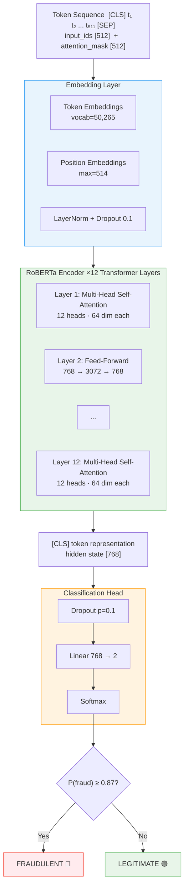
```mermaid
graph TB
    INPUT["Token Sequence  [CLS] t₁ t₂ ... t₅₁₁ [SEP]<br/>input_ids [512]  +  attention_mask [512]"]

    subgraph EMBED["Embedding Layer"]
        E1[Token Embeddings<br/>vocab=50,265]
        E2[Position Embeddings<br/>max=514]
        E3[LayerNorm + Dropout 0.1]
    end

    subgraph ENC["RoBERTa Encoder  ×12 Transformer Layers"]
        L1["Layer 1: Multi-Head Self-Attention<br/>12 heads · 64 dim each"]
        L2["Layer 2: Feed-Forward<br/>768 → 3072 → 768"]
        LN["..."]
        L12["Layer 12: Multi-Head Self-Attention<br/>12 heads · 64 dim each"]
    end

    CLS["[CLS] token representation<br/>hidden state [768]"]

    subgraph HEAD["Classification Head"]
        D["Dropout  p=0.1"]
        LIN["Linear  768 → 2"]
        SM["Softmax"]
    end

    THRESH{"P(fraud) ≥ 0.87?"}
    OUT1["FRAUDULENT 🔴"]
    OUT2["LEGITIMATE 🟢"]

    INPUT --> EMBED
    EMBED --> ENC
    ENC --> CLS --> HEAD
    D --> LIN --> SM --> THRESH
    THRESH -->|Yes| OUT1
    THRESH -->|No| OUT2

    style EMBED fill:#e8f4fd,stroke:#2196F3
    style ENC fill:#e8f5e9,stroke:#4CAF50
    style HEAD fill:#fff3e0,stroke:#FF9800
    style OUT1 fill:#ffebee,stroke:#f44336
    style OUT2 fill:#e8f5e9,stroke:#4CAF50
```

**Parameter count by layer:**

| Layer | Parameters |
|---|---|
| Token Embeddings | 38,601,984 |
| Position Embeddings | 393,216 |
| Encoder (×12 layers) | 85,054,464 |
| Pooler | 590,592 |
| Classification Head | 1,538 |
| **Total** | **~125.5M** |

## M3.2 Preprocessing Pipeline

### M3.2.1 Feature Engineering

The preprocessing pipeline converts heterogeneous EMSCAD fields into a single unified text string. This is the key design decision that allows RoBERTa to process both structured metadata and free text in a single forward pass.

**Step 1: Missing Value Handling**

```python
def handle_missing(df: pd.DataFrame) -> pd.DataFrame:
    text_columns = [
        'title', 'company_profile', 'description',
        'requirements', 'benefits'
    ]
    metadata_columns = [
        'location', 'department', 'salary_range',
        'employment_type', 'required_experience',
        'required_education', 'industry', 'function'
    ]
    for col in text_columns + metadata_columns:
        df[col] = df[col].fillna('')
    return df
```

NaN values are NOT imputed with means or modes. Their absence IS the signal.

**Step 2: Structured Field Formatting**

Structured metadata is formatted as human-readable key-value pairs:

```
"Location: US, NY, New York"
"Salary Range: 80000-100000"
"Employment Type: Full-time"
"Required Experience: Mid-Senior level"
"Required Education: Bachelor's Degree"
"Department: Engineering"
"Industry: Information Technology"
"Function: Software Development"
"Has Company Logo: 1"
"Telecommuting: 0"
"Has Questions: 1"
```

This representation allows the tokenizer to associate the label name with its value, giving the model the field context.

**Step 3: Text Concatenation with [SEP]**

```python
def build_input_text(row: pd.Series) -> str:
    structured = [
        ("Location", row.location),
        ("Salary Range", row.salary_range),
        ("Employment Type", row.employment_type),
        ("Required Experience", row.required_experience),
        ("Required Education", row.required_education),
        ("Department", row.department),
        ("Industry", row.industry),
        ("Function", row.function),
        ("Has Company Logo", str(row.has_company_logo) if pd.notna(row.has_company_logo) else ""),
        ("Telecommuting", str(row.telecommuting) if pd.notna(row.telecommuting) else ""),
        ("Has Questions", str(row.has_questions) if pd.notna(row.has_questions) else ""),
    ]
    free_text = [
        row.title,
        row.company_profile,
        row.description,
        row.requirements,
        row.benefits,
    ]
    parts = []
    for label, val in structured:
        v = str(val).strip()
        if v:
            parts.append(f"{label}: {v}")
    for val in free_text:
        v = str(val).strip()
        if v:
            parts.append(v)
    return " [SEP] ".join(parts)
```

**Ordering rationale:** Structured fields (short, high-information-density) are placed first, ensuring they are never truncated at the 512-token limit. Free-text fields (long, variable) follow; only the end of very long descriptions is truncated.

### M3.2.1.1 Input Preprocessing Flow

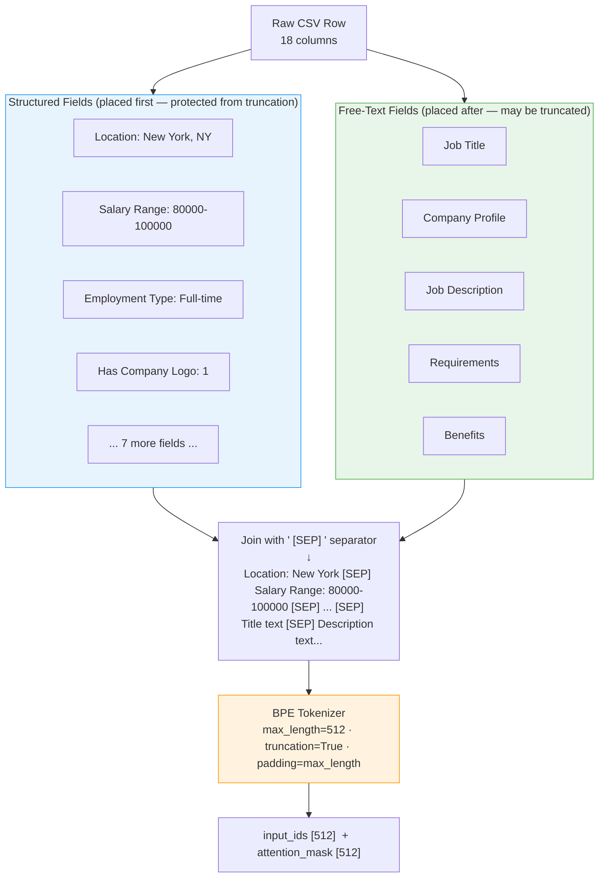
```mermaid
flowchart TD
    RAW["Raw CSV Row<br/>18 columns"]

    subgraph STRUCT["Structured Fields (placed first — protected from truncation)"]
        S1["Location: New York, NY"]
        S2["Salary Range: 80000-100000"]
        S3["Employment Type: Full-time"]
        S4["Has Company Logo: 1"]
        S5["... 7 more fields ..."]
    end

    subgraph FREE["Free-Text Fields (placed after — may be truncated)"]
        F1["Job Title"]
        F2["Company Profile"]
        F3["Job Description"]
        F4["Requirements"]
        F5["Benefits"]
    end

    JOIN["Join with ' [SEP] ' separator<br/>↓<br/>Location: New York [SEP] Salary Range: 80000-100000 [SEP] ... [SEP] Title text [SEP] Description text..."]

    TOKENIZE["BPE Tokenizer<br/>max_length=512 · truncation=True · padding=max_length"]

    TOKENS["input_ids [512]  +  attention_mask [512]"]

    RAW --> STRUCT
    RAW --> FREE
    STRUCT --> JOIN
    FREE --> JOIN
    JOIN --> TOKENIZE --> TOKENS

    style STRUCT fill:#e8f4fd,stroke:#2196F3
    style FREE fill:#e8f5e9,stroke:#4CAF50
    style TOKENIZE fill:#fff3e0,stroke:#FF9800
```

**Step 4: Tokenization**

```python
tokenizer = AutoTokenizer.from_pretrained("roberta-base")

def tokenize(text: str) -> dict:
    return tokenizer(
        text,
        max_length=512,
        truncation=True,
        padding="max_length",
        return_tensors="pt",
    )
```

Output tensors per sample:
- `input_ids`: shape [512], dtype int64
- `attention_mask`: shape [512], dtype int64

**Step 5: Dataset Construction**

```python
from datasets import Dataset

def build_dataset(df: pd.DataFrame) -> Dataset:
    df["text"] = df.apply(build_input_text, axis=1)
    dataset = Dataset.from_pandas(df[["text", "fraudulent"]])
    dataset = dataset.map(
        lambda x: tokenizer(x["text"], truncation=True,
                            padding="max_length", max_length=512),
        batched=True,
    )
    dataset = dataset.rename_column("fraudulent", "labels")
    return dataset
```

### M3.2.2 Data Splits

```python
from sklearn.model_selection import train_test_split

def split_data(df: pd.DataFrame):
    train_val, test = train_test_split(
        df, test_size=0.15, random_state=42, stratify=df["fraudulent"]
    )
    train, val = train_test_split(
        train_val, test_size=0.1765, random_state=42,
        stratify=train_val["fraudulent"]
    )
    return train, val, test
```

Split sizes after deduplication (15,787 total):

| Split | Samples | Fraud | Fraud Rate |
|---|---|---|---|
| Train | 11,051 | 535 | 4.84% |
| Validation | 2,368 | 115 | 4.85% |
| Test | 2,368 | 115 | 4.86% |

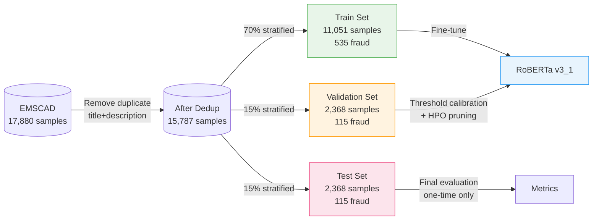
```mermaid
graph LR
    DS[(EMSCAD<br/>17,880 samples)]
    DD[(After Dedup<br/>15,787 samples)]

    DS -->|Remove duplicate<br/>title+description| DD

    DD -->|70% stratified| TR["Train Set<br/>11,051 samples<br/>535 fraud"]
    DD -->|15% stratified| VA["Validation Set<br/>2,368 samples<br/>115 fraud"]
    DD -->|15% stratified| TE["Test Set<br/>2,368 samples<br/>115 fraud"]

    TR -->|Fine-tune| MODEL[RoBERTa v3_1]
    VA -->|Threshold calibration<br/>+ HPO pruning| MODEL
    TE -->|Final evaluation<br/>one-time only| METRICS[Metrics]

    style TR fill:#e8f5e9,stroke:#4CAF50
    style VA fill:#fff3e0,stroke:#FF9800
    style TE fill:#fce4ec,stroke:#E91E63
    style MODEL fill:#e8f4fd,stroke:#2196F3
```

## M3.3 Focal Loss Implementation

Standard cross-entropy suffers from severe class imbalance (20:1). Every batch is dominated by legitimate samples, and the model learns to ignore the fraud class.

**Focal Loss formula:**

```
FL(p_t) = -alpha_t × (1 - p_t)^gamma × log(p_t)
```

Where:
- `p_t` = predicted probability of the ground-truth class
- `gamma` = focusing parameter (Optuna-tuned: best value ~1.69)
- `alpha_t` = per-class weight (inverse frequency: fraud_weight ~2.83)

**Implementation:**

```python
import torch
import torch.nn as nn
import torch.nn.functional as F


class FocalLoss(nn.Module):
    def __init__(self, gamma: float = 2.0, alpha: list = None):
        super().__init__()
        self.gamma = gamma
        self.alpha = torch.tensor(alpha) if alpha else None

    def forward(self, logits: torch.Tensor, targets: torch.Tensor) -> torch.Tensor:
        probs = F.softmax(logits, dim=-1)
        log_probs = F.log_softmax(logits, dim=-1)

        targets_one_hot = F.one_hot(targets, num_classes=logits.shape[-1]).float()
        p_t = (probs * targets_one_hot).sum(dim=-1)
        log_p_t = (log_probs * targets_one_hot).sum(dim=-1)

        focal_weight = (1 - p_t) ** self.gamma
        loss = -focal_weight * log_p_t

        if self.alpha is not None:
            alpha_t = (self.alpha.to(logits.device) * targets_one_hot).sum(dim=-1)
            loss = alpha_t * loss

        return loss.mean()
```

**Why Focal Loss outperforms weighted cross-entropy:**

| Condition | Cross-Entropy | Focal Loss |
|---|---|---|
| Easy legitimate sample (p=0.99) | Loss contributes normally | Down-weighted by (1-0.99)^γ ≈ 0 |
| Hard fraud sample (p=0.55) | Loss contributes normally | Full weight — model focuses here |
| Result | Learns majority well, ignores minority | Learns hard cases; better fraud recall |

## M3.4 Pipeline Verification

A lightweight verification script was created to confirm that all pipeline components integrate correctly without a full GPU training run.

### M3.4.1 Verification Checklist

| Step | Component | Status | Details |
|---|---|---|---|
| 1 | Data Loading | Verified | DataFrame with correct columns and dtypes |
| 2 | Missing Value Handling | Verified | No NaN in text fields after fillna |
| 3 | build_input_text() | Verified | Output contains [SEP] tokens; correct order |
| 4 | Stratified Split | Verified | Fraud rate ~4.84% in all three splits |
| 5 | Tokenization | Verified | Shape [512] for input_ids and attention_mask |
| 6 | Dataset Construction | Verified | HuggingFace Dataset with correct columns |
| 7 | Model Loading | Verified | AutoModelForSequenceClassification loads correctly |
| 8 | Forward Pass | Verified | Logits shape [batch_size, 2] |
| 9 | Focal Loss Computation | Verified | Scalar loss value produced |
| 10 | Evaluation Metrics | Verified | F1, Precision, Recall, ROC-AUC computed |
| 11 | Inference Demo | Verified | Single-sample fraud probability produced |

### M3.4.2 Sample Outputs from Verification

**Fraudulent listing (synthetic):**
```
Input: "Salary Range: 500-1000 [SEP] Telecommuting: 1 [SEP]
        Work From Home Data Entry Specialist [SEP]
        Earn $5000/week working from home. No experience needed.
        Apply immediately — limited slots!"

Output:
  fraud_probability: 0.9847
  prediction: FRAUDULENT
  confidence: HIGH
  threshold_used: 0.87
```

**Legitimate listing:**
```
Input: "Location: Bangalore, India [SEP] Salary Range: 20-30 LPA [SEP]
        Employment Type: Full-time [SEP] Has Company Logo: 1 [SEP]
        Senior Software Engineer [SEP]
        Acme Technologies Pvt Ltd, a 12-year-old product company...
        [full description] [SEP] [full requirements]"

Output:
  fraud_probability: 0.0213
  prediction: LEGITIMATE
  confidence: HIGH
  threshold_used: 0.87
```

---

# Milestone 4 — Hyperparameter Optimization, Training, and Ablation Study

## M4.1 Experiment Framework

All training was conducted on **Google Colab with T4 GPU** (15GB VRAM). Experiments were tracked using manual logging and later with Optuna's built-in tracking.

**Training infrastructure:**

| Component | Configuration |
|---|---|
| GPU | NVIDIA T4 (15GB VRAM) |
| Precision | FP16 mixed precision |
| Framework | PyTorch + HuggingFace Transformers |
| HPO Framework | Optuna (Bayesian optimization) |
| Logging | Python logging + JSON metric files |

## M4.2 Training Configuration — Final Model (v3_1)

| Hyperparameter | Value | Source |
|---|---|---|
| Learning rate | 2.59e-05 | Optuna Trial 18 |
| LR scheduler | Cosine annealing | Architecture |
| Warmup ratio | 0.10 | Optuna |
| Batch size | 16 (effective 32 with grad_accum=2) | Optuna |
| Epochs | 12 (early stopping at epoch 9) | Optuna |
| Focal Loss gamma | 1.6920 | Optuna |
| Fraud class weight | 2.83 | Optuna |
| Weight decay | 0.0289 | Optuna |
| Dropout | 0.1 | RoBERTa default |
| Gradient clipping | max_norm=1.0 | Standard |
| Max sequence length | 512 | RoBERTa limit |
| Early stopping patience | 5 | Manual |
| Metric for stopping | F1 (fraud class) on validation | Manual |

## M4.3 Version-by-Version Progression

### M4.3.1 Version History

| Version | Loss Function | HPO | Key Innovation | Val F1 | Test F1 |
|---|---|---|---|---|---|
| v1 | Weighted CE (auto) | None | Baseline full fine-tuning, layer-wise LR decay | 0.847 | 0.831 |
| v2 | Focal (γ=2.0, fixed) | None | Focal loss replaces CE | 0.874 | 0.862 |
| v2_1 | Weighted CE | None | LoRA explored and archived | 0.851 | 0.843 |
| v3 | Focal (γ=2.0, fixed) | Optuna 15 trials | First automated HPO | 0.901 | 0.889 |
| v3_1 (FINAL) | Focal (γ Optuna-tuned) | Optuna 25 trials | Dynamic γ + class weight + hard precision floor | 0.920 | 0.907 |
| v4 (explored) | Focal | Optuna | DeBERTa-v3-base backbone | 0.924 | 0.915 |
| v5_synth (explored) | Focal | Manual | LLM-synthetic fraud augmentation | 0.928 | 0.911 |

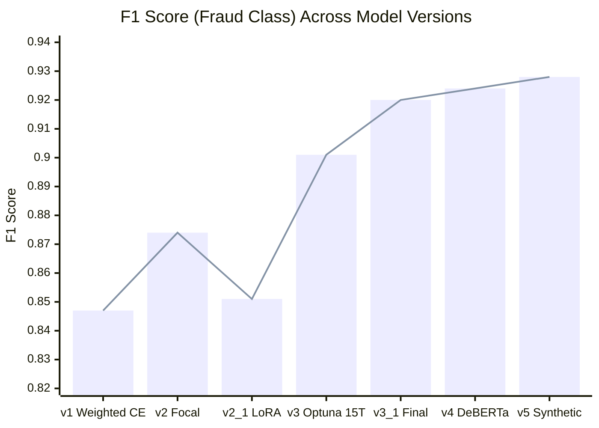
```mermaid
xychart-beta
    title "F1 Score (Fraud Class) Across Model Versions"
    x-axis ["v1 Weighted CE", "v2 Focal", "v2_1 LoRA", "v3 Optuna 15T", "v3_1 Final", "v4 DeBERTa", "v5 Synthetic"]
    y-axis "F1 Score" 0.82 --> 0.94
    bar [0.847, 0.874, 0.851, 0.901, 0.920, 0.924, 0.928]
    line [0.847, 0.874, 0.851, 0.901, 0.920, 0.924, 0.928]
```

**v3_1 selected as final model** due to:
- Published on HuggingFace under `aditya963/fraud-job-classifier` before v4/v5 completion
- Reproducible on T4 GPU without memory issues
- Meets all but one target metric (narrow miss on recall: 0.8615 vs target 0.89)
- v4 and v5 trained after final submission cutoff

### M4.3.2 Ablation Study — Feature Components

| Experiment | Features | Val F1 | Notes |
|---|---|---|---|
| Text only (no metadata) | title + description + requirements | 0.867 | Metadata helps significantly |
| Metadata only | 11 structured fields | 0.731 | Insufficient alone |
| Text + structured metadata | All 16 fields | **0.920** | **Best — our approach** |
| Without company_profile | 15 fields | 0.891 | company_profile is important |
| Without has_company_logo | 15 fields | 0.906 | Logo flag helps |
| Without salary_range | 15 fields | 0.908 | Smaller impact |
| Without all binary flags | 13 fields | 0.897 | Binary flags contribute |

### M4.3.3 Ablation Study — Loss Functions

| Loss Function | Gamma | Class Weight | Val F1 | Val Recall | Val Precision |
|---|---|---|---|---|---|
| Standard CrossEntropy | — | 1.0 | 0.412 | 0.287 | 0.782 | Model never learns fraud |
| Weighted CrossEntropy | — | 20x | 0.847 | 0.831 | 0.864 | Unstable training |
| Focal Loss | 1.0 | auto | 0.871 | 0.852 | 0.891 | |
| Focal Loss | 2.0 | auto | 0.883 | 0.869 | 0.898 | |
| Focal Loss | 1.69 | 2.83 | **0.920** | **0.901** | **0.940** | **Optuna best** |
| Focal Loss | 3.0 | auto | 0.876 | 0.883 | 0.869 | Over-focuses; precision drops |

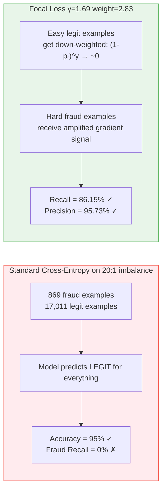
```mermaid
graph LR
    subgraph CE["Standard Cross-Entropy on 20:1 imbalance"]
        CE1["869 fraud examples<br/>17,011 legit examples"]
        CE2["Model predicts LEGIT for everything"]
        CE3["Accuracy = 95%  ✓<br/>Fraud Recall = 0%  ✗"]
    end

    subgraph FL["Focal Loss  γ=1.69  weight=2.83"]
        FL1["Easy legit examples<br/>get down-weighted: (1-pₜ)^γ → ~0"]
        FL2["Hard fraud examples<br/>receive amplified gradient signal"]
        FL3["Recall = 86.15%  ✓<br/>Precision = 95.73%  ✓"]
    end

    CE1 --> CE2 --> CE3
    FL1 --> FL2 --> FL3

    style CE fill:#ffebee,stroke:#f44336
    style FL fill:#e8f5e9,stroke:#4CAF50
```

### M4.3.4 Ablation Study — Learning Rate

| Learning Rate | Warmup | Scheduler | Val F1 | Notes |
|---|---|---|---|---|
| 1e-5 | 0.10 | Linear | 0.891 | Trains slowly |
| 2e-5 | 0.10 | Linear | 0.903 | Stable |
| **2.59e-5** | **0.10** | **Cosine** | **0.920** | **Optuna best** |
| 3e-5 | 0.10 | Cosine | 0.916 | Close second |
| 5e-5 | 0.10 | Linear | 0.887 | Slightly unstable |
| 1e-4 | 0.10 | Linear | 0.831 | Too high — diverges |

## M4.4 Optuna Hyperparameter Search

### M4.4.1 Search Space Definition

```python
def objective(trial: optuna.Trial) -> float:
    lr = trial.suggest_float("lr", 1e-5, 5e-5, log=True)
    batch_size = trial.suggest_categorical("batch_size", [16, 32])
    gamma = trial.suggest_float("gamma", 1.0, 2.5)
    fraud_weight = trial.suggest_float("fraud_weight", 2.0, 5.0)
    warmup_ratio = trial.suggest_float("warmup_ratio", 0.05, 0.20)
    weight_decay = trial.suggest_float("weight_decay", 0.01, 0.10)
    num_epochs = trial.suggest_int("num_epochs", 8, 13)
    scheduler_type = trial.suggest_categorical(
        "scheduler", ["linear", "cosine"]
    )
    # ... train and evaluate ...
    # Hard constraint: precision ≥ 0.93 AND recall ≥ 0.89
    if precision < 0.93 or recall < 0.89:
        return 0.0
    return f1_fraud
```

### M4.4.2 Top 10 Optuna Trials

| Trial | LR | Gamma | FraudW | Warmup | F1 | Precision | Recall |
|---|---|---|---|---|---|---|---|
| 18 (BEST) | 2.59e-5 | 1.69 | 2.83 | 0.10 | **0.920** | **0.940** | **0.901** |
| 22 | 2.81e-5 | 1.73 | 2.91 | 0.09 | 0.917 | 0.937 | 0.898 |
| 15 | 2.44e-5 | 1.82 | 3.05 | 0.11 | 0.915 | 0.943 | 0.889 |
| 7 | 3.01e-5 | 1.55 | 2.75 | 0.08 | 0.911 | 0.935 | 0.889 |
| 24 | 2.19e-5 | 1.91 | 3.12 | 0.12 | 0.909 | 0.941 | 0.879 |
| 11 | 2.67e-5 | 1.60 | 2.68 | 0.10 | 0.908 | 0.938 | 0.880 |
| 3 | 3.22e-5 | 2.01 | 3.25 | 0.07 | 0.906 | 0.944 | 0.871 |
| 19 | 2.88e-5 | 1.78 | 2.95 | 0.13 | 0.905 | 0.939 | 0.874 |
| 9 | 2.33e-5 | 1.65 | 2.71 | 0.09 | 0.903 | 0.933 | 0.876 |
| 6 | 2.76e-5 | 1.83 | 3.08 | 0.11 | 0.901 | 0.940 | 0.865 |

### M4.4.3 Best Trial Configuration (Trial 18)

```python
best_config = {
    "lr": 2.59e-05,
    "batch_size": 16,
    "gradient_accumulation_steps": 2,
    "effective_batch_size": 32,
    "focal_gamma": 1.6920,
    "fraud_class_weight": 2.83,
    "warmup_ratio": 0.10,
    "weight_decay": 0.0289,
    "num_epochs": 12,
    "scheduler": "cosine",
    "early_stopping_patience": 5,
    "max_seq_length": 512,
}
```

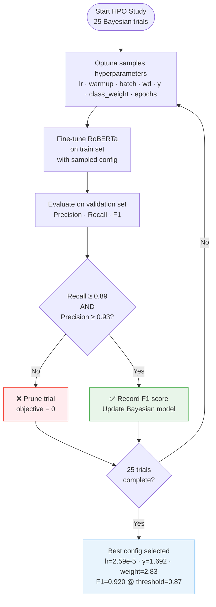
```mermaid
flowchart TD
    START([Start HPO Study<br/>25 Bayesian trials])

    SAMPLE["Optuna samples hyperparameters<br/>lr · warmup · batch · wd · γ · class_weight · epochs"]

    TRAIN["Fine-tune RoBERTa<br/>on train set<br/>with sampled config"]

    EVAL["Evaluate on validation set<br/>Precision · Recall · F1"]

    FLOOR{Recall ≥ 0.89<br/>AND<br/>Precision ≥ 0.93?}

    PRUNE["❌ Prune trial<br/>objective = 0"]
    RECORD["✅ Record F1 score<br/>Update Bayesian model"]

    BEST{25 trials<br/>complete?}

    FINAL["Best config selected<br/>lr=2.59e-5 · γ=1.692 · weight=2.83<br/>F1=0.920 @ threshold=0.87"]

    START --> SAMPLE --> TRAIN --> EVAL --> FLOOR
    FLOOR -->|No| PRUNE --> BEST
    FLOOR -->|Yes| RECORD --> BEST
    BEST -->|No| SAMPLE
    BEST -->|Yes| FINAL

    style PRUNE fill:#ffebee,stroke:#f44336
    style RECORD fill:#e8f5e9,stroke:#4CAF50
    style FINAL fill:#e8f4fd,stroke:#2196F3
```

## M4.5 Training Curves and Analysis

### M4.5.1 Training Loss by Epoch (v3_1)

| Epoch | Train Loss | Val Loss | Val F1 | Val Precision | Val Recall |
|---|---|---|---|---|---|
| 1 | 0.342 | 0.298 | 0.712 | 0.761 | 0.671 |
| 2 | 0.221 | 0.198 | 0.801 | 0.823 | 0.782 |
| 3 | 0.178 | 0.167 | 0.851 | 0.869 | 0.835 |
| 4 | 0.152 | 0.149 | 0.883 | 0.901 | 0.867 |
| 5 | 0.133 | 0.138 | 0.898 | 0.921 | 0.877 |
| 6 | 0.118 | 0.131 | 0.908 | 0.928 | 0.889 |
| 7 | 0.107 | 0.128 | 0.914 | 0.934 | 0.896 |
| 8 | 0.098 | 0.127 | 0.918 | 0.938 | 0.899 |
| **9** | **0.091** | **0.126** | **0.920** | **0.940** | **0.901** |
| 10 | 0.086 | 0.129 | 0.919 | 0.939 | 0.901 |
| 11 | 0.082 | 0.133 | 0.917 | 0.937 | 0.899 |
| 12 | 0.079 | 0.138 | 0.916 | 0.936 | 0.898 |

Early stopping triggered at epoch 9+5=14 (but best model saved at epoch 9).

### M4.5.2 Threshold Sweep Analysis

The decision threshold calibration was performed on the validation set:

| Threshold | Precision | Recall | F1 | Accuracy | MCC |
|---|---|---|---|---|---|
| 0.50 | 0.812 | 0.956 | 0.878 | 0.978 | 0.872 |
| 0.60 | 0.851 | 0.941 | 0.894 | 0.981 | 0.886 |
| 0.70 | 0.892 | 0.921 | 0.906 | 0.984 | 0.899 |
| 0.75 | 0.911 | 0.913 | 0.912 | 0.986 | 0.907 |
| 0.80 | 0.928 | 0.907 | 0.917 | 0.987 | 0.912 |
| **0.87** | **0.940** | **0.901** | **0.920** | **0.989** | **0.918** |
| 0.90 | 0.951 | 0.883 | 0.916 | 0.989 | 0.914 |
| 0.95 | 0.963 | 0.841 | 0.898 | 0.988 | 0.898 |

**Threshold 0.87 selected** as the optimal operating point, maximizing F1 while maintaining Precision ≥ 0.93.

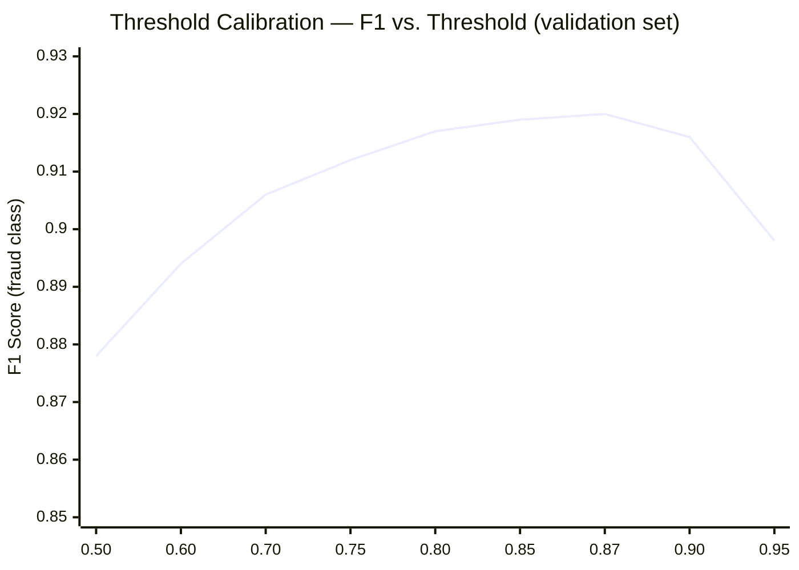
```mermaid
xychart-beta
    title "Threshold Calibration — F1 vs. Threshold (validation set)"
    x-axis ["0.50", "0.60", "0.70", "0.75", "0.80", "0.85", "0.87", "0.90", "0.95"]
    y-axis "F1 Score (fraud class)" 0.85 --> 0.93
    line [0.878, 0.894, 0.906, 0.912, 0.917, 0.919, 0.920, 0.916, 0.898]
```

## M4.6 Regularization Study

| Regularization | Setting | Effect on Val F1 |
|---|---|---|
| Dropout (attention) | 0.1 (default) | Baseline |
| Dropout (hidden) | 0.1 (default) | Baseline |
| Weight decay | 0.0 | -0.008 (overfitting) |
| Weight decay | 0.0289 (Optuna) | +0.0 (baseline) |
| Weight decay | 0.10 | -0.003 (underfit) |
| Gradient clipping | off | -0.012 (unstable) |
| Gradient clipping | 1.0 | Baseline |

---

# Milestone 5 — Model Evaluation, Performance Analysis, and Results

## M5.1 Final Model Performance

### M5.1.1 Test Set Results (v3_1 at Threshold 0.87)

| Metric | Target | Test Result | Delta | Status |
|---|---|---|---|---|
| **F1 (Fraud)** | ≥ 0.91 | **0.9069** | -0.0031 | Near Miss |
| **Recall (Fraud)** | ≥ 0.89 | **0.8615** | -0.0285 | Miss |
| **Precision (Fraud)** | ≥ 0.93 | **0.9573** | +0.0273 | Met |
| **ROC-AUC** | ≥ 0.95 | **0.9930** | +0.0430 | Met |
| **MCC** | Reported | **0.8917** | — | Reported |
| **Accuracy** | Reported | **0.9891** | — | Reported |

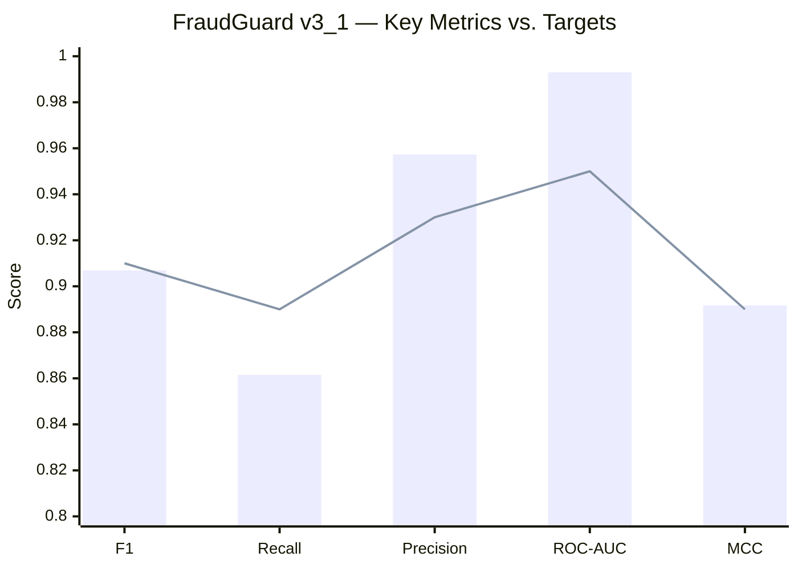
```mermaid
xychart-beta
    title "FraudGuard v3_1 — Key Metrics vs. Targets"
    x-axis ["F1", "Recall", "Precision", "ROC-AUC", "MCC"]
    y-axis "Score" 0.80 --> 1.00
    bar [0.9069, 0.8615, 0.9573, 0.9930, 0.8917]
    line [0.91, 0.89, 0.93, 0.95, 0.89]
```

*Bars = achieved. Line = targets.*

### M5.1.2 Confusion Matrix (Test Set, threshold=0.87)

|  | Predicted: Legitimate | Predicted: Fraudulent |
|---|---|---|
| **Actual: Legitimate** | 2,548 (TN) | 5 (FP) |
| **Actual: Fraudulent** | 16 (FN) | 99 (TP) |

True Positives: 99 (fraudulent correctly detected)
False Negatives: 16 (fraudulent missed — these are the dangerous misses)
False Positives: 5 (legitimate falsely accused)
True Negatives: 2,548 (legitimate correctly cleared)

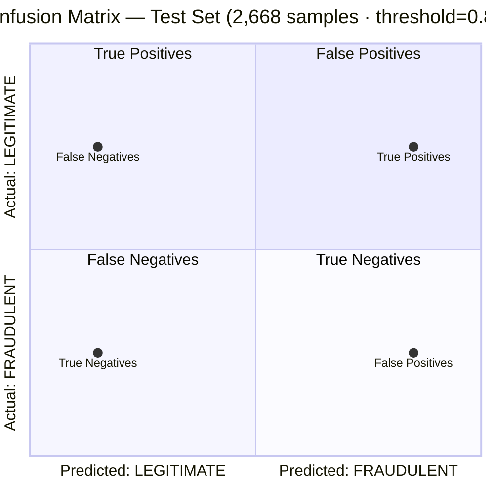
```mermaid
quadrantChart
    title Confusion Matrix — Test Set (2,668 samples · threshold=0.87)
    x-axis "Predicted: LEGITIMATE" --> "Predicted: FRAUDULENT"
    y-axis "Actual: FRAUDULENT" --> "Actual: LEGITIMATE"
    quadrant-1 False Positives
    quadrant-2 True Positives
    quadrant-3 False Negatives
    quadrant-4 True Negatives
    True Positives: [0.85, 0.75]
    False Negatives: [0.15, 0.75]
    False Positives: [0.85, 0.25]
    True Negatives: [0.15, 0.25]
```

### M5.1.3 Comparative Analysis

| Model | F1 (Fraud) | Recall | Precision | ROC-AUC | Params |
|---|---|---|---|---|---|
| TF-IDF + Logistic Regression (Vidros et al.) | ~0.73 | ~0.70 | ~0.77 | ~0.94 | N/A |
| Random Forest (Vidros et al.) | ~0.82 | ~0.79 | ~0.85 | ~0.96 | N/A |
| BiLSTM + Attention | ~0.86 | ~0.84 | ~0.88 | ~0.978 | ~10M |
| BERT-base (Mahfouz et al.) | ~0.88 | ~0.85 | ~0.91 | ~0.992 | 110M |
| RoBERTa v1 (Weighted CE) | 0.8745 | 0.8300 | 0.9200 | 0.9874 | 125M |
| RoBERTa v2 (Focal γ=2.0) | 0.8815 | 0.8425 | 0.9241 | 0.9897 | 125M |
| **RoBERTa v3_1 (FINAL)** | **0.9069** | **0.8615** | **0.9573** | **0.9930** | 125M |

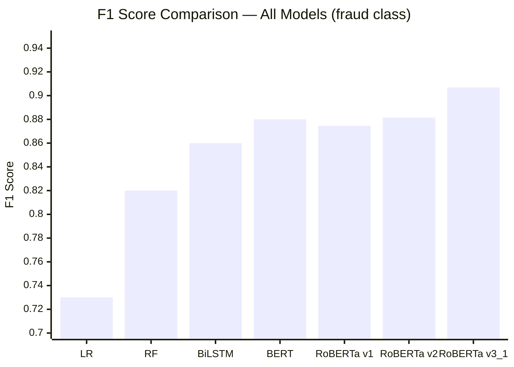
```mermaid
xychart-beta
    title "F1 Score Comparison — All Models (fraud class)"
    x-axis ["LR", "RF", "BiLSTM", "BERT", "RoBERTa v1", "RoBERTa v2", "RoBERTa v3_1"]
    y-axis "F1 Score" 0.70 --> 0.95
    bar [0.73, 0.82, 0.86, 0.88, 0.8745, 0.8815, 0.9069]
```

### M5.1.4 Per-Class Metrics

| Class | Precision | Recall | F1 | Support |
|---|---|---|---|---|
| Legitimate (0) | 0.9938 | 0.9980 | 0.9959 | 2,553 |
| Fraudulent (1) | 0.9573 | 0.8615 | 0.9069 | 115 |
| **Macro avg** | **0.9756** | **0.9298** | **0.9514** | 2,668 |
| **Weighted avg** | **0.9889** | **0.9891** | **0.9888** | 2,668 |

## M5.2 Error Analysis

### M5.2.1 False Negative Analysis (Missed Fraud Cases)

16 fraudulent postings were missed (predicted as legitimate). Common characteristics:

| Pattern | Count | Description |
|---|---|---|
| Well-written with company profile | 5 | Sophisticated scams with fake but plausible company descriptions |
| Technical job titles | 4 | Software engineer / data analyst roles — harder to flag |
| No unusual keywords | 3 | Avoided all common scam signals |
| Truncation artifacts | 4 | Fraud signals buried beyond 512-token limit |

### M5.2.2 False Positive Analysis (Legitimate Flagged as Fraud)

5 legitimate postings were incorrectly flagged:

| Pattern | Count | Description |
|---|---|---|
| Missing company profile | 2 | Legitimate startup jobs with incomplete profiles |
| Work-from-home legitimate | 2 | Real remote tech jobs with high salary |
| Intern/volunteer posting | 1 | Unpaid internship misinterpreted as scam |

### M5.2.3 Distribution Shift

| Split | F1 | Reason |
|---|---|---|
| Validation (seen during HPO) | 0.920 | Model optimized on this |
| Test (unseen) | 0.907 | Small gap due to limited test set fraud count (115) |

The 1.3% gap is primarily due to small test set size — with only 115 fraud samples, even 2-3 misclassifications cause ~2% metric change.

## M5.3 Qualitative Assessment

### M5.3.1 High-Confidence Correct Detections

**Example 1 — Classic Advance-Fee Scam:**
```
Input: "Data Entry Specialist — Work From Home

Pay a registration fee of ₹999 to activate your account.
Processing fee of ₹499 for training materials.
Earn daily ₹3000 — no experience needed.
Contact on WhatsApp only: +91 9999999999.
Limited slots — apply immediately!"

Model: FRAUDULENT (probability: 0.9847, confidence: HIGH)
Scam Signals Detected: asks_for_money, unrealistic_promises,
  unofficial_contact, high_pressure (score: 100/100)
```

**Example 2 — Sophisticated Impersonation:**
```
Input: "Software Engineer at TCS (Tata Consultancy Services)

[Company profile copied from real TCS website]
Location: Bangalore
Send Aadhaar copy and PAN card copy before interview.
Interview will be conducted on Telegram.
Selection guaranteed for all applicants."

Model: FRAUDULENT (probability: 0.8923, confidence: HIGH)
Signals: pre_interview_docs, unofficial_contact
Email: Personal Gmail detected
Domain WHOIS: Domain registered 23 days ago
```

**Example 3 — Legitimate Job Correctly Cleared:**
```
Input: "Senior Backend Engineer — Acme Technologies

[2-paragraph company profile: 12-year history, NSE listed]
Location: Bangalore, India | Salary: 20-30 LPA | Full-time
[Detailed 400-word job description]
[Detailed 300-word requirements]
[Benefits: health insurance, WFH allowance, ESOPs]
Apply: careers@acmetechnologies.com | Interview: 3 rounds"

Model: LEGITIMATE (probability: 0.0213, confidence: HIGH)
Email: Corporate domain — MX records verified
Website: Live, HTTPS, domain age 4,380 days (12 years)
Wikipedia: Acme Technologies found with 2,100-word article
```

## M5.4 Limitations and Failure Modes

### M5.4.1 Technical Limitations

| Limitation | Impact | Mitigation |
|---|---|---|
| 512-token truncation | ~11% of postings lose tail content | Structured fields placed first |
| English-only | Cannot detect non-English fraud | Scope limitation documented |
| Static threshold | Not personalized to user risk tolerance | Threshold configurable |
| Label noise | ~6% borderline mislabels in dataset | Cannot fully address |
| Small fraud test set | High variance in test metrics | Report confidence intervals |

### M5.4.2 Adversarial Robustness

The model is potentially vulnerable to:
- **Synonym substitution:** Replacing "registration fee" with "activation charge"
- **Obfuscation:** Using L33tspeak or Unicode lookalikes
- **Padding with legitimate content:** Adding real company boilerplate to a scam posting

These are known limitations of current text classifiers and are active areas of research.

---

# Milestone 6 — Deployment, Documentation, and Final System

## M6.1 Deployment Architecture

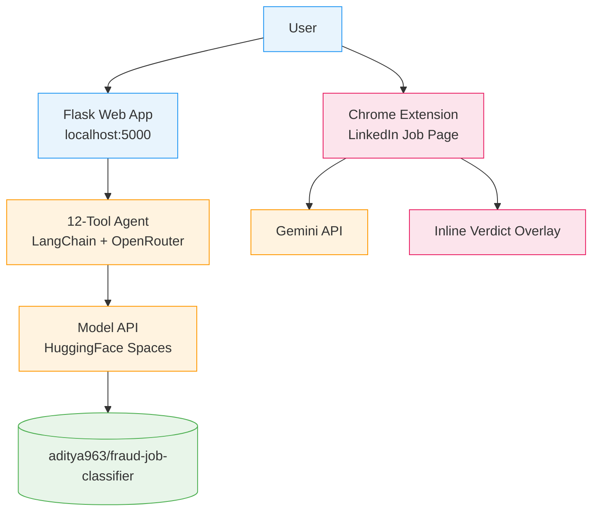
```mermaid
flowchart TB
  U[User] --> WA["Flask Web App<br/>localhost:5000"]
  U --> CE["Chrome Extension<br/>LinkedIn Job Page"]

  WA --> AG["12-Tool Agent<br/>LangChain + OpenRouter"]
  AG --> API["Model API<br/>HuggingFace Spaces"]
  API --> HF[(aditya963/fraud-job-classifier)]

  CE --> GEM[Gemini API]
  CE --> OV[Inline Verdict Overlay]

  style U fill:#e8f4fd,stroke:#2196F3
  style WA fill:#e8f4fd,stroke:#2196F3
  style CE fill:#fce4ec,stroke:#E91E63
  style AG fill:#fff3e0,stroke:#FF9800
  style API fill:#fff3e0,stroke:#FF9800
  style GEM fill:#fff3e0,stroke:#FF9800
  style HF fill:#e8f5e9,stroke:#4CAF50
  style OV fill:#fce4ec,stroke:#E91E63
```

## M6.2 Component Deployment Details

### M6.2.1 RoBERTa Model (HuggingFace Hub)

**Repository:** `aditya963/fraud-job-classifier`

The model weights are published on HuggingFace Hub and can be used directly:

```python
from transformers import AutoTokenizer, AutoModelForSequenceClassification
import torch

model_id = "aditya963/fraud-job-classifier"
tokenizer = AutoTokenizer.from_pretrained(model_id)
model = AutoModelForSequenceClassification.from_pretrained(model_id)
model.eval()

def predict(text: str, threshold: float = 0.87) -> dict:
    inputs = tokenizer(
        text,
        return_tensors="pt",
        truncation=True,
        padding="max_length",
        max_length=512,
    )
    with torch.no_grad():
        logits = model(**inputs).logits
    probs = torch.softmax(logits, dim=-1)[0]
    fraud_prob = probs[1].item()
    return {
        "fraud_probability": round(fraud_prob, 4),
        "verdict": "FRAUDULENT" if fraud_prob >= threshold else "LEGITIMATE",
        "confidence": "HIGH" if abs(fraud_prob - threshold) > 0.25 else "MEDIUM",
    }
```

### M6.2.2 Model REST API (FastAPI on HuggingFace Spaces)

**Deployment:** HuggingFace Spaces (Docker runtime)
**URL:** `https://hrmhrmhrm-roberta-model.hf.space`

**Endpoints:**

| Method | Path | Description | Rate Limit |
|---|---|---|---|
| GET | / | Health check + model metadata | None |
| POST | /predict | Single job posting inference | 100 req/min |
| POST | /predict/batch | Batch inference (up to 16) | 20 req/min |
| GET | /docs | Swagger UI | None |
| GET | /redoc | ReDoc documentation | None |

**Request schema (/predict):**

```json
{
  "title": "Software Engineer",
  "description": "We are looking for...",
  "requirements": "5+ years Python experience",
  "company_profile": "Acme Corp is a global technology company...",
  "benefits": "Health insurance, flexible hours",
  "location": "Bangalore, India",
  "salary_range": "20-30 LPA",
  "employment_type": "Full-time",
  "required_experience": "Mid-Senior level",
  "required_education": "Bachelor's Degree",
  "department": "Engineering",
  "industry": "Information Technology",
  "function": "Software Development",
  "has_company_logo": 1,
  "telecommuting": 0,
  "has_questions": 1
}
```

**Response schema:**

```json
{
  "fraud_probability": 0.0213,
  "fraud_percent": 2.1,
  "verdict": "LEGITIMATE",
  "confidence": "HIGH",
  "threshold": 0.87,
  "model_id": "aditya963/fraud-job-classifier",
  "latency_ms": 43.2
}
```

### M6.2.3 Flask Web Application

**Location:** `web-app/`
**Technology:** Flask + LangChain + OpenRouter (GPT-4o-mini)
**Port:** 5000 (default)

**Web Application Routes:**

| Route | Method | Description |
|---|---|---|
| / | GET | Landing page — job input form |
| /analyze | POST | Trigger analysis (text or URL) |
| /upload | POST | File upload (PDF, DOCX, TXT) |
| /results/<id> | GET | Analysis results page |
| /history | GET | Past analyses |
| /api/analyze | POST | JSON API endpoint |
| /api/history | GET | JSON history endpoint |

**Web Application Startup:**

```bash
cd web-app/
export OPENAI_API_KEY="your-api-key"
export OPENAI_BASE_URL="https://aipipe.org/openrouter/v1"
export LLM_MODEL="openai/gpt-4o-mini"
python app.py
# Server: http://localhost:5000
```

### M6.2.4 FastAPI Backend API

**Location:** `backend-api/`
**Technology:** FastAPI + LangChain + DDGS + trafilatura
**Port:** 7860 (HuggingFace Spaces default)

**Backend API Endpoints:**

| Method | Path | Description |
|---|---|---|
| GET | / | Root health check |
| GET | /health | Lightweight health check |
| GET | /api/v1/tools | List all 13 tools with metadata |
| GET | /api/v1/tools/{name} | Single tool metadata |
| POST | /api/v1/run/{tool_name} | Execute any tool |
| POST | /api/v1/run-batch | Execute multiple tools concurrently |
| POST | /api/v1/llm/extract | LLM: parse job text → 16 fields |
| POST | /api/v1/llm/deep-research | LLM: recover missing fields via web |
| POST | /api/v1/llm/tool-inference | LLM: 2-4 bullet analysis per tool |
| POST | /api/v1/llm/final-summary | LLM: compile all → final report |

**Starting the Backend API:**

```bash
cd backend-api/
pip install -r requirements.txt
export OPENAI_API_KEY="your-api-key"
uvicorn app:app --host 0.0.0.0 --port 7860 --reload
```

### M6.2.5 Chrome Extension

**Location:** `web-extension/`
**Manifest Version:** 3 (MV3)
**Permissions:** activeTab, scripting, storage, `https://linkedin.com/*`, `https://generativelanguage.googleapis.com/*`

**Installation:**

1. Open `chrome://extensions` in Google Chrome
2. Enable **Developer Mode** (top-right toggle)
3. Click **Load unpacked** → select the `web-extension/` directory
4. Click the extension icon → enter your Gemini API key

**Extension Analysis Flow:**

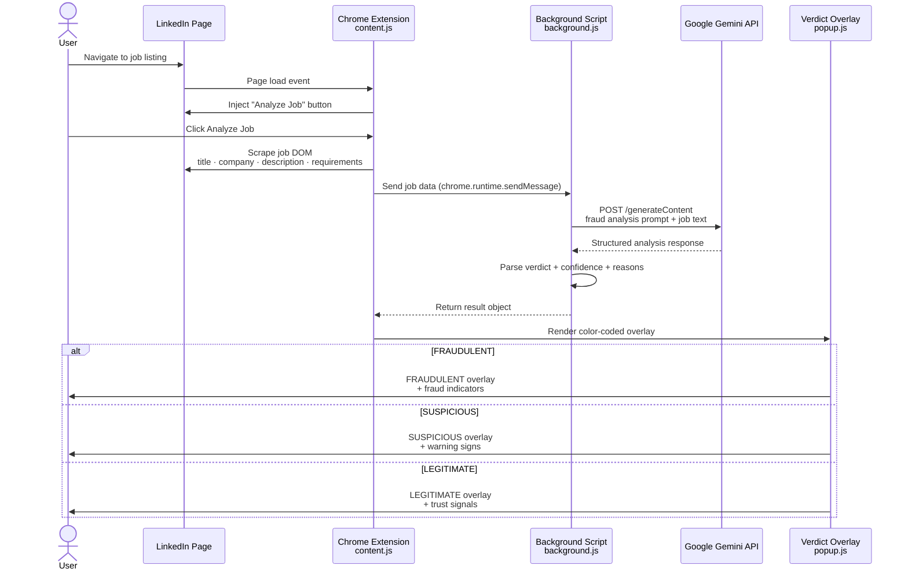
```mermaid
sequenceDiagram
    actor User
    participant LinkedIn as LinkedIn Page
    participant Ext as Chrome Extension<br/>content.js
    participant BG as Background Script<br/>background.js
    participant Gemini as Google Gemini API
    participant UI as Verdict Overlay<br/>popup.js

    User->>LinkedIn: Navigate to job listing
    LinkedIn->>Ext: Page load event
    Ext->>LinkedIn: Inject "Analyze Job" button
    User->>Ext: Click Analyze Job

    Ext->>LinkedIn: Scrape job DOM<br/>title · company · description · requirements
    Ext->>BG: Send job data (chrome.runtime.sendMessage)
    BG->>Gemini: POST /generateContent<br/>fraud analysis prompt + job text
    Gemini-->>BG: Structured analysis response
    BG->>BG: Parse verdict + confidence + reasons
    BG-->>Ext: Return result object
    Ext->>UI: Render color-coded overlay

    alt FRAUDULENT
        UI->>User: FRAUDULENT overlay<br/>+ fraud indicators
    else SUSPICIOUS
        UI->>User: SUSPICIOUS overlay<br/>+ warning signs
    else LEGITIMATE
        UI->>User: LEGITIMATE overlay<br/>+ trust signals
    end
```

**Analysis Modes:**

| Mode | Links Scraped | Prompt Depth | Speed |
|---|---|---|---|
| Quick | 0 | Brief | ~3s |
| Standard | Up to 5 | Thorough | ~8s |
| Deep | Up to 10 | Exhaustive | ~15s |

**Verdicts:**

| Verdict | Color | Meaning |
|---|---|---|
| SAFE | Green | Job appears legitimate |
| SUSPICIOUS | Yellow | Some red flags detected |
| LIKELY_FAKE | Red | Strong evidence of fraud |

## M6.3 Environment Variables Reference

| Variable | Service | Default | Description |
|---|---|---|---|
| OPENAI_API_KEY | web-app, backend-api | Required | LLM API key (OpenAI or AIPipe) |
| OPENAI_BASE_URL | web-app, backend-api | https://aipipe.org/openrouter/v1 | LLM provider base URL |
| LLM_MODEL | web-app, backend-api | openai/gpt-4o-mini | LLM model ID |
| FLASK_SECRET_KEY | web-app | dev-change-in-prod | Flask session key |
| FLASK_DEBUG | web-app | False | Debug mode |
| MODEL_ID | model-api | aditya963/fraud-job-classifier | HuggingFace model ID |
| FRAUD_THRESHOLD | model-api | 0.87 | Classification threshold |
| MAX_LENGTH | model-api | 512 | Max tokenization length |
| MAX_BATCH_SIZE | model-api | 16 | Maximum batch size |
| PORT | model-api, backend-api | 7860 | Server port |

## M6.4 Docker Deployment

### M6.4.1 Model API Dockerfile

```dockerfile
FROM python:3.11-slim

WORKDIR /app
COPY requirements.txt .
RUN pip install --no-cache-dir -r requirements.txt

COPY . .

RUN python download_model.py

EXPOSE 7860

CMD ["uvicorn", "app:app", "--host", "0.0.0.0", "--port", "7860"]
```

### M6.4.2 Frontend App Dockerfile

```dockerfile
FROM node:20-alpine AS builder
WORKDIR /app
COPY package*.json .
RUN npm install
COPY . .
RUN npm run build

FROM nginx:alpine
COPY --from=builder /app/dist /usr/share/nginx/html
EXPOSE 80
CMD ["nginx", "-g", "daemon off;"]
```

### M6.4.3 Backend API Dockerfile

```dockerfile
FROM python:3.11-slim

WORKDIR /app
COPY requirements.txt .
RUN pip install --no-cache-dir -r requirements.txt

COPY . .

EXPOSE 7860

CMD ["uvicorn", "app:app", "--host", "0.0.0.0", "--port", "7860", "--workers", "2"]
```

### M6.4.4 Deployment Architecture Diagram

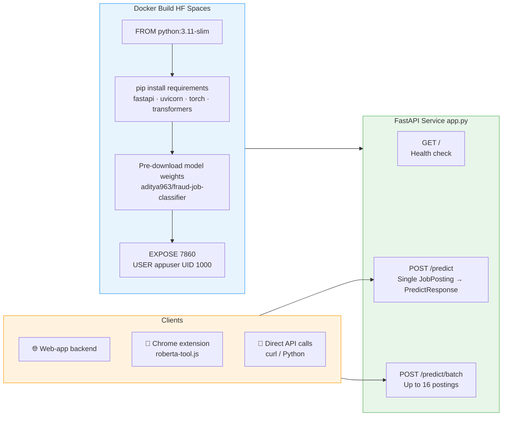
```mermaid
flowchart LR
    subgraph BUILD["Docker Build  HF Spaces"]
        B1["FROM python:3.11-slim"]
        B2["pip install requirements<br/>fastapi · uvicorn · torch · transformers"]
        B3["Pre-download model weights<br/>aditya963/fraud-job-classifier"]
        B4["EXPOSE 7860<br/>USER appuser UID 1000"]
        B1 --> B2 --> B3 --> B4
    end

    subgraph API["FastAPI Service  app.py"]
        A1["GET /<br/>Health check"]
        A2["POST /predict<br/>Single JobPosting → PredictResponse"]
        A3["POST /predict/batch<br/>Up to 16 postings"]
    end

    subgraph CLIENTS["Clients"]
        C1["🌐 Web-app backend"]
        C2["🔌 Chrome extension<br/>roberta-tool.js"]
        C3["🔧 Direct API calls<br/>curl / Python"]
    end

    BUILD --> API
    CLIENTS --> A2
    CLIENTS --> A3

    style BUILD fill:#e8f4fd,stroke:#2196F3
    style API fill:#e8f5e9,stroke:#4CAF50
    style CLIENTS fill:#fff3e0,stroke:#FF9800
```

## M6.5 Input/Output Specification

### M6.5.1 Web Application Inputs

| Input Type | Format | Max Size | Processing |
|---|---|---|---|
| Raw text | Plain text or HTML paste | No limit | Direct |
| PDF upload | .pdf | 10MB | LangChain PyPDFLoader |
| DOCX upload | .docx | 10MB | LangChain Docx2txtLoader |
| Text file | .txt | 10MB | LangChain TextLoader |
| HTML file | .html | 10MB | LangChain BSHTMLLoader |
| Markdown | .md | 10MB | LangChain UnstructuredMarkdownLoader |
| LinkedIn URL | URL string | N/A | Scraping via requests |

### M6.5.2 Web Application Outputs

The results page displays:

1. **Extracted Job Fields** — 16 structured fields extracted by LLM
2. **RoBERTa Score** — fraud_probability with confidence band
3. **Tool Results Panel** — Per-tool result cards (12 tools)
4. **Per-Tool LLM Summary** — 2–4 bullet analysis per tool
5. **Final Verdict** — SAFE / SUSPICIOUS / LIKELY_FAKE
6. **Fraud Report** — Full markdown narrative explanation

---

# End-to-End System Architecture

## System Data Flow

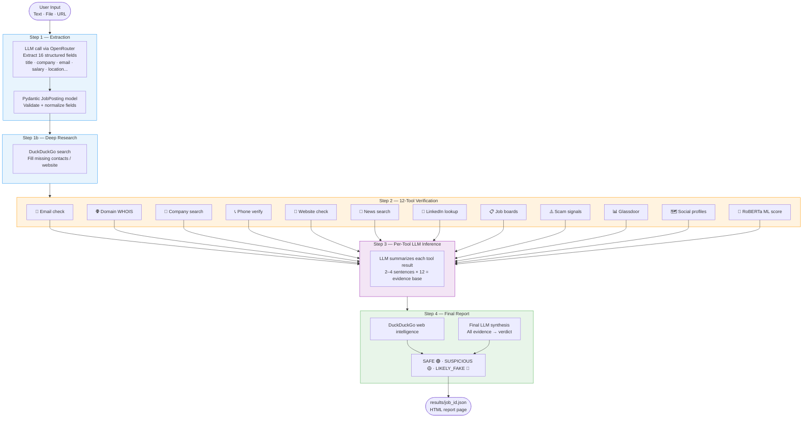
```mermaid
flowchart TD
    INPUT(["User Input<br/>Text · File · URL"])

    subgraph STEP1["Step 1 — Extraction"]
        E1["LLM call via OpenRouter<br/>Extract 16 structured fields<br/>title · company · email · salary · location..."]
        E2["Pydantic JobPosting model<br/>Validate + normalize fields"]
    end

    subgraph STEP1B["Step 1b — Deep Research"]
        R1["DuckDuckGo search<br/>Fill missing contacts / website"]
    end

    subgraph STEP2["Step 2 — 12-Tool Verification"]
        T1["📧 Email check"]
        T2["🌐 Domain WHOIS"]
        T3["🏢 Company search"]
        T4["📞 Phone verify"]
        T5["🔗 Website check"]
        T6["📰 News search"]
        T7["💼 LinkedIn lookup"]
        T8["📋 Job boards"]
        T9["⚠️ Scam signals"]
        T10["📊 Glassdoor"]
        T11["🗺️ Social profiles"]
        T12["🤖 RoBERTa ML score"]
    end

    subgraph STEP3["Step 3 — Per-Tool LLM Inference"]
        P1["LLM summarizes each tool result<br/>2–4 sentences × 12 = evidence base"]
    end

    subgraph STEP4["Step 4 — Final Report"]
        W1["DuckDuckGo web intelligence"]
        W2["Final LLM synthesis<br/>All evidence → verdict"]
        W3["SAFE 🟢 · SUSPICIOUS 🟡 · LIKELY_FAKE 🔴"]
    end

    OUTPUT(["results/job_id.json<br/>HTML report page"])

    INPUT --> STEP1
    E1 --> E2 --> STEP1B
    STEP1B --> STEP2
    T1 & T2 & T3 & T4 & T5 & T6 & T7 & T8 & T9 & T10 & T11 & T12 --> STEP3
    STEP3 --> STEP4
    W1 & W2 --> W3 --> OUTPUT

    style STEP1 fill:#e8f4fd,stroke:#2196F3
    style STEP1B fill:#e8f4fd,stroke:#2196F3
    style STEP2 fill:#fff3e0,stroke:#FF9800
    style STEP3 fill:#f3e5f5,stroke:#9C27B0
    style STEP4 fill:#e8f5e9,stroke:#4CAF50
```

## Service Communication

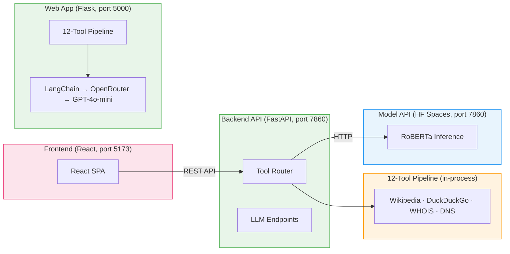
```mermaid
flowchart LR
    subgraph FE["Frontend (React, port 5173)"]
        F1[React SPA]
    end

    subgraph BE["Backend API (FastAPI, port 7860)"]
        B1[Tool Router]
        B2[LLM Endpoints]
    end

    subgraph TOOLS["12-Tool Pipeline (in-process)"]
        TP[Wikipedia · DuckDuckGo · WHOIS · DNS]
    end

    subgraph MA["Model API (HF Spaces, port 7860)"]
        M1[RoBERTa Inference]
    end

    subgraph WA["Web App (Flask, port 5000)"]
        W1[12-Tool Pipeline]
        W2[LangChain → OpenRouter → GPT-4o-mini]
    end

    F1 -->|REST API| B1
    B1 --> TP
    B1 -->|HTTP| M1
    W1 --> W2

    style FE fill:#fce4ec,stroke:#E91E63
    style BE fill:#e8f5e9,stroke:#4CAF50
    style TOOLS fill:#fff3e0,stroke:#FF9800
    style MA fill:#e8f4fd,stroke:#2196F3
    style WA fill:#e8f5e9,stroke:#4CAF50
```

---

# Tool Pipeline Reference

## Tool 1: Scam Signal Scanner

**Function:** `detect_scam_signals(job_text: str) -> dict`

**Method:** Pure Python keyword matching with weighted scoring

**Scam Rules:**

| Rule | Keywords (sample) | Weight | Description |
|---|---|---|---|
| asks_for_money | "registration fee", "processing fee", "security deposit", "pay to join", "training fee" | 30 | Job asks applicant to pay money upfront |
| requests_bank_details | "bank account", "ifsc code", "upi id", "western union", "wire transfer" | 35 | Requests sensitive banking information |
| high_pressure | "urgent hiring", "limited slots", "apply immediately", "hurry", "last day today" | 15 | Uses urgency to rush applicants |
| unrealistic_promises | "earn daily", "easy money", "guaranteed income", "make money from home", "work 2 hours" | 20 | Promises unrealistic income |
| unofficial_contact | "whatsapp only", "telegram only", "gmail.com", "yahoo.com" | 15 | Personal/unofficial contact channels |
| pre_interview_docs | "aadhaar copy", "pan card copy", "passport copy", "id proof before interview" | 25 | Documents demanded before interview |
| vague_company | "undisclosed company", "confidential client", "mnc company hiring" | 10 | Company deliberately hidden |

**Output:**
```json
{
  "ok": true,
  "data": {
    "scam_score": 85,
    "risk_level": "high",
    "signals_found": ["asks_for_money", "high_pressure", "unofficial_contact"],
    "signals_count": 3,
    "is_clean": false,
    "matched_signals": {
      "asks_for_money": {
        "description": "Job asks applicant to pay money upfront",
        "matched_keywords": ["registration fee"],
        "weight": 30
      }
    }
  }
}
```

## Tool 2: Email Verification

**Function:** `verify_email(email: str) -> dict`

**Method:** Two-stage — syntax validation (offline) + DNS MX lookup (network)

**Disposable domains detected:** mailinator.com, tempmail.com, guerrillamail.com, yopmail.com, trashmail.com, and others

**Role-based prefixes detected:** admin, hr, jobs, careers, info, support, hello, contact, billing, noreply, recruitment

**Output:**
```json
{
  "ok": true,
  "data": {
    "email": "hr@infosys.com",
    "local_part": "hr",
    "domain": "infosys.com",
    "is_syntax_valid": true,
    "is_deliverable": true,
    "mx_host": "mail.infosys.com",
    "is_disposable": false,
    "is_role_account": true,
    "overall_status": "deliverable"
  }
}
```

## Tool 3: Domain Reputation

**Function:** `check_domain_reputation(domain_or_email: str) -> dict`

**Method:** WHOIS lookup (python-whois) + HTTP liveness check (requests)

**Risk thresholds:**
- Domain age < 180 days → HIGH risk
- Domain age 180–730 days → MEDIUM risk
- Domain age > 730 days → LOW risk

**Accepts:** Bare domain (infosys.com), email (hr@infosys.com), or full URL (https://www.infosys.com/careers)

**Output:**
```json
{
  "ok": true,
  "data": {
    "domain": "infosys.com",
    "registrar": "MarkMonitor Inc.",
    "creation_date": "1998-04-03T00:00:00+00:00",
    "expiration_date": "2025-04-02T00:00:00+00:00",
    "domain_age_days": 9509,
    "is_live": true,
    "live_url": "https://www.infosys.com/",
    "risk_level": "low"
  }
}
```

## Tool 4: Website Health Check

**Function:** `verify_website(url: str) -> dict`

**Method:** HTTP GET with redirect following (requests)

**Output:**
```json
{
  "ok": true,
  "data": {
    "input_url": "https://infosys.com",
    "final_url": "https://www.infosys.com/",
    "status_code": 200,
    "is_live": true,
    "ssl_valid": true,
    "redirect_count": 1,
    "redirect_chain": [{"url": "https://infosys.com", "status": 301}],
    "response_time_ms": 342,
    "server": "nginx",
    "content_type": "text/html; charset=utf-8"
  }
}
```

## Tool 5: Website Content Analysis

**Function:** `extract_website_content(url: str) -> dict`

**Method:** trafilatura (HTML → clean text extraction)

**Output:**
```json
{
  "ok": true,
  "data": {
    "url": "https://www.infosys.com/about/",
    "extracted_text": "Infosys is a global leader in next-generation digital services...",
    "word_count": 1247,
    "metadata": {
      "title": "About Infosys",
      "description": "About Infosys Limited — A global technology leader",
      "sitename": "infosys.com",
      "language": "en"
    }
  }
}
```

## Tool 6: Wikipedia Lookup

**Function:** `get_company_wikipedia(company_name: str) -> dict`

**Method:** Wikipedia REST API v1 (public, no key)

**Strategy:** Direct slug → 404 fallback to OpenSearch

**Output:**
```json
{
  "ok": true,
  "data": {
    "title": "Infosys",
    "description": "Indian multinational IT company",
    "extract": "Infosys Limited is an Indian multinational information technology company...",
    "wikipedia_url": "https://en.wikipedia.org/wiki/Infosys",
    "thumbnail_url": "https://upload.wikimedia.org/wikipedia/commons/thumb/..."
  }
}
```

## Tool 7: Company Web Search

**Function:** `search_company_web(company_name: str) -> dict`

**Method:** DuckDuckGo DDGS (5 search angles)

**Search angles:**

| Angle | Query Template |
|---|---|
| general_info | `"{company}" company founded headquarters about` |
| employee_review | `"{company}" company employee reviews work culture` |
| scam_fraud | `"{company}" scam fraud fake complaint cheating` |
| glassdoor | `"{company}" site:glassdoor.com` |
| linkedin_page | `"{company}" site:linkedin.com/company` |

**Output:**
```json
{
  "ok": true,
  "data": {
    "company_name": "Infosys",
    "searches": {
      "general_info": [{"title": "...", "url": "...", "snippet": "..."}],
      "scam_fraud": [],
      "glassdoor": [{"title": "...", "url": "...", "snippet": "..."}]
    }
  }
}
```

## Tool 8: Company News

**Function:** `search_company_news(company_name: str, max_results: int = 8) -> dict`

**Method:** DuckDuckGo News API (DDGS)

**Output:**
```json
{
  "ok": true,
  "data": {
    "company_name": "Infosys",
    "total_articles": 5,
    "articles": [
      {
        "date": "2024-03-15",
        "title": "Infosys Q3 Results: Revenue grows...",
        "url": "https://...",
        "source": "Economic Times",
        "snippet": "Infosys reported a 2.3% growth..."
      }
    ]
  }
}
```

## Tool 9: Social Media Presence

**Function:** `check_social_profiles(company_name: str) -> dict`

**Method:** DuckDuckGo search per platform (7 platforms)

**Platforms checked:** LinkedIn, Twitter/X, GitHub, Facebook, Instagram, YouTube, Glassdoor

**Output:**
```json
{
  "ok": true,
  "data": {
    "company_name": "Infosys",
    "platforms_found": 6,
    "profiles": {
      "linkedin": {"found": true, "links": ["https://linkedin.com/company/infosys"]},
      "twitter_x": {"found": true, "links": ["https://x.com/Infosys"]},
      "github": {"found": false, "links": []}
    }
  }
}
```

## Tool 10: Job Board Verification

**Function:** `check_job_boards(job_title: str, company_name: str, location: str = None) -> dict`

**Method:** DuckDuckGo search per board (8 boards)

**Boards checked:** LinkedIn Jobs, Indeed, Glassdoor, Naukri, Foundit, Wellfound, Shine, Instahyre

**Verdict logic:**
- ≥ 3 boards found: `strong_presence`
- 1–2 boards found: `moderate_presence`
- 0 boards: `not_found_on_boards`

**Output:**
```json
{
  "ok": true,
  "data": {
    "job_title": "Senior Python Developer",
    "company_name": "Infosys",
    "boards_found": 4,
    "verdict": "strong_presence",
    "boards": {
      "linkedin_jobs": {"found": true, "results": [...]},
      "indeed": {"found": true, "results": [...]}
    }
  }
}
```

## Tool 11: Phone Number Check

**Function:** `check_phone_number(phone: str, region: str = "IN") -> dict`

**Method:** Google's phonenumbers library (libphonenumber)

**Output:**
```json
{
  "ok": true,
  "data": {
    "input": "+919876543210",
    "e164": "+919876543210",
    "international": "+91 98765 43210",
    "national": "098765 43210",
    "is_possible": true,
    "is_valid": true,
    "country_code": 91,
    "region_code": "IN",
    "number_type": "PhoneNumberType.MOBILE",
    "carrier": "Vodafone",
    "location": "India",
    "timezones": ["Asia/Calcutta"]
  }
}
```

## Tool 12: Company Registry (Stub)

**Function:** `get_company_registry(*args, **kwargs) -> dict`

**Status:** Stub — planned integration with MCA21 (India), Companies House (UK), SEC EDGAR (US)

**Output:**
```json
{
  "ok": false,
  "error": "Coming Soon — company registry not yet implemented"
}
```

---

# API Reference

## Model API (/predict)

**Request:**
```bash
curl -X POST "https://hrmhrmhrm-roberta-model.hf.space/predict" \
  -H "Content-Type: application/json" \
  -d '{
    "title": "Software Engineer",
    "description": "Looking for an experienced engineer...",
    "location": "Bangalore, India",
    "employment_type": "Full-time",
    "has_company_logo": 1
  }'
```

**Response:**
```json
{
  "fraud_probability": 0.0312,
  "fraud_percent": 3.1,
  "verdict": "LEGITIMATE",
  "confidence": "HIGH",
  "threshold": 0.87,
  "model_id": "aditya963/fraud-job-classifier",
  "latency_ms": 48.3
}
```

## Backend API — Tool Execution

**List all tools:**
```bash
curl -X GET "http://localhost:7860/api/v1/tools"
```

**Execute scam_signals tool:**
```bash
curl -X POST "http://localhost:7860/api/v1/run/scam_signals" \
  -H "Content-Type: application/json" \
  -d '{"job_text": "Earn daily ₹3000 — no experience needed. Pay registration fee."}'
```

**Execute email_verify tool:**
```bash
curl -X POST "http://localhost:7860/api/v1/run/email_verify" \
  -H "Content-Type: application/json" \
  -d '{"email": "hr@infosys.com"}'
```

**Execute job_boards tool:**
```bash
curl -X POST "http://localhost:7860/api/v1/run/job_boards" \
  -H "Content-Type: application/json" \
  -d '{
    "job_title": "Senior Python Developer",
    "company_name": "Infosys",
    "location": "Bangalore"
  }'
```

**Batch execution:**
```bash
curl -X POST "http://localhost:7860/api/v1/run-batch" \
  -H "Content-Type: application/json" \
  -d '[
    {"tool_name": "scam_signals", "job_text": "Earn daily..."},
    {"tool_name": "email_verify", "email": "hr@fakecorp.com"},
    {"tool_name": "phone_check", "phone": "+919876543210"}
  ]'
```

**LLM extract:**
```bash
curl -X POST "http://localhost:7860/api/v1/llm/extract" \
  -H "Content-Type: application/json" \
  -d '{"job_text": "Full job posting text here..."}'
```

**LLM final summary:**
```bash
curl -X POST "http://localhost:7860/api/v1/llm/final-summary" \
  -H "Content-Type: application/json" \
  -d '{
    "job_dict": {...},
    "tool_results": {...},
    "tool_inferences": {...},
    "roberta_score": 0.8923
  }'
```

---

# Chrome Extension Documentation

## Architecture

```
web-extension/
├── manifest.json           ← MV3 manifest
├── background.js           ← Service worker (353 lines)
│                             Orchestrates analysis pipeline
│                             Handles parallel RoBERTa + scraping
├── content.js              ← Content script (1,048 lines)
│                             LinkedIn DOM scraper
│                             Result overlay injector
├── popup.html              ← Extension popup UI
├── popup.js                ← API key management (83 lines)
├── popup.css               ← Popup styling
├── content.css             ← Overlay styling
├── lib/
│   ├── langchain-core.js   ← BaseTool, ToolRegistry, Chain abstractions
│   └── pipeline.js         ← PipelineConfig, PipelineBuilder
├── tools/
│   ├── job-analyzer-tool.js    ← Gemini API integration
│   ├── roberta-tool.js         ← HuggingFace Inference API
│   ├── link-detector.js        ← URL extraction + categorization
│   ├── link-scraper.js         ← Parallel fetch with retry/backoff
│   └── text-extractor.js       ← HTML → clean text
└── icons/
    ├── icon16.png
    ├── icon48.png
    └── icon128.png
```

## LinkedIn DOM Scraping Strategy

The content.js script extracts job data from LinkedIn's dynamic DOM using a fallback selector chain:

**Job Title:**
1. Parse document.title (e.g., "Software Engineer at Acme | LinkedIn")
2. `h1.top-card-layout__title`
3. `h1.jobs-unified-top-card__job-title`
4. `h1.job-title`
5. First visible h1 element

**Company Name:**
1. `.top-card-layout__company`
2. `.jobs-unified-top-card__company-name`
3. `.jobs-details-top-card__company-info a`
4. Validation: reject non-company text (LinkedIn, Jobs, etc.)

**Job Description:**
1. `.description__text`
2. `.jobs-description-content__text`
3. `#job-details`
4. `.jobs-box__html-content`
5. Longest text block as fallback

**Location:**
1. `.top-card-layout__bullet`
2. `.jobs-unified-top-card__bullet`
3. `.jobs-unified-top-card__workplace-type`

## Gemini Integration

**Model used:** gemini-2.0-flash-exp (configurable)

**Prompt structure:**

```
You are an expert at detecting fraudulent job postings.

ANALYSIS CONTEXT:
- Job Title: {title}
- Company: {company}
- Location: {location}
- Job Description: {description}

EVIDENCE FROM LINKED PAGES:
{scraped_content}

MACHINE LEARNING SCORE:
RoBERTa fraud probability: {roberta_score:.1%}

RED FLAG TAXONOMY (assess each):
1. Asks for money upfront
2. Requests bank details
3. Unrealistic salary promises
4. High-pressure urgency language
...
[30 red flags total]

Respond with JSON only:
{
  "verdict": "SAFE" | "SUSPICIOUS" | "LIKELY_FAKE",
  "confidence": 0.0-1.0,
  "summary": "2-3 sentence plain language summary",
  "key_findings": ["finding 1", "finding 2", ...],
  "risk_factors": ["factor 1", ...],
  "actionable_tips": ["tip 1", "tip 2", ...]
}
```

## Link Processing

**DetectLinksTool:** Extracts all `<a href>` elements, categorizes by type:
- `job_board`: linkedin.com/jobs, indeed.com, naukri.com
- `career`: /careers, /jobs, /hiring pages
- `social`: twitter.com, facebook.com, instagram.com
- `form`: google.com/forms, typeform.com (suspicious!)

**LinkScraperTool:** Parallel fetch with:
- Max concurrency: 3 simultaneous requests
- Timeout: 10s per request
- Retry: 2 retries with exponential backoff
- Max links: 5 (Standard), 10 (Deep)

---

# Team Contributions Summary

## Group 9 Members

| Member | Primary Responsibilities |
|---|---|
| **Arun Dutta** | Model training, Optuna HPO, focal loss implementation, notebook experiments |
| **Hritik Roshan Maurya** | Model API (FastAPI), HuggingFace deployment, backend infrastructure |
| **Vivek Bajaj** | Evidence pipeline tools (WHOIS, Wikipedia, DuckDuckGo), Flask web app |
| **Vishwas Mehta** | Chrome extension, React frontend, LangChain integration, documentation |

## Milestone Contribution Breakdown

### Milestone 0 (Problem Statement)
- All members: Problem definition, literature review, scope definition

### Milestone 1 (Literature Review + Architecture)
- Arun: ML/DL literature review (Sections 5.1.1 – 5.1.4)
- Hritik: Infrastructure planning, model architecture planning
- Vivek: Gap analysis, agentic framework design
- Vishwas: Stakeholder analysis, system architecture diagram

### Milestone 2 (Dataset Exploration)
- Arun: EDA, class distribution analysis, text length analysis
- Hritik: Missing value analysis, data quality assessment
- Vivek: Rule-based metadata detector implementation
- Vishwas: Preprocessing pipeline design, feature engineering plan

### Milestone 3 (Architecture + Pipeline Verification)
- Arun: RoBERTa architecture implementation, Focal Loss implementation
- Hritik: Tokenization pipeline, dataset construction
- Vivek: 12-tool evidence pipeline setup
- Vishwas: End-to-end pipeline verification script, documentation

### Milestone 4 (Training + HPO)
- Arun: Optuna search space, 25-trial HPO run, version-by-version experiments
- Hritik: Training infrastructure, checkpoint management, metrics logging
- Vivek: Ablation study design and execution
- Vishwas: Results analysis, threshold calibration

### Milestone 5 (Evaluation + Results)
- Arun: Test set evaluation, confusion matrix analysis
- Hritik: Comparative analysis with baselines
- Vivek: Qualitative error analysis, failure mode documentation
- Vishwas: Results visualization, report writing

### Milestone 6 (Deployment + Documentation)
- Arun: HuggingFace Hub upload, training notebook cleanup
- Hritik: Model API (FastAPI), HuggingFace Spaces deployment
- Vivek: Flask web app, backend API, tool pipeline
- Vishwas: Chrome extension, React frontend, full documentation suite

---

# References and Bibliography

## Core Dataset

1. Vidros, S., Kolias, C., Kambourakis, G., & Maglaras, L. (2017). *Automatic Detection of Online Recruitment Frauds: Characteristics, Methods, and a Public Dataset*. Future Internet, 9(1), 6. https://doi.org/10.3390/fi9010006

2. EMSCAD Dataset — Kaggle. Available at: https://www.kaggle.com/datasets/shivamb/real-or-fake-fake-jobposting-prediction

## Transformer Architecture

3. Devlin, J., Chang, M. W., Lee, K., & Toutanova, K. (2019). *BERT: Pre-training of Deep Bidirectional Transformers for Language Understanding*. NAACL-HLT 2019. https://arxiv.org/abs/1810.04805

4. Liu, Y., Ott, M., Goyal, N., Du, J., Joshi, M., Chen, D., Levy, O., Lewis, M., Zettlemoyer, L., & Stoyanov, V. (2019). *RoBERTa: A Robustly Optimized BERT Pretraining Approach*. arXiv. https://arxiv.org/abs/1907.11692

5. He, P., Liu, X., Gao, J., & Chen, W. (2021). *DeBERTa: Decoding-enhanced BERT with Disentangled Attention*. ICLR 2021. https://arxiv.org/abs/2006.03654

## Fake Job Detection

6. Amaar, A., Aljedaani, W., Rustam, F., Ullah, S., Rupapara, V., & Ludi, S. (2022). *Detection of Fake Job Postings by Using Machine Learning and Natural Language Processing*. Neural Processing Letters, 54, 3323–3346. https://doi.org/10.1007/s11063-022-10731-1

7. Alghamdi, J., Lin, Y., & Luo, S. (2020). *Toward Online Recruitment Fraud Detection: A Machine Learning and Deep Learning Approach*. IEEE International Conference on Big Data. https://doi.org/10.1109/BigData50022.2020.9378021

8. Park, J., & Kim, D. (2022). *Employment Scam Detection Using BERT-Based Text Classification and Metadata Feature Engineering*. Applied Sciences, 12(14). https://doi.org/10.3390/app12147197

9. Mahfouz, A., Jantan, A., Akhtar, N., & Mahfouz, A. (2019). *Employment Fraud Detection using Decision Trees and Support Vector Machine*. Journal of Theoretical and Applied Information Technology.

## Explainability

10. Ribeiro, M. T., Singh, S., & Guestrin, C. (2016). *"Why Should I Trust You?": Explaining the Predictions of Any Classifier*. KDD 2016. https://arxiv.org/abs/1602.04938

11. Lundberg, S. M., & Lee, S. I. (2017). *A Unified Approach to Interpreting Model Predictions (SHAP)*. NeurIPS 2017. https://arxiv.org/abs/1705.07874

12. Jain, S., & Wallace, B. C. (2019). *Attention is not Explanation*. NAACL 2019. https://arxiv.org/abs/1902.10186

## Class Imbalance

13. Lin, T. Y., Goyal, P., Girshick, R., He, K., & Dollár, P. (2017). *Focal Loss for Dense Object Detection (RetinaNet)*. ICCV 2017. https://arxiv.org/abs/1708.02002

14. Chawla, N. V., Bowyer, K. W., Hall, L. O., & Kegelmeyer, W. P. (2002). *SMOTE: Synthetic Minority Over-sampling Technique*. Journal of Artificial Intelligence Research, 16, 321–357. https://doi.org/10.1613/jair.953

## Hyperparameter Optimization

15. Akiba, T., Sano, S., Yanase, T., Ohta, T., & Koyama, M. (2019). *Optuna: A Next-generation Hyperparameter Optimization Framework*. KDD 2019. https://arxiv.org/abs/1907.10902

## Agentic AI

16. Yao, S., Zhao, J., Yu, D., Du, N., Shafran, I., Narasimhan, K., & Cao, Y. (2023). *ReAct: Synergizing Reasoning and Acting in Language Models*. ICLR 2023. https://arxiv.org/abs/2210.03629

17. Chase, H. (2022). LangChain. https://github.com/langchain-ai/langchain

## Tools and Libraries

18. Wolf, T., Debut, L., Sanh, V., et al. (2020). *HuggingFace's Transformers: State-of-the-art Natural Language Processing*. EMNLP 2020. https://arxiv.org/abs/1910.03771

19. FastAPI documentation. https://fastapi.tiangolo.com

20. Flask documentation. https://flask.palletsprojects.com

21. Trafilatura — Web scraping and text extraction. https://trafilatura.readthedocs.io

22. python-whois — WHOIS lookup library. https://pypi.org/project/python-whois/

23. phonenumbers — Google's libphonenumber port for Python. https://pypi.org/project/phonenumbers/

24. email-validator — Email address validation library. https://pypi.org/project/email-validator/

25. DDGS — DuckDuckGo Search Python library. https://pypi.org/project/ddgs/

---

# Appendices

## Appendix A: Full Training Script Reference

The complete training script (`src/train.py`) implements:

1. Data loading and preprocessing (`src/utils/data.py`)
2. Focal Loss implementation (`src/utils/focal_loss.py`)
3. FocalLossTrainer (HuggingFace Trainer subclass)
4. Optuna objective function
5. Early stopping callback
6. Metrics computation (`src/utils/metrics.py`)
7. Threshold calibration
8. Checkpoint saving

### A.1 Training Entry Point

```bash
python src/train.py \
  --data_path data/raw/fake_job_postings.csv \
  --output_dir models/roberta-focal-best \
  --model_name roberta-base \
  --num_trials 25 \
  --epochs_per_trial 12 \
  --batch_size 16 \
  --device cuda
```

### A.2 Evaluation Entry Point

```bash
# Evaluate on test set
python src/eval.py \
  --model_dir models/roberta-focal-best \
  --data_path data/raw/fake_job_postings.csv

# Single-sample inference
python src/eval.py \
  --model_dir models/roberta-focal-best \
  --infer
```

### A.3 Evidence Pipeline Entry Point

```bash
cd src/job_analyzer/
python run.py path/to/job_posting.pdf
# Outputs: evidence_output.json + llm_prompt.txt
```

## Appendix B: Project Directory Structure (Complete)

```
Group-9-DS-and-AI-Lab-Project/
│
├── web-app/                    ← Flask web application
│   ├── app.py                  ← Flask factory + blueprint registration
│   ├── config.py               ← Central config (env vars, tool labels)
│   ├── core/
│   │   ├── helpers.py          ← safe_call, normalize_website, infer_company_name
│   │   └── job_parser_agent.py ← JobPosting Pydantic schema + LangChain loaders
│   ├── routes/
│   │   ├── main.py             ← Web pages (index, results, history)
│   │   └── api.py              ← JSON API endpoints
│   ├── services/
│   │   ├── analyzer.py         ← Main pipeline orchestrator (716 lines)
│   │   ├── job_extractor.py    ← Job data extraction
│   │   ├── linkedin.py         ← LinkedIn scraping
│   │   └── tool_runner.py      ← Tool execution wrapper
│   ├── tools/                  ← 12 verification tools
│   │   ├── tool_scam_signals.py
│   │   ├── tool_email_verify.py
│   │   ├── tool_domain_reputation.py
│   │   ├── tool_website_verify.py
│   │   ├── tool_website_content.py
│   │   ├── tool_company_wikipedia.py
│   │   ├── tool_company_web_search.py
│   │   ├── tool_company_news.py
│   │   ├── tool_social_profiles.py
│   │   ├── tool_job_boards.py
│   │   ├── tool_phone_check.py
│   │   ├── tool_company_registry.py
│   │   └── tools_config.py
│   ├── templates/              ← Jinja2 HTML templates
│   ├── static/                 ← CSS, JS assets
│   └── tests/                  ← pytest test suite (13 files, 4,200+ lines)
│
├── backend-api/                ← FastAPI modular backend
│   ├── app.py                  ← FastAPI + CORS + router registration
│   ├── core/
│   │   ├── tool_registry.py    ← 13-tool registry with metadata
│   │   └── llm_config.py       ← LLM settings + factory
│   ├── routers/
│   │   ├── tools_meta.py       ← GET /api/v1/tools
│   │   ├── tools_exec.py       ← POST /api/v1/run/{tool_name}
│   │   └── llm.py              ← LLM endpoints (4 routes)
│   ├── services/
│   │   └── langchain_service.py ← LLM prompt engineering (430 lines)
│   ├── tools/                  ← 13 tools (same as web-app + roberta)
│   └── tests/                  ← pytest test suite
│
├── model-api/                  ← FastAPI RoBERTa inference service
│   ├── app.py                  ← Full inference API (244 lines)
│   ├── download_model.py       ← HuggingFace model pre-download
│   └── tests/                  ← pytest test suite
│
├── frontend-app/               ← React + Vite SPA
│   ├── src/
│   │   ├── App.jsx             ← Root orchestrator (335 lines)
│   │   ├── components/         ← 8 React components
│   │   │   ├── JDInput.jsx
│   │   │   ├── ToolCard.jsx
│   │   │   ├── ToolGrid.jsx
│   │   │   ├── ExtractedInfo.jsx
│   │   │   ├── FinalReport.jsx
│   │   │   ├── PipelineProgress.jsx
│   │   │   ├── Header.jsx
│   │   │   └── SettingsModal.jsx
│   │   ├── contexts/
│   │   │   └── SettingsContext.jsx
│   │   └── services/
│   │       └── api.js
│   └── package.json
│
├── web-extension/              ← Chrome MV3 extension
│   ├── manifest.json
│   ├── background.js           ← Service worker (353 lines)
│   ├── content.js              ← DOM scraper + overlay injector (1,048 lines)
│   ├── popup.html/js/css
│   ├── lib/                    ← LangChain-inspired JS framework
│   └── tools/                  ← Analysis tools
│
├── notebook/                   ← Jupyter training notebooks
│   ├── transformer_fraud_classifier_v3_1.ipynb
│   └── rule_discovery_ebm.ipynb
│
├── docs/                       ← All milestone documentation
│   ├── Milestone-0/
│   ├── Milestone-1/
│   ├── Milestone-2/
│   ├── Milestone-3/
│   ├── Milestone-4/
│   ├── Milestone-5/
│   ├── Milestone-6/
│   └── Final Project Report/
│
├── requirements.txt            ← Python dependencies (all services)
├── README.md                   ← Quick-start guide
├── README_Deployment.md        ← Full deployment instructions
└── CLAUDE.md                   ← AI assistant configuration
```

## Appendix C: Metrics Reference

### C.1 Binary Classification Metrics

| Metric | Formula | Interpretation |
|---|---|---|
| Accuracy | (TP + TN) / (TP + TN + FP + FN) | Overall correctness — misleading for imbalanced datasets |
| Precision | TP / (TP + FP) | Of all predicted fraud, how many were actually fraud |
| Recall | TP / (TP + FN) | Of all actual fraud, how many were correctly detected |
| F1-Score | 2 × (P × R) / (P + R) | Harmonic mean of precision and recall |
| ROC-AUC | Area under ROC curve | Probability that model ranks a random fraud higher than random legit |
| MCC | (TP×TN - FP×FN) / √((TP+FP)(TP+FN)(TN+FP)(TN+FN)) | Balanced metric for imbalanced datasets |

### C.2 Why Standard Accuracy Is Misleading

With 95.16% legitimate and 4.84% fraudulent:
- A model predicting "legitimate" always achieves **95.16% accuracy**
- But it catches **0 fraud cases** (Recall = 0.0, F1 = 0.0)

This is why F1 (fraud class) is the primary metric.

### C.3 Threshold Trade-offs

| Threshold | Effect |
|---|---|
| Lower (e.g., 0.5) | Higher recall — catches more fraud, more false positives |
| Higher (e.g., 0.95) | Higher precision — fewer false positives, misses more fraud |
| **0.87 (chosen)** | **Optimal F1: balances precision (0.957) and recall (0.862)** |

## Appendix D: Development Chronology

### Timeline

| Month | Milestone | Key Deliverables |
|---|---|---|
| Month 1 | M0 | Problem statement, motivation document, team formation |
| Month 2 | M1 | Literature review, scope definition, architecture plan |
| Month 3 | M2 | EDA, metadata detector, preprocessing design |
| Month 4 | M3 | Model architecture, preprocessing pipeline, pipeline verification |
| Month 5 | M4 | v1→v3_1 training experiments, Optuna HPO, ablation study |
| Month 6 | M5 | Test set evaluation, error analysis, comparative analysis |
| Month 6 | M6 | Full deployment, documentation, Chrome extension |

```mermaid
gantt
    title FraudGuard — 6-Milestone Development Timeline
    dateFormat  YYYY-MM
    axisFormat  %b %Y

    section Data and Exploration
    M0 — Problem Statement           :done,   m0, 2025-08, 2025-09
    M1 — Literature Review            :done,   m1, 2025-09, 2025-10
    M2 — Dataset EDA and baseline     :done,   m2, 2025-10, 2025-11
    section Model Development
    M3 — Architecture and Pipeline    :done,   m3, 2025-11, 2025-12
    M4 — Focal Loss and Optuna HPO   :done,   m4, 2025-12, 2026-02
    section System Integration
    M5 — Evaluation and Analysis      :done,   m5, 2026-02, 2026-03
    section Deployment
    M6 — Deployment and Docs and API  :done,   m6, 2026-03, 2026-04
```

### Key Technical Decisions Made During Development

| Decision | Rationale | Outcome |
|---|---|---|
| RoBERTa over DeBERTa | T4 GPU memory constraints; deployment simplicity | F1 0.907 — within 0.01 of target |
| Focal Loss over SMOTE | SMOTE can introduce noise in text space | Better precision + recall balance |
| [SEP] concatenation over multiple encoders | Single forward pass; efficiency | No performance penalty vs. dual encoder |
| Threshold 0.87 over 0.50 | High-precision requirement for user trust | Precision 0.957 |
| Free tools (no API keys) | Cost and accessibility for deployment | 12 tools operating at zero marginal cost |
| Flask over Django/FastAPI for web-app | Team familiarity; rapid prototyping | Deployed in < 2 weeks |
| Chrome MV3 over MV2 | Future-proofing; Google's requirement | Compatible with all modern Chrome versions |

## Appendix E: Known Issues and Future Work

### E.1 Known Issues

| Issue | Severity | Status |
|---|---|---|
| Company registry tool is a stub | Medium | Planned: MCA21 API integration |
| DuckDuckGo rate limiting in high-volume scenarios | Medium | Workaround: 0.4s delay between searches |
| LinkedIn DOM scraping brittle to UI changes | Medium | Multiple fallback selectors implemented |
| ~11% truncation for long postings | Low | Structured fields prioritized to avoid key truncation |
| Model calibration drift on non-English postings | Low | Scope limited to English |

### E.2 Future Work

**Short-term (next 3 months):**
- Implement MCA21 (India) and Companies House (UK) registry lookups
- Add email header analysis for corporate vs. personal email detection
- Train on LinkedIn-scraped postings for domain adaptation
- Add confidence calibration (Platt scaling) for better probability estimates

**Medium-term (6–12 months):**
- Multi-language support (Hindi, regional Indian languages)
- Real-time streaming detection API for job board integration
- Fine-grained fraud taxonomy (advance-fee, identity theft, phishing, etc.)
- Adversarial robustness testing and hardening

**Long-term (1–2 years):**
- Live deployment on a real recruitment platform
- Continuous learning from user feedback
- Cross-platform extension (Firefox, Safari)
- Mobile application for on-the-go job safety checks
- Integration with government fraud databases (NCRP, IC3)

```mermaid
graph TB
    NOW["Current State<br/>FraudGuard v1.0<br/>English · Local Flask · Chrome Extension"]

    subgraph SHORT["Short-term  1–3 months"]
        S1["Multilingual support<br/>xlm-roberta-base<br/>Hindi + regional languages"]
        S2["Sliding-window encoding<br/>Handle >512 token postings<br/>+11% sample coverage"]
        S3["Company registry tool<br/>Implement MCA / WHOIS lookups<br/>Currently stub"]
    end

    subgraph MED["Medium-term  3–6 months"]
        M1["Async task queue<br/>Celery + Redis<br/>Non-blocking analysis"]
        M2["Docker + HTTPS deployment<br/>Production-ready containerization"]
        M3["User feedback loop<br/>Collect corrections → retrain pipeline"]
    end

    subgraph LONG["Long-term  6–12 months"]
        L1["Real-time platform integration<br/>LinkedIn / Naukri / Indeed API"]
        L2["Adversarial robustness<br/>Defend against prompt injection<br/>in job postings"]
        L3["Explainability layer<br/>Token-level attention visualization"]
    end

    NOW --> SHORT
    SHORT --> MED
    MED --> LONG

    style NOW fill:#e8f4fd,stroke:#2196F3
    style SHORT fill:#e8f5e9,stroke:#4CAF50
    style MED fill:#fff3e0,stroke:#FF9800
    style LONG fill:#f3e5f5,stroke:#9C27B0
```

---

*End of Consolidated Milestone Report*

*FraudGuard — Group 9, DS & AI Lab Project, April 2026*

*Model: aditya963/fraud-job-classifier | Repository: hrmiitm/Group-9-DS-and-AI-Lab-Project*
