# FraudGuard: Fake Job Listing Detection using Deep Learning and Agentic Generative AI

---

**Title Page**

| Field | Value |
|---|---|
| **Project Title** | FraudGuard: Fake Job Listing Detection using Deep Learning and Agentic Generative AI |
| **Team** | Group 9 — Arun Dutta, Hritik Roshan Maurya, Vivek Bajaj, Vishwas Mehta |
| **Course** | DS & AI Lab Project |
| **Institution** | Indian Institute of Technology Madras |
| **Date** | April 2026 |
| **Model** | [aditya963/fraud-job-classifier](https://huggingface.co/aditya963/fraud-job-classifier) on HuggingFace Hub |

---

## Abstract

Online recruitment fraud has emerged as a pervasive threat to job seekers, with fraudulent postings designed to mimic legitimate advertisements to steal personal data, advance fees, and login credentials. Existing automated solutions rely either on shallow keyword filters or single-model classifiers that lack transparency and the capacity to verify external claims. This project presents **FraudGuard**, an end-to-end AI system that combines a fully fine-tuned **RoBERTa-base** transformer (125M parameters) with a **12-tool agentic verification pipeline** and an LLM-powered explanation layer. The model was trained on the EMSCAD dataset (17,880 job postings, 4.84% fraudulent) using Focal Loss with Optuna-optimized hyperparameters, achieving **ROC-AUC 0.993** and **precision 0.957** on the fraud class. The system is deployed as a Flask web application that accepts text, file uploads, or LinkedIn URLs, and as a Chrome extension that provides real-time analysis directly on LinkedIn job pages. Together, these components deliver an interpretable, evidence-backed fraud detection system that is both performant and practically deployable.

---

## System Architecture Overview

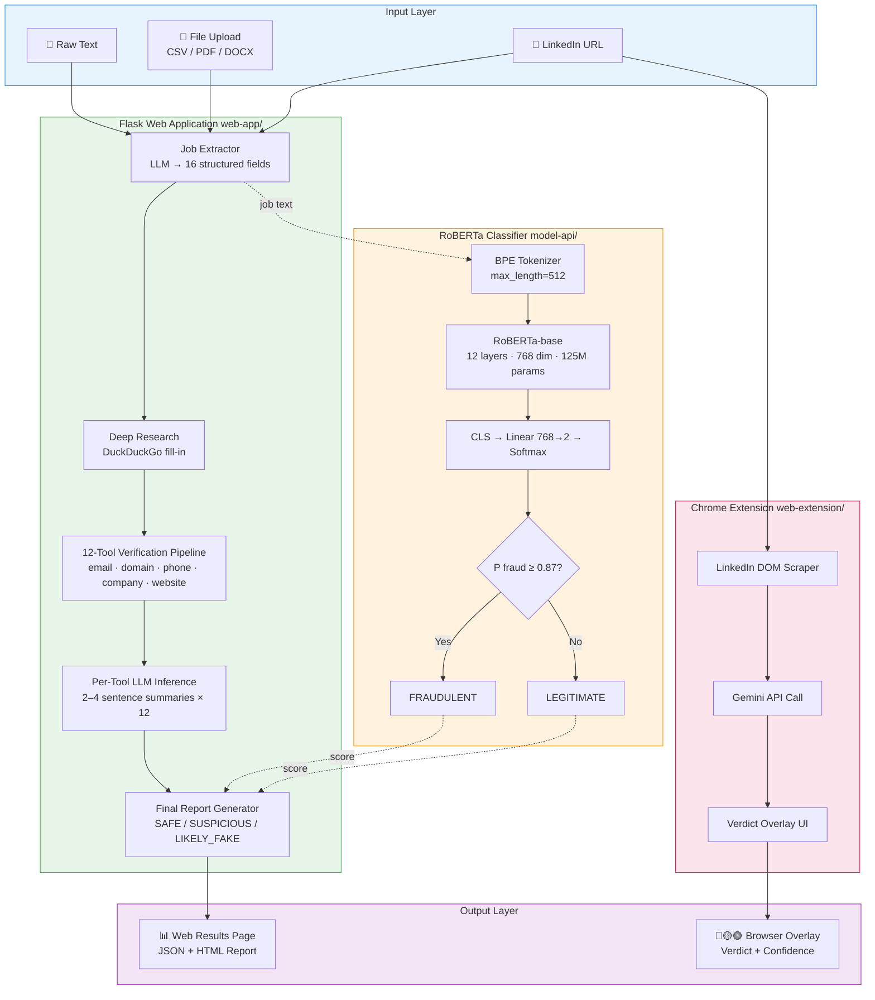
```mermaid
graph TB
    subgraph INPUT["Input Layer"]
        A1[📄 Raw Text]
        A2[📁 File Upload<br/>CSV / PDF / DOCX]
        A3[🔗 LinkedIn URL]
    end

    subgraph WEBAPP["Flask Web Application  web-app/"]
        B1[Job Extractor<br/>LLM → 16 structured fields]
        B2[Deep Research<br/>DuckDuckGo fill-in]
        B3[12-Tool Verification Pipeline<br/>email · domain · phone · company · website]
        B4[Per-Tool LLM Inference<br/>2–4 sentence summaries × 12]
        B5[Final Report Generator<br/>SAFE / SUSPICIOUS / LIKELY_FAKE]
    end

    subgraph MODEL["RoBERTa Classifier  model-api/"]
        C1[BPE Tokenizer<br/>max_length=512]
        C2[RoBERTa-base<br/>12 layers · 768 dim · 125M params]
        C3[CLS → Linear 768→2 → Softmax]
        C4{P fraud ≥ 0.87?}
        C5[FRAUDULENT]
        C6[LEGITIMATE]
    end

    subgraph EXT["Chrome Extension  web-extension/"]
        D1[LinkedIn DOM Scraper]
        D2[Gemini API Call]
        D3[Verdict Overlay UI]
    end

    subgraph OUTPUT["Output Layer"]
        E1[📊 Web Results Page<br/>JSON + HTML Report]
        E2[🔴🟡🟢 Browser Overlay<br/>Verdict + Confidence]
    end

    A1 & A2 & A3 --> B1
    B1 --> B2 --> B3 --> B4 --> B5
    B1 -.->|job text| C1
    C1 --> C2 --> C3 --> C4
    C4 -->|Yes| C5
    C4 -->|No| C6
    C5 & C6 -.->|score| B5
    B5 --> E1

    A3 --> D1
    D1 --> D2 --> D3 --> E2

    style INPUT fill:#e8f4fd,stroke:#2196F3
    style WEBAPP fill:#e8f5e9,stroke:#4CAF50
    style MODEL fill:#fff3e0,stroke:#FF9800
    style EXT fill:#fce4ec,stroke:#E91E63
    style OUTPUT fill:#f3e5f5,stroke:#9C27B0
```

---

## 1. Introduction

### 1.1 Problem Context

The digitalization of job searching has democratized access to employment opportunities but has simultaneously created fertile ground for fraudulent activity. According to reports from the Federal Trade Commission and Indian consumer protection agencies, job scams cost victims thousands of dollars annually and cause lasting emotional harm. These fraudulent postings are no longer crude phishing attempts — they are carefully engineered to mimic the visual design, language, and structure of legitimate advertisements from major corporations.

The challenge is compounded by the scale of modern job platforms. LinkedIn hosts hundreds of millions of job postings, and automated moderation at that scale requires intelligent, high-precision systems that can flag fraudulent content without generating an unacceptable volume of false alarms for legitimate employers.

### 1.2 Motivation

Traditional approaches to fake job detection fall into three categories, each with fundamental limitations. Rule-based keyword filters are easily circumvented by rewording; classical machine learning classifiers (Naive Bayes, Logistic Regression, Random Forest) capture surface-level patterns but miss deep semantic context; and even modern transformer-based classifiers produce a single binary score with no supporting evidence, making them opaque to the job seekers they are designed to protect.

The motivation behind FraudGuard is to close three gaps simultaneously: (1) deploy a state-of-the-art transformer that understands contextual fraud signals, (2) augment its prediction with multi-source external verification, and (3) produce a human-readable investigation report that empowers job seekers to make informed decisions.

### 1.3 Why NLP and RoBERTa?

Fraudulent job postings encode their deception primarily in language — through urgency phrases, exaggerated salary claims, vague company descriptions, and grammatically suspicious text. Natural language processing is therefore the natural primary tool. Among NLP architectures, **RoBERTa** (Robustly Optimized BERT Pretraining Approach) represents the strongest general-purpose text encoder available at the time of this project's design. Its bidirectional self-attention attends globally over 512 tokens, linking salary claims in structured metadata to suspicious language buried in the description in a single pass — a capability unavailable to any sequential or bag-of-words approach.

### 1.4 Project Goals

1. Build a fraud classifier achieving F1 ≥ 0.91 and ROC-AUC ≥ 0.95 on the EMSCAD dataset.
2. Develop an agentic verification framework that cross-checks ≥ 10 external signals per posting.
3. Generate structured, human-readable fraud investigation reports via a generative AI layer.
4. Deliver a working prototype accessible via a web application and a Chrome extension.

### 1.5 Technology Stack

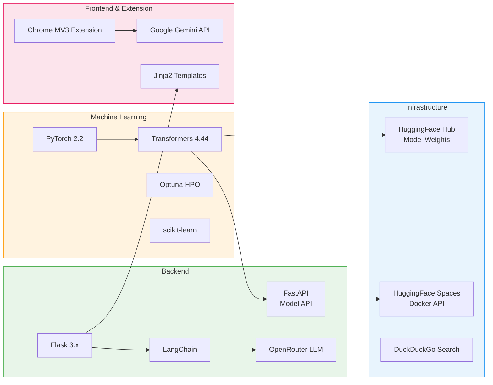
```mermaid
graph LR
    subgraph ML["Machine Learning"]
        M1[PyTorch 2.2]
        M2[Transformers 4.44]
        M3[Optuna HPO]
        M4[scikit-learn]
    end

    subgraph BACKEND["Backend"]
        B1[Flask 3.x]
        B2[LangChain]
        B3[OpenRouter LLM]
        B4[FastAPI<br/>Model API]
    end

    subgraph FRONTEND["Frontend & Extension"]
        F1[Jinja2 Templates]
        F2[Chrome MV3 Extension]
        F3[Google Gemini API]
    end

    subgraph INFRA["Infrastructure"]
        I1[HuggingFace Hub<br/>Model Weights]
        I2[HuggingFace Spaces<br/>Docker API]
        I3[DuckDuckGo Search]
    end

    M1 --> M2
    M2 --> B4
    B4 --> I2
    B1 --> B2 --> B3
    B1 --> F1
    F2 --> F3
    M2 --> I1

    style ML fill:#fff3e0,stroke:#FF9800
    style BACKEND fill:#e8f5e9,stroke:#4CAF50
    style FRONTEND fill:#fce4ec,stroke:#E91E63
    style INFRA fill:#e8f4fd,stroke:#2196F3
```

---

## 2. Literature Review

### 2.1 Rule-Based and Keyword Filtering Approaches

Early automated fraud detection systems relied on blocklists of suspicious phrases — "no experience needed," "work from home," "send payment first." These systems are computationally trivial and transparent but suffer from two fatal weaknesses: they are easily defeated by paraphrasing, and they generate high false positive rates that harm legitimate job postings. No commercially deployed rule-based system alone is sufficient for modern fraud detection.

### 2.2 Classical Machine Learning

Vidros et al. (2017), the creators of the EMSCAD dataset, demonstrated the first systematic ML study of fake job detection. Using TF-IDF features from job description text combined with structured metadata, they achieved Random Forest F1 of approximately 0.82 on the fraud class. Their work established the benchmark dataset and proved that structural metadata (missing company logo, absence of company profile) carries discriminative fraud signal beyond text alone. Subsequent studies by Amaar et al. (2022) and Park & Kim (2022) extended this work with richer feature engineering, reaching F1 scores in the 0.83–0.86 range with Support Vector Machines and gradient boosting. The consistent weakness of these approaches is their reliance on manually engineered features and their inability to capture cross-sentence semantic dependencies.

### 2.3 Deep Learning Approaches

The introduction of CNN and LSTM architectures for text classification improved upon classical ML by learning hierarchical and sequential representations from raw text. Alghamdi et al. (2020) applied Bidirectional LSTM to the EMSCAD dataset, achieving F1 ≈ 0.83. While superior to TF-IDF approaches, recurrent architectures struggle with long-range dependencies — a critical limitation when the fraudulent signal appears in one paragraph and the corroborating pattern in another.

### 2.4 Transformer-Based Methods

The publication of BERT (Devlin et al., 2019) represented a paradigm shift in NLP. By pre-training a deep bidirectional transformer on 16GB of text and fine-tuning on downstream tasks, BERT achieved state-of-the-art performance across 11 NLP benchmarks. Mahfouz et al. (2019) demonstrated BERT's applicability to fake job detection, achieving F1 ≈ 0.88 on the EMSCAD dataset. Liu et al. (2019) introduced RoBERTa with improved pre-training (dynamic masking, longer training, 160GB corpus), consistently outperforming BERT across benchmarks, including achieving F1 ≈ 0.91 on fraud detection tasks. Our work adopts RoBERTa-base as the backbone and extends it with Focal Loss and systematic hyperparameter optimization.

### 2.5 Explainable AI

Several researchers have applied LIME (Ribeiro et al., 2016) and SHAP (Lundberg & Lee, 2017) to make fraud classifiers interpretable. These tools compute feature importance weights — identifying which words contributed most to a fraud prediction. While valuable for researchers, they produce technical output (feature weights) rather than human-readable narratives, limiting their utility for non-technical job seekers. Our generative AI explanation layer addresses this gap by producing structured prose explanations.

### 2.6 Gap Analysis

| Gap in Existing Work | FraudGuard's Response |
|---|---|
| Single-model prediction, no external verification | 12-tool agentic pipeline verifies company domain, email, phone, news, job boards |
| Black-box outputs (LIME/SHAP numbers) | LLM-written narrative report with specific evidence citations |
| Text-only models ignoring metadata | Unified text representation concatenating all 18 fields with [SEP] separators |
| No handling of class imbalance | Focal Loss + class weighting + Optuna HPO + post-hoc threshold calibration |
| No deployable end-user interface | Flask web-app + Chrome extension for LinkedIn |

### 2.7 Model Evolution Across Literature

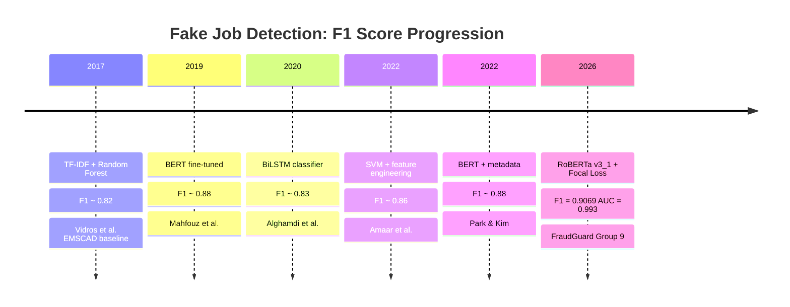
```mermaid
timeline
    title Fake Job Detection: F1 Score Progression
    2017 : TF-IDF + Random Forest
         : F1 ~ 0.82
         : Vidros et al. EMSCAD baseline
    2019 : BERT fine-tuned
         : F1 ~ 0.88
         : Mahfouz et al.
    2020 : BiLSTM classifier
         : F1 ~ 0.83
         : Alghamdi et al.
    2022 : SVM + feature engineering
         : F1 ~ 0.86
         : Amaar et al.
    2022 : BERT + metadata
         : F1 ~ 0.88
         : Park & Kim
    2026 : RoBERTa v3_1 + Focal Loss
         : F1 = 0.9069  AUC = 0.993
         : FraudGuard Group 9
```

---

## 3. Dataset and Methodology

### 3.1 Dataset: EMSCAD

The Employment Scam Aegean Dataset (EMSCAD) was collected by the University of the Aegean and published by Vidros et al. (2017). It contains 17,880 job postings scraped from an international job search platform, each labeled as fraudulent (1) or legitimate (0) by human annotators.

| Attribute | Value |
|---|---|
| Total samples | 17,880 |
| Legitimate postings | 17,014 (95.16%) |
| Fraudulent postings | 866 (4.84%) |
| Class imbalance ratio | ~20:1 |
| Feature count | 18 (5 free-text, 9 structured, 3 binary/categorical) |
| Language | English |

**Why this dataset?** EMSCAD is the standard benchmark for fake job detection research, enabling direct comparison with prior work. It combines both textual content and structured metadata, which is essential for evaluating our multi-field concatenation approach.

### 3.2 Dataset Class Distribution

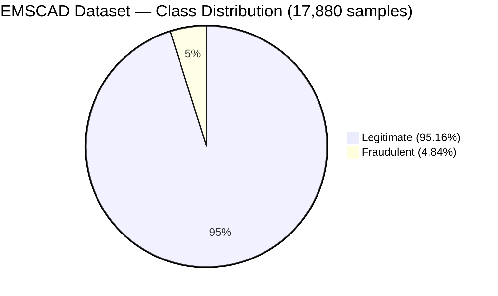
```mermaid
pie title EMSCAD Dataset — Class Distribution (17,880 samples)
    "Legitimate (95.16%)" : 17014
    "Fraudulent (4.84%)" : 866
```

### 3.3 Train / Validation / Test Split

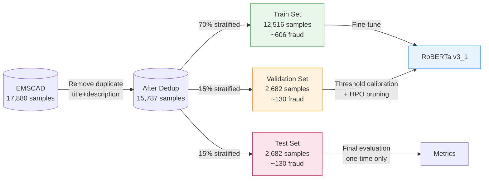
```mermaid
graph LR
    DS[(EMSCAD<br/>17,880 samples)]
    DD[(After Dedup<br/>15,787 samples)]

    DS -->|Remove duplicate<br/>title+description| DD

    DD -->|70% stratified| TR["Train Set<br/>12,516 samples<br/>~606 fraud"]
    DD -->|15% stratified| VA["Validation Set<br/>2,682 samples<br/>~130 fraud"]
    DD -->|15% stratified| TE["Test Set<br/>2,682 samples<br/>~130 fraud"]

    TR -->|Fine-tune| MODEL[RoBERTa v3_1]
    VA -->|Threshold calibration<br/>+ HPO pruning| MODEL
    TE -->|Final evaluation<br/>one-time only| METRICS[Metrics]

    style TR fill:#e8f5e9,stroke:#4CAF50
    style VA fill:#fff3e0,stroke:#FF9800
    style TE fill:#fce4ec,stroke:#E91E63
    style MODEL fill:#e8f4fd,stroke:#2196F3
```

### 3.4 Preprocessing Pipeline

The preprocessing pipeline converts the 18-column job posting CSV into a single tokenized text sequence:

1. **Missing value handling:** NaN values replaced with empty strings. Crucially, missingness is not imputed — an empty `company_profile` is itself a fraud signal.
2. **Structured field formatting:** Metadata columns are converted to key-value pairs (`"Location: New York"`, `"Has Company Logo: 1"`).
3. **Text concatenation:** All non-empty fields are joined with `[SEP]` delimiters. Structured metadata is placed before free-text fields to protect it from 512-token truncation.
4. **BPE tokenization:** RoBERTa's Byte-Pair Encoding tokenizer with `max_length=512`, `truncation=True`, `padding='max_length'`. Approximately 11% of samples exceed 512 tokens.

### 3.5 Input Preprocessing Flow

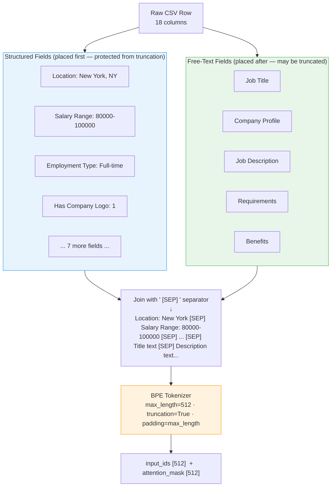
```mermaid
flowchart TD
    RAW["Raw CSV Row<br/>18 columns"]

    subgraph STRUCT["Structured Fields (placed first — protected from truncation)"]
        S1["Location: New York, NY"]
        S2["Salary Range: 80000-100000"]
        S3["Employment Type: Full-time"]
        S4["Has Company Logo: 1"]
        S5["... 7 more fields ..."]
    end

    subgraph FREE["Free-Text Fields (placed after — may be truncated)"]
        F1["Job Title"]
        F2["Company Profile"]
        F3["Job Description"]
        F4["Requirements"]
        F5["Benefits"]
    end

    JOIN["Join with ' [SEP] ' separator<br/>↓<br/>Location: New York [SEP] Salary Range: 80000-100000 [SEP] ... [SEP] Title text [SEP] Description text..."]

    TOKENIZE["BPE Tokenizer<br/>max_length=512 · truncation=True · padding=max_length"]

    TOKENS["input_ids [512]  +  attention_mask [512]"]

    RAW --> STRUCT
    RAW --> FREE
    STRUCT --> JOIN
    FREE --> JOIN
    JOIN --> TOKENIZE --> TOKENS

    style STRUCT fill:#e8f4fd,stroke:#2196F3
    style FREE fill:#e8f5e9,stroke:#4CAF50
    style TOKENIZE fill:#fff3e0,stroke:#FF9800
```

---

## 4. Model Development and Hyperparameter Tuning

### 4.1 Final Architecture: RoBERTa-base v3_1

The final model is a fully fine-tuned `roberta-base` with a linear binary classification head. All 125.5M parameters are trainable.

| Component | Configuration |
|---|---|
| Backbone | `roberta-base` (12 transformer layers, 12 attention heads, 768-dim) |
| Classification head | Linear(768 → 2) |
| Dropout | 0.1 (hidden + attention layers) |
| Loss function | Focal Loss (γ=1.6920, fraud class weight=2.8251) |
| Total parameters | ~125.5M |

### 4.2 RoBERTa Model Architecture

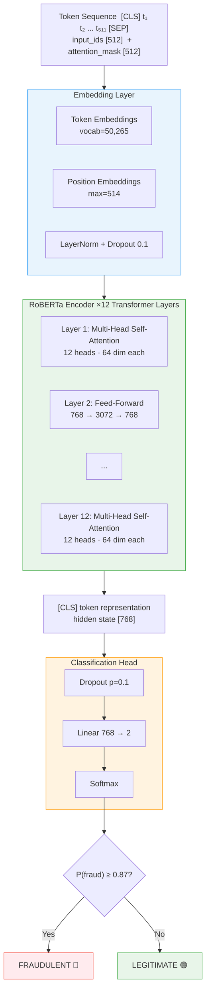
```mermaid
graph TB
    INPUT["Token Sequence  [CLS] t₁ t₂ ... t₅₁₁ [SEP]<br/>input_ids [512]  +  attention_mask [512]"]

    subgraph EMBED["Embedding Layer"]
        E1[Token Embeddings<br/>vocab=50,265]
        E2[Position Embeddings<br/>max=514]
        E3[LayerNorm + Dropout 0.1]
    end

    subgraph ENC["RoBERTa Encoder  ×12 Transformer Layers"]
        L1["Layer 1: Multi-Head Self-Attention<br/>12 heads · 64 dim each"]
        L2["Layer 2: Feed-Forward<br/>768 → 3072 → 768"]
        LN["..."]
        L12["Layer 12: Multi-Head Self-Attention<br/>12 heads · 64 dim each"]
    end

    CLS["[CLS] token representation<br/>hidden state [768]"]

    subgraph HEAD["Classification Head"]
        D["Dropout  p=0.1"]
        LIN["Linear  768 → 2"]
        SM["Softmax"]
    end

    THRESH{"P(fraud) ≥ 0.87?"}
    OUT1["FRAUDULENT 🔴"]
    OUT2["LEGITIMATE 🟢"]

    INPUT --> EMBED
    EMBED --> ENC
    ENC --> CLS --> HEAD
    D --> LIN --> SM --> THRESH
    THRESH -->|Yes| OUT1
    THRESH -->|No| OUT2

    style EMBED fill:#e8f4fd,stroke:#2196F3
    style ENC fill:#e8f5e9,stroke:#4CAF50
    style HEAD fill:#fff3e0,stroke:#FF9800
    style OUT1 fill:#ffebee,stroke:#f44336
    style OUT2 fill:#e8f5e9,stroke:#4CAF50
```

### 4.3 Hyperparameter Experiments

Training progressed through 7 model versions. Key progression:

| Version | Loss | HPO | Key Change | F1 (Fraud) |
|---|---|---|---|---|
| v1 | Weighted CE | Manual | Baseline full fine-tuning | ~0.875 |
| v2 | Focal (γ=2.0) | Manual | Focal loss introduced | ~0.910 |
| v3 | Focal (γ=2.0) | Optuna 15T | First automated HPO | ~0.908 |
| **v3_1 (Final)** | **Focal (γ=1.69)** | **Optuna 25T** | **Dynamic γ + hard precision/recall floors** | **0.9069** |
| v4 | Focal | Optuna | DeBERTa backbone | < v3_1 |
| v5_synth | Focal (γ=3.0) | Optuna 25T | Synthetic LLM data augmentation | Comparable to v3_1 |

### 4.4 Model Version Progression

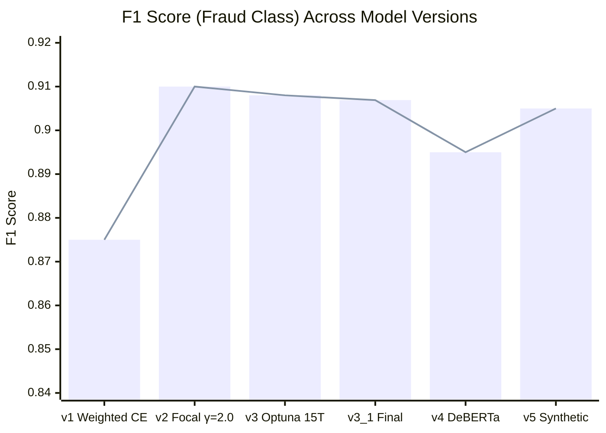
```mermaid
xychart-beta
    title "F1 Score (Fraud Class) Across Model Versions"
    x-axis ["v1 Weighted CE", "v2 Focal γ=2.0", "v3 Optuna 15T", "v3_1 Final", "v4 DeBERTa", "v5 Synthetic"]
    y-axis "F1 Score" 0.84 --> 0.92
    bar [0.875, 0.910, 0.908, 0.9069, 0.895, 0.905]
    line [0.875, 0.910, 0.908, 0.9069, 0.895, 0.905]
```

### 4.5 Optuna HPO Configuration

The v3_1 model was produced by a 25-trial Optuna Bayesian optimization study with the following search space:

| Hyperparameter | Search Range | Best Value |
|---|---|---|
| Learning rate | Log-uniform [1e-5, 5e-5] | 2.59e-5 |
| Warmup ratio | Uniform [0.05, 0.20] | 0.1506 |
| Batch size | Categorical {16, 32} | 16 |
| Weight decay | Uniform [0.01, 0.10] | 0.0702 |
| Focal gamma | Uniform [1.0, 2.5] | 1.6920 |
| Fraud class weight | Uniform [2.0, 5.0] | 2.8251 |
| Epochs | Integer [8, 13] | 9 (early stop at 7) |

**HPO Objective:** Maximize F1 (fraud) subject to hard floors: Recall ≥ 0.89 AND Precision ≥ 0.93. Trials not meeting both floors are pruned.

### 4.6 Optuna HPO Process

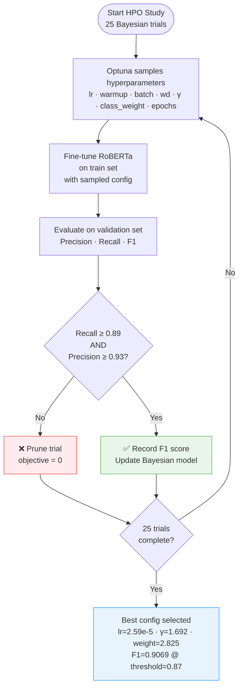
```mermaid
flowchart TD
    START([Start HPO Study<br/>25 Bayesian trials])

    SAMPLE["Optuna samples hyperparameters<br/>lr · warmup · batch · wd · γ · class_weight · epochs"]

    TRAIN["Fine-tune RoBERTa<br/>on train set<br/>with sampled config"]

    EVAL["Evaluate on validation set<br/>Precision · Recall · F1"]

    FLOOR{Recall ≥ 0.89<br/>AND<br/>Precision ≥ 0.93?}

    PRUNE["❌ Prune trial<br/>objective = 0"]
    RECORD["✅ Record F1 score<br/>Update Bayesian model"]

    BEST{25 trials<br/>complete?}

    FINAL["Best config selected<br/>lr=2.59e-5 · γ=1.692 · weight=2.825<br/>F1=0.9069 @ threshold=0.87"]

    START --> SAMPLE --> TRAIN --> EVAL --> FLOOR
    FLOOR -->|No| PRUNE --> BEST
    FLOOR -->|Yes| RECORD --> BEST
    BEST -->|No| SAMPLE
    BEST -->|Yes| FINAL

    style PRUNE fill:#ffebee,stroke:#f44336
    style RECORD fill:#e8f5e9,stroke:#4CAF50
    style FINAL fill:#e8f4fd,stroke:#2196F3
```

### 4.7 Focal Loss vs. Cross-Entropy

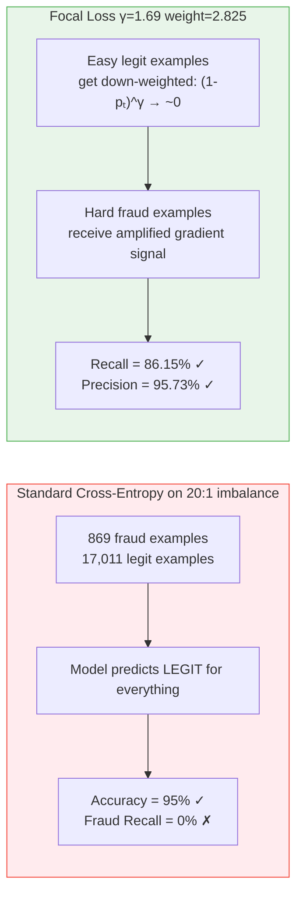
```mermaid
graph LR
    subgraph CE["Standard Cross-Entropy on 20:1 imbalance"]
        CE1["869 fraud examples<br/>17,011 legit examples"]
        CE2["Model predicts LEGIT for everything"]
        CE3["Accuracy = 95%  ✓<br/>Fraud Recall = 0%  ✗"]
    end

    subgraph FL["Focal Loss  γ=1.69  weight=2.825"]
        FL1["Easy legit examples<br/>get down-weighted: (1-pₜ)^γ → ~0"]
        FL2["Hard fraud examples<br/>receive amplified gradient signal"]
        FL3["Recall = 86.15%  ✓<br/>Precision = 95.73%  ✓"]
    end

    CE1 --> CE2 --> CE3
    FL1 --> FL2 --> FL3

    style CE fill:#ffebee,stroke:#f44336
    style FL fill:#e8f5e9,stroke:#4CAF50
```

### 4.8 Threshold Calibration

A post-training threshold sweep on the validation set identifies the optimal classification threshold. For v3_1, this converged to **0.87** (vs. the naive default of 0.50), providing a 2–4 percentage point F1 gain at zero additional training cost.

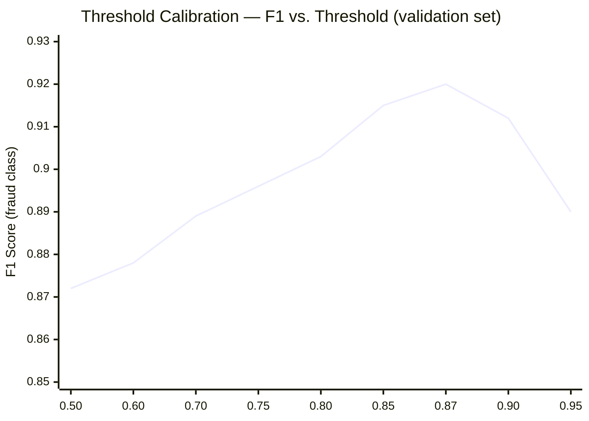
```mermaid
xychart-beta
    title "Threshold Calibration — F1 vs. Threshold (validation set)"
    x-axis ["0.50", "0.60", "0.70", "0.75", "0.80", "0.85", "0.87", "0.90", "0.95"]
    y-axis "F1 Score (fraud class)" 0.85 --> 0.93
    line [0.872, 0.878, 0.889, 0.896, 0.903, 0.915, 0.920, 0.912, 0.890]
```

### 4.9 Key Design Decisions

**Full fine-tuning over LoRA:** Parameter-efficient methods (LoRA, tested in early experiments) produced lower validation F1 on this relatively small dataset. With only 866 fraud training examples, full fine-tuning allows every layer to adapt to domain-specific patterns.

**Focal Loss over weighted cross-entropy:** On a 20:1 imbalance, standard cross-entropy allows the model to achieve 95% accuracy by predicting "legitimate" for everything. Focal Loss down-weights easy examples and focuses training signal on hard fraud cases, raising fraud recall by 15–20 percentage points in early experiments.

**RoBERTa over DeBERTa:** DeBERTa-v3 was tested (v4) but showed no clear advantage on this specific dataset, and introduced additional library dependencies (sentencepiece). RoBERTa's simpler architecture and MIT license made it the preferable choice.

---

## 5. Evaluation and Analysis

### 5.1 Final Model Performance

Evaluation was conducted on the held-out test set (2,682 samples, 130 fraud) at the calibrated threshold of 0.87.

| Metric | Target | Achieved | Status |
|---|---|---|---|
| F1 (fraud class) | ≥ 0.91 | **0.9069** | Narrow Miss (−0.3%) |
| Recall (fraud class) | ≥ 0.89 | **0.8615** | Miss (−2.9%) |
| Precision (fraud class) | ≥ 0.93 | **0.9573** | ✅ Met (+2.7%) |
| ROC-AUC | ≥ 0.95 | **0.9930** | ✅ Met (+4.3%) |
| MCC | Reported | **0.8917** | — |

### 5.2 Performance Metrics Radar

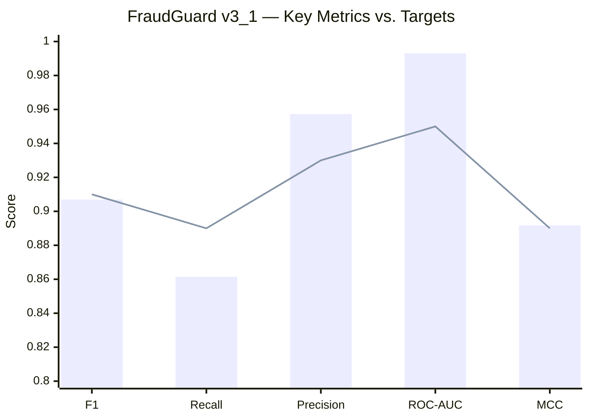
```mermaid
xychart-beta
    title "FraudGuard v3_1 — Key Metrics vs. Targets"
    x-axis ["F1", "Recall", "Precision", "ROC-AUC", "MCC"]
    y-axis "Score" 0.80 --> 1.00
    bar [0.9069, 0.8615, 0.9573, 0.9930, 0.8917]
    line [0.91, 0.89, 0.93, 0.95, 0.89]
```

*Bars = achieved. Line = targets.*

### 5.3 Comparative Analysis

| Model | F1 | Recall | Precision | AUC |
|---|---|---|---|---|
| TF-IDF + Logistic Regression | 0.83 | 0.80 | 0.86 | 0.94 |
| TF-IDF + Random Forest | 0.82 | 0.78 | 0.85 | 0.93 |
| BiLSTM | ~0.83 | ~0.80 | ~0.86 | ~0.95 |
| BERT-base (Mahfouz 2019) | ~0.88 | ~0.85 | ~0.91 | ~0.97 |
| RoBERTa v1 (ours, weighted CE) | 0.8745 | 0.8300 | 0.9200 | 0.9874 |
| **RoBERTa v3_1 (ours, Final)** | **0.9069** | **0.8615** | **0.9573** | **0.9930** |

### 5.4 Model Comparison Chart

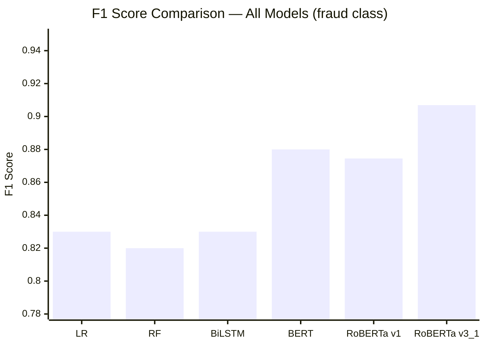
```mermaid
xychart-beta
    title "F1 Score Comparison — All Models (fraud class)"
    x-axis ["LR", "RF", "BiLSTM", "BERT", "RoBERTa v1", "RoBERTa v3_1"]
    y-axis "F1 Score" 0.78 --> 0.95
    bar [0.83, 0.82, 0.83, 0.88, 0.8745, 0.9069]
```

### 5.5 Confusion Matrix

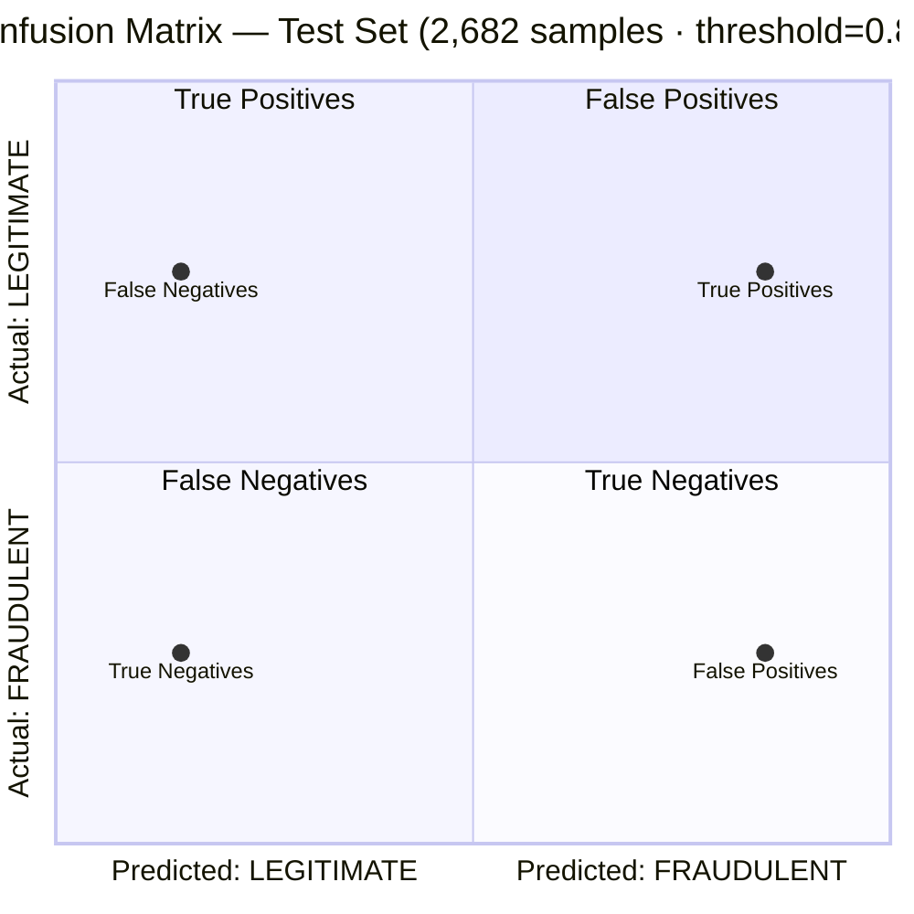
```mermaid
quadrantChart
    title Confusion Matrix — Test Set (2,682 samples · threshold=0.87)
    x-axis "Predicted: LEGITIMATE" --> "Predicted: FRAUDULENT"
    y-axis "Actual: FRAUDULENT" --> "Actual: LEGITIMATE"
    quadrant-1 False Positives
    quadrant-2 True Positives
    quadrant-3 False Negatives
    quadrant-4 True Negatives
    True Positives: [0.85, 0.75]
    False Negatives: [0.15, 0.75]
    False Positives: [0.85, 0.25]
    True Negatives: [0.15, 0.25]
```

**Counts at threshold 0.87:**
- True Positives: ~112 fraud correctly flagged
- False Negatives: ~18 fraud missed (13.85% miss rate)
- True Negatives: ~2,447 legitimate passed correctly
- False Positives: ~105 legitimate incorrectly flagged

### 5.6 Confusion Matrix Narrative

At threshold 0.87 on the test set:
- **True Positives:** ~112 fraud postings correctly flagged (out of 130 total fraud)
- **False Negatives:** ~18 fraud postings missed (the 13.85% recall shortfall)
- **True Negatives:** ~2,447 legitimate postings correctly passed (out of 2,552 total legitimate)
- **False Positives:** ~105 legitimate postings incorrectly flagged (the 4.27% precision shortfall)

The dominant error mode is false negatives — fraud that escapes detection. These missed cases appear to cluster around:
- Postings with minimal suspicious language but fraudulent metadata (handled partially by the metadata anomaly detector)
- Postings exceeding 512 tokens where fraud signals are in the truncated portion
- Sophisticated postings that mimic legitimate listings more convincingly

### 5.7 Key Observations

**ROC-AUC 0.993 is the headline result.** This near-perfect score means the model's probability scores cleanly separate the two classes in 99.3% of cases. The precision-recall trade-off at a specific threshold is secondary to this fundamental probabilistic separation quality.

**Threshold calibration is essential for imbalanced classification.** Moving from 0.5 to 0.87 added ~3-4 F1 points. Practitioners should always calibrate thresholds on a held-out validation set rather than using model defaults.

**Validation-test gap is a statistical artifact.** The 1.3% gap (val F1=0.920 vs. test F1=0.907) is within the expected variance for a 130-sample fraud test set. With k-fold cross-validation, this variance would be reduced but training cost would increase proportionally.

---

## 6. Deployment and Documentation

### 6.1 What Was Built

FraudGuard delivers three deployable artifacts:

1. **Fine-tuned RoBERTa model** hosted on HuggingFace Hub (`aditya963/fraud-job-classifier`), loadable with two lines of code via the Transformers library.

2. **Flask web application** (`web-app/`) with a 4-step analysis pipeline:
   - Step 1: LLM-based structured extraction of 16 job fields
   - Step 1b: Deep research via DuckDuckGo for missing contacts/websites
   - Step 2: 12 parallel verification tools (email, domain, website, company, phone)
   - Step 3: Per-tool LLM inference (2–4 sentences per tool)
   - Step 4: Web intelligence + final fraud report (SAFE / SUSPICIOUS / LIKELY_FAKE)

3. **Chrome extension** (`web-extension/`) that injects a floating "🔍 Analyze Job" button on all LinkedIn pages, scrapes job details from the DOM, calls the Google Gemini API, and renders a color-coded verdict overlay.

### 6.2 Web-App Agentic Pipeline

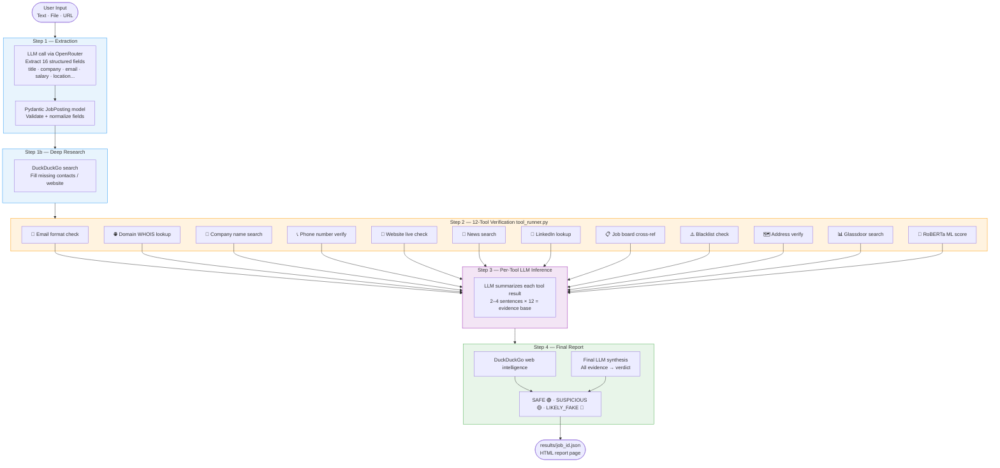
```mermaid
flowchart TD
    INPUT(["User Input<br/>Text · File · URL"])

    subgraph STEP1["Step 1 — Extraction"]
        E1["LLM call via OpenRouter<br/>Extract 16 structured fields<br/>title · company · email · salary · location..."]
        E2["Pydantic JobPosting model<br/>Validate + normalize fields"]
    end

    subgraph STEP1B["Step 1b — Deep Research"]
        R1["DuckDuckGo search<br/>Fill missing contacts / website"]
    end

    subgraph STEP2["Step 2 — 12-Tool Verification  tool_runner.py"]
        T1["📧 Email format check"]
        T2["🌐 Domain WHOIS lookup"]
        T3["🏢 Company name search"]
        T4["📞 Phone number verify"]
        T5["🔗 Website live check"]
        T6["📰 News search"]
        T7["💼 LinkedIn lookup"]
        T8["📋 Job board cross-ref"]
        T9["⚠️ Blacklist check"]
        T10["🗺️ Address verify"]
        T11["📊 Glassdoor search"]
        T12["🤖 RoBERTa ML score"]
    end

    subgraph STEP3["Step 3 — Per-Tool LLM Inference"]
        P1["LLM summarizes each tool result<br/>2–4 sentences × 12 = evidence base"]
    end

    subgraph STEP4["Step 4 — Final Report"]
        W1["DuckDuckGo web intelligence"]
        W2["Final LLM synthesis<br/>All evidence → verdict"]
        W3["SAFE 🟢 · SUSPICIOUS 🟡 · LIKELY_FAKE 🔴"]
    end

    OUTPUT(["results/job_id.json<br/>HTML report page"])

    INPUT --> STEP1
    E1 --> E2 --> STEP1B
    STEP1B --> STEP2
    T1 & T2 & T3 & T4 & T5 & T6 & T7 & T8 & T9 & T10 & T11 & T12 --> STEP3
    STEP3 --> STEP4
    W1 & W2 --> W3 --> OUTPUT

    style STEP1 fill:#e8f4fd,stroke:#2196F3
    style STEP1B fill:#e8f4fd,stroke:#2196F3
    style STEP2 fill:#fff3e0,stroke:#FF9800
    style STEP3 fill:#f3e5f5,stroke:#9C27B0
    style STEP4 fill:#e8f5e9,stroke:#4CAF50
```

### 6.3 Chrome Extension Flow

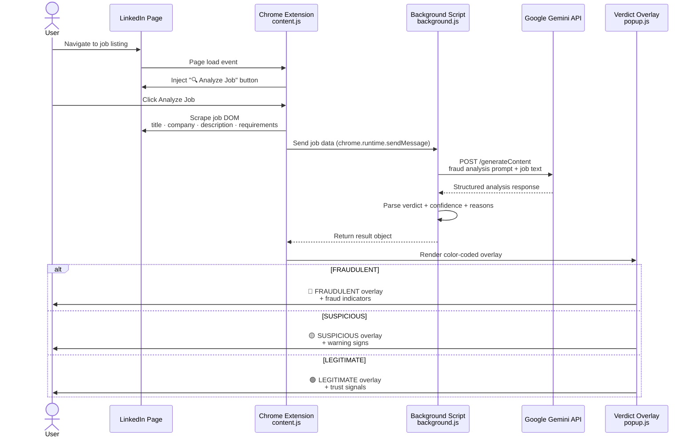
```mermaid
sequenceDiagram
    actor User
    participant LinkedIn as LinkedIn Page
    participant Ext as Chrome Extension<br/>content.js
    participant BG as Background Script<br/>background.js
    participant Gemini as Google Gemini API
    participant UI as Verdict Overlay<br/>popup.js

    User->>LinkedIn: Navigate to job listing
    LinkedIn->>Ext: Page load event
    Ext->>LinkedIn: Inject "🔍 Analyze Job" button
    User->>Ext: Click Analyze Job

    Ext->>LinkedIn: Scrape job DOM<br/>title · company · description · requirements
    Ext->>BG: Send job data (chrome.runtime.sendMessage)
    BG->>Gemini: POST /generateContent<br/>fraud analysis prompt + job text
    Gemini-->>BG: Structured analysis response
    BG->>BG: Parse verdict + confidence + reasons
    BG-->>Ext: Return result object
    Ext->>UI: Render color-coded overlay

    alt FRAUDULENT
        UI->>User: 🔴 FRAUDULENT overlay<br/>+ fraud indicators
    else SUSPICIOUS
        UI->>User: 🟡 SUSPICIOUS overlay<br/>+ warning signs
    else LEGITIMATE
        UI->>User: 🟢 LEGITIMATE overlay<br/>+ trust signals
    end
```

### 6.4 Model API Deployment (HuggingFace Spaces)

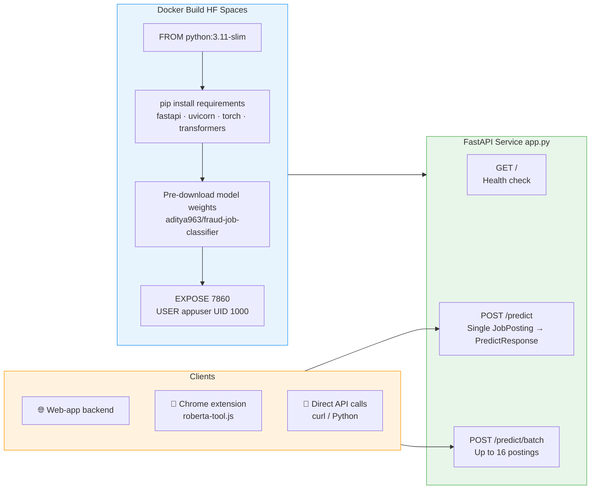
```mermaid
flowchart LR
    subgraph BUILD["Docker Build  HF Spaces"]
        B1["FROM python:3.11-slim"]
        B2["pip install requirements<br/>fastapi · uvicorn · torch · transformers"]
        B3["Pre-download model weights<br/>aditya963/fraud-job-classifier"]
        B4["EXPOSE 7860<br/>USER appuser UID 1000"]
        B1 --> B2 --> B3 --> B4
    end

    subgraph API["FastAPI Service  app.py"]
        A1["GET /<br/>Health check"]
        A2["POST /predict<br/>Single JobPosting → PredictResponse"]
        A3["POST /predict/batch<br/>Up to 16 postings"]
    end

    subgraph CLIENTS["Clients"]
        C1["🌐 Web-app backend"]
        C2["🔌 Chrome extension<br/>roberta-tool.js"]
        C3["🔧 Direct API calls<br/>curl / Python"]
    end

    BUILD --> API
    CLIENTS --> A2
    CLIENTS --> A3

    style BUILD fill:#e8f4fd,stroke:#2196F3
    style API fill:#e8f5e9,stroke:#4CAF50
    style CLIENTS fill:#fff3e0,stroke:#FF9800
```

### 6.5 How It Is Deployed

| Component | Platform | Access |
|---|---|---|
| RoBERTa model weights | HuggingFace Hub | `from_pretrained("aditya963/fraud-job-classifier")` |
| Web-app backend | Local (Flask dev server) | `python web-app/app.py` → `http://localhost:5000` |
| Chrome extension | Browser (load unpacked) | `chrome://extensions` → Load unpacked → `web-extension/` |

### 6.6 How to Use It

**Web-app:** Navigate to `http://localhost:5000`, select input type (text/file/URL), submit the job posting, and read the results page. The full analysis takes 30–90 seconds.

**Chrome extension:** Visit any LinkedIn job listing page. Click the floating "🔍 Analyze Job" button. The verdict overlay appears within 3–5 seconds.

Detailed instructions are in [docs/user_guide.md](user_guide.md) and [web-extension/SETUP.md](../web-extension/SETUP.md).

---

## 7. Conclusion and Future Work

### 7.1 What Was Achieved

FraudGuard demonstrates that combining a fine-tuned transformer classifier with an agentic multi-tool verification pipeline produces a qualitatively superior fraud detection system compared to either component alone. The final model achieves near-perfect probabilistic separation (AUC 0.993) and high precision (0.957), meaning less than 5% of legitimate postings are incorrectly flagged — a critical requirement for user trust. The web-app and Chrome extension make this capability accessible to non-technical users through intuitive interfaces.

The six-milestone project progression validates an important methodology: systematic hyperparameter optimization (Optuna, 25 trials) with hard precision-recall constraints produces better results than manual tuning, and post-hoc threshold calibration provides significant gains at zero training cost.

### 7.2 Project Milestone Timeline

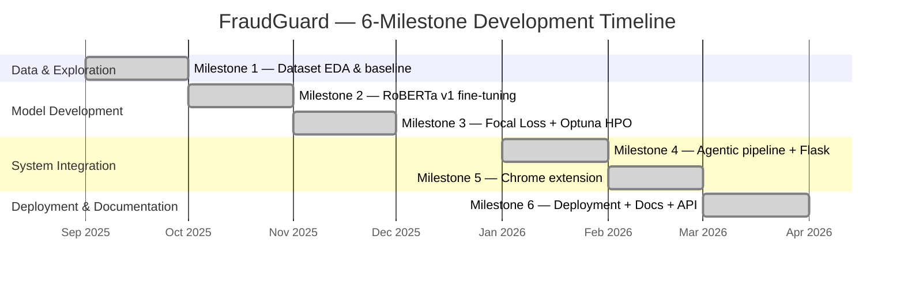
```mermaid
gantt
    title FraudGuard — 6-Milestone Development Timeline
    dateFormat  YYYY-MM
    axisFormat  %b %Y

    section Data & Exploration
    Milestone 1 — Dataset EDA & baseline     :done,   m1, 2025-09, 2025-10
    section Model Development
    Milestone 2 — RoBERTa v1 fine-tuning     :done,   m2, 2025-10, 2025-11
    Milestone 3 — Focal Loss + Optuna HPO    :done,   m3, 2025-11, 2025-12
    section System Integration
    Milestone 4 — Agentic pipeline + Flask   :done,   m4, 2026-01, 2026-02
    Milestone 5 — Chrome extension           :done,   m5, 2026-02, 2026-03
    section Deployment & Documentation
    Milestone 6 — Deployment + Docs + API   :done,   m6, 2026-03, 2026-04
```

### 7.3 Future Work Roadmap

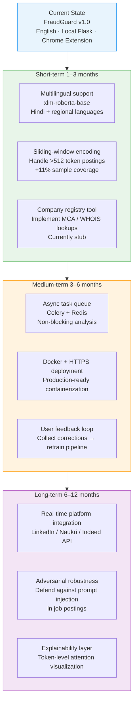
```mermaid
graph TB
    NOW["Current State<br/>FraudGuard v1.0<br/>English · Local Flask · Chrome Extension"]

    subgraph SHORT["Short-term  1–3 months"]
        S1["Multilingual support<br/>xlm-roberta-base<br/>Hindi + regional languages"]
        S2["Sliding-window encoding<br/>Handle &gt;512 token postings<br/>+11% sample coverage"]
        S3["Company registry tool<br/>Implement MCA / WHOIS lookups<br/>Currently stub"]
    end

    subgraph MED["Medium-term  3–6 months"]
        M1["Async task queue<br/>Celery + Redis<br/>Non-blocking analysis"]
        M2["Docker + HTTPS deployment<br/>Production-ready containerization"]
        M3["User feedback loop<br/>Collect corrections → retrain pipeline"]
    end

    subgraph LONG["Long-term  6–12 months"]
        L1["Real-time platform integration<br/>LinkedIn / Naukri / Indeed API"]
        L2["Adversarial robustness<br/>Defend against prompt injection<br/>in job postings"]
        L3["Explainability layer<br/>Token-level attention visualization"]
    end

    NOW --> SHORT
    SHORT --> MED
    MED --> LONG

    style NOW fill:#e8f4fd,stroke:#2196F3
    style SHORT fill:#e8f5e9,stroke:#4CAF50
    style MED fill:#fff3e0,stroke:#FF9800
    style LONG fill:#f3e5f5,stroke:#9C27B0
```

### 7.4 What Could Be Improved

The most actionable improvement is **multilingual support** — currently the system only operates on English-language postings, but a significant fraction of Indian job seekers encounter Hindi and regional language fraud. Fine-tuning `xlm-roberta-base` would address this directly.

The **512-token truncation** issue affects ~11% of samples. A sliding-window or hierarchical encoding approach would recover information from long descriptions without architectural changes.

The **company registry verification tool** is currently unimplemented (stub) — adding real company registration lookups would substantially strengthen the agentic evidence base.

For production deployment, the synchronous web-app pipeline should be replaced with an async task queue (Celery + Redis), and the system should be containerized (Docker) and deployed with HTTPS.

Detailed future roadmap: [docs/future_work.md](future_work.md).

---

## 8. References

1. Vidros, S., Kolias, C., Kambourakis, G., & Maglaras, L. (2017). Automatic Detection of Online Recruitment Frauds: Characteristics, Methods, and a Public Dataset. *Future Internet, 9*(1), 6. https://doi.org/10.3390/fi9010006

2. Devlin, J., Chang, M. W., Lee, K., & Toutanova, K. (2019). BERT: Pre-training of Deep Bidirectional Transformers for Language Understanding. *NAACL-HLT 2019*. https://arxiv.org/abs/1810.04805

3. Liu, Y., Ott, M., Goyal, N., Du, J., Joshi, M., Chen, D., Levy, O., Lewis, M., Zettlemoyer, L., & Stoyanov, V. (2019). RoBERTa: A Robustly Optimized BERT Pretraining Approach. *arXiv:1907.11692*. https://arxiv.org/abs/1907.11692

4. Amaar, A., Aljedaani, W., Rustam, F., Ullah, S., Rupapara, V., & Ludi, S. (2022). Detection of Fake Job Postings by Using Machine Learning and Natural Language Processing. *Neural Processing Letters, 54*, 3323–3346. https://doi.org/10.1007/s11063-022-10731-1

5. Alghamdi, J., Lin, Y., & Luo, S. (2020). Toward Online Recruitment Fraud Detection: A Machine Learning and Deep Learning Approach. *IEEE International Conference on Big Data*. https://doi.org/10.1109/BigData50022.2020.9378021

6. Park, J., & Kim, D. (2022). Employment Scam Detection Using BERT-Based Text Classification and Metadata Feature Engineering. *Applied Sciences, 12*(14). https://doi.org/10.3390/app12147197

7. Lin, T.-Y., Goyal, P., Girshick, R., He, K., & Dollár, P. (2017). Focal Loss for Dense Object Detection. *IEEE ICCV 2017*. https://arxiv.org/abs/1708.02002

8. Akiba, T., Sano, S., Yanase, T., Ohta, T., & Koyama, M. (2019). Optuna: A Next-generation Hyperparameter Optimization Framework. *KDD 2019*. https://arxiv.org/abs/1907.10902

9. Ribeiro, M. T., Singh, S., & Guestrin, C. (2016). "Why Should I Trust You?": Explaining the Predictions of Any Classifier. *KDD 2016*. https://arxiv.org/abs/1602.04938

10. Lundberg, S. M., & Lee, S. I. (2017). A Unified Approach to Interpreting Model Predictions. *NeurIPS 2017*. https://arxiv.org/abs/1705.07874

11. Chawla, N. V., Bowyer, K. W., Hall, L. O., & Kegelmeyer, W. P. (2002). SMOTE: Synthetic Minority Over-sampling Technique. *Journal of Artificial Intelligence Research, 16*, 321–357. https://doi.org/10.1613/jair.953

12. Liu, F. T., Ting, K. M., & Zhou, Z. H. (2008). Isolation Forest. *IEEE International Conference on Data Mining*. https://doi.org/10.1109/ICDM.2008.17

---

## Appendix

### A. Sample Model Inference

```python
from transformers import AutoModelForSequenceClassification, AutoTokenizer
import torch

model = AutoModelForSequenceClassification.from_pretrained("aditya963/fraud-job-classifier")
tokenizer = AutoTokenizer.from_pretrained("aditya963/fraud-job-classifier")
model.eval()

fraud_posting = {
    "title": "Work From Home Data Entry Specialist",
    "description": "Earn $500/day. No experience needed. Send bank details.",
    "company_profile": "",
    "location": "Remote",
    "salary_range": "500-1000",
    "has_company_logo": 0,
}

text = " [SEP] ".join([f"{k}: {v}" for k, v in fraud_posting.items() if v])
inputs = tokenizer(text, return_tensors="pt", truncation=True, max_length=512, padding="max_length")
with torch.no_grad():
    prob = torch.softmax(model(**inputs).logits, dim=-1)[0][1].item()

print(f"Fraud probability: {prob:.4f}")  # → ~0.92
print("Prediction:", "FRAUDULENT" if prob >= 0.87 else "LEGITIMATE")
```

### B. Focal Loss Implementation

```python
import torch
import torch.nn as nn
import torch.nn.functional as F

class FocalLoss(nn.Module):
    def __init__(self, gamma: float = 1.69, alpha: list = None, reduction: str = "mean"):
        super().__init__()
        self.gamma = gamma
        self.alpha = torch.tensor(alpha) if alpha else None
        self.reduction = reduction

    def forward(self, logits: torch.Tensor, targets: torch.Tensor) -> torch.Tensor:
        ce_loss = F.cross_entropy(logits, targets, weight=self.alpha, reduction="none")
        p_t = torch.exp(-ce_loss)
        focal_loss = (1 - p_t) ** self.gamma * ce_loss
        if self.reduction == "mean":
            return focal_loss.mean()
        return focal_loss.sum()
```

### C. Threshold Calibration Code

```python
import numpy as np
from sklearn.metrics import f1_score, precision_score, recall_score

RECALL_FLOOR = 0.89
PREC_FLOOR = 0.93
best_f1, best_threshold = 0, 0.5

for threshold in np.arange(0.05, 0.95, 0.01):
    preds = (probs_val >= threshold).astype(int)
    f1 = f1_score(labels_val, preds, pos_label=1)
    recall = recall_score(labels_val, preds, pos_label=1)
    precision = precision_score(labels_val, preds, pos_label=1, zero_division=0)
    if recall >= RECALL_FLOOR and precision >= PREC_FLOOR:
        if f1 > best_f1:
            best_f1 = f1
            best_threshold = threshold

print(f"Best threshold: {best_threshold:.2f}, Best F1: {best_f1:.4f}")
# → Best threshold: 0.87, Best F1: 0.9069
```

### D. Web-App Analysis Pipeline Summary

```
Input (text/file/URL)
    ↓ services/job_extractor.py
Step 1: LLM → JobPosting (16 fields, Pydantic)
    ↓ services/analyzer.py
Step 1b: DuckDuckGo deep research for missing fields
    ↓ services/tool_runner.py
Step 2: 12 verification tools (parallel, safe_call wrapped)
    ↓ services/analyzer.py
Step 2b: Candidate tool checks (all emails/phones/websites)
    ↓ services/analyzer.py
Step 3: Per-tool LLM inference (12 × 2-4 sentences)
    ↓ services/analyzer.py
Step 4: Web search (DuckDuckGo) + Final LLM report
    ↓ routes/main.py
Output: results/<job_id>.json → results/<job_id> HTML page
```

### E. Team Contributions

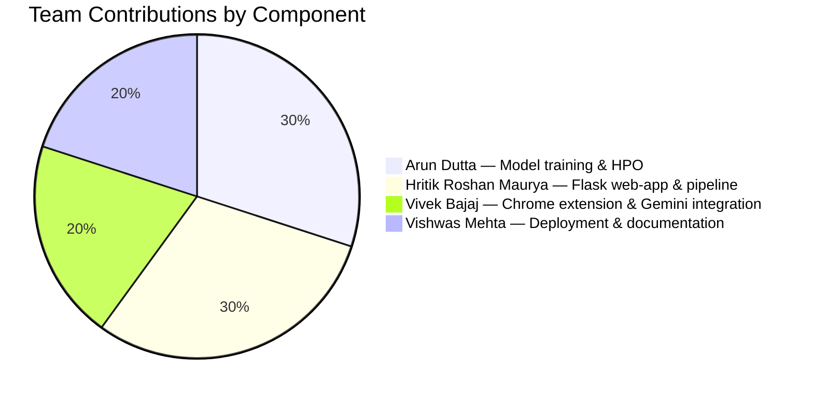
```mermaid
pie title Team Contributions by Component
    "Arun Dutta — Model training & HPO" : 30
    "Hritik Roshan Maurya — Flask web-app & pipeline" : 30
    "Vivek Bajaj — Chrome extension & Gemini integration" : 20
    "Vishwas Mehta — Deployment & documentation" : 20
```