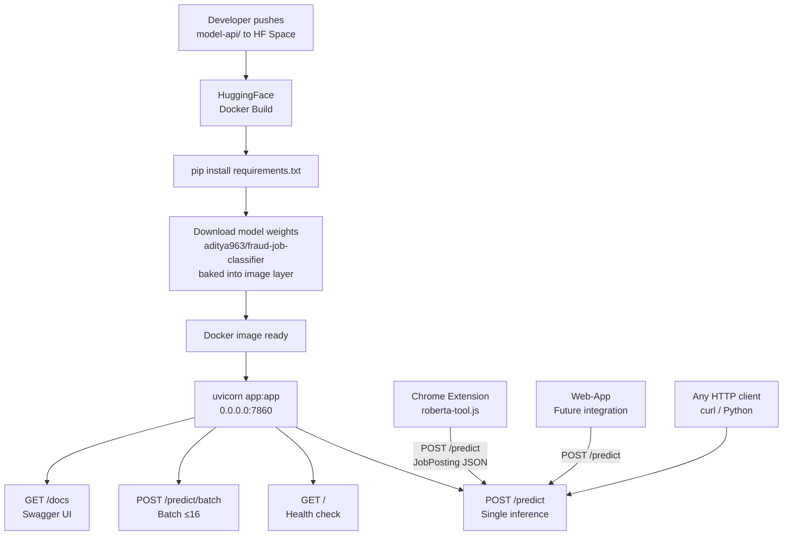

# API Documentation

FraudGuard exposes **two independent APIs**:

| API | Location | Purpose |
|---|---|---|
| **RoBERTa Model API** | `model-api/` → HuggingFace Spaces | Pure ML inference — job text in, fraud probability out |
| **Web-App API** | `web-app/` → `localhost:5000` | Full agentic pipeline — 12-tool verification + LLM report |

---

## Part 1 — RoBERTa Model API (HuggingFace Spaces)

> Thin FastAPI wrapper around the fine-tuned `aditya963/fraud-job-classifier` model.
> Designed to be called by the **Chrome extension** (`roberta-tool.js`) and any external client.
> Source code: [`model-api/`](../model-api/)

### Architecture

```
                    ┌─────────────────────────────────────────┐
                    │         Clients                         │
                    │                                         │
                    │  Chrome Extension    Python / curl      │
                    │  (roberta-tool.js)   (any HTTP client)  │
                    └──────────┬──────────────────┬──────────┘
                               │                  │
                               │   POST /predict  │
                               ▼                  ▼
                    ┌─────────────────────────────────────────┐
                    │    FastAPI  (uvicorn, port 7860)        │
                    │    HuggingFace Spaces — Docker SDK      │
                    │                                         │
                    │  GET  /              health check       │
                    │  POST /predict       single inference   │
                    │  POST /predict/batch batch inference    │
                    │  GET  /docs          Swagger UI         │
                    └──────────────────┬──────────────────────┘
                                       │
                                       ▼
                    ┌─────────────────────────────────────────┐
                    │           Inference Pipeline            │
                    │                                         │
                    │  build_input_text(JobPosting)           │
                    │  ┌─────────────────────────────────┐   │
                    │  │  Structured fields first:        │   │
                    │  │  "Location: X [SEP]              │   │
                    │  │   Salary Range: Y [SEP] ..."     │   │
                    │  │  Then free-text fields           │   │
                    │  └─────────────────────────────────┘   │
                    │           │                             │
                    │           ▼                             │
                    │  RoBERTa BPE Tokenizer → [512 tokens]  │
                    │           │                             │
                    │           ▼                             │
                    │  RoBERTa-base Encoder (12L × 768d)     │
                    │           │                             │
                    │           ▼                             │
                    │  Linear(768→2) → Softmax → P(fraud)    │
                    │           │                             │
                    │     threshold 0.87                      │
                    │           │                             │
                    │           ▼                             │
                    │  { fraud_probability, verdict,         │
                    │    confidence, latency_ms }             │
                    └─────────────────────────────────────────┘
```

### Deployment Architecture on HuggingFace Spaces



### Base URL

```
https://YOUR-USERNAME-fraudguard-api.hf.space
```

Replace `YOUR-USERNAME` with your HuggingFace username after deployment.

---

### Endpoint: `GET /`

Health check. Confirms model is loaded and ready.

**Response `200`:**
```json
{
  "status": "ok",
  "model_id": "aditya963/fraud-job-classifier",
  "threshold": 0.87,
  "device": "cpu",
  "version": "1.0.0"
}
```

**curl:**
```bash
curl https://YOUR-USERNAME-fraudguard-api.hf.space/
```

---

### Endpoint: `POST /predict`

Predict fraud probability for a single job posting.

**Content-Type:** `application/json`

**Request Body — `JobPosting`** (all fields optional):

| Field | Type | Description |
|---|---|---|
| `title` | string | Job title |
| `description` | string | Full job description |
| `requirements` | string | Required qualifications |
| `company_profile` | string | About the company |
| `benefits` | string | Benefits offered |
| `location` | string | Job location |
| `salary_range` | string | Salary band e.g. `"80000-100000"` |
| `employment_type` | string | `"Full-time"`, `"Part-time"`, etc. |
| `required_experience` | string | e.g. `"Mid-Senior level"` |
| `required_education` | string | e.g. `"Bachelor's Degree"` |
| `department` | string | Department name |
| `industry` | string | Industry name |
| `function` | string | Job function |
| `has_company_logo` | int `0\|1` | Whether the posting has a company logo |
| `telecommuting` | int `0\|1` | Whether remote work is offered |
| `has_questions` | int `0\|1` | Whether screening questions are included |

**Response `200` — `PredictResponse`:**

| Field | Type | Description |
|---|---|---|
| `fraud_probability` | float | Model score 0.0–1.0 |
| `fraud_percent` | float | Same score as percentage |
| `verdict` | string | `FRAUDULENT` or `LEGITIMATE` |
| `confidence` | string | `HIGH` / `MEDIUM` / `LOW` (distance from threshold) |
| `threshold` | float | Operating threshold used (default `0.87`) |
| `model_id` | string | HuggingFace model repo ID |
| `latency_ms` | float | Server-side inference time in milliseconds |

**Example — Fraudulent posting:**
```bash
curl -X POST https://YOUR-USERNAME-fraudguard-api.hf.space/predict \
  -H "Content-Type: application/json" \
  -d '{
    "title": "Work From Home Data Entry Specialist",
    "description": "Earn $500/day. No experience needed. Send bank details to start.",
    "company_profile": "",
    "location": "Remote",
    "salary_range": "500-1000",
    "employment_type": "Part-time",
    "has_company_logo": 0
  }'
```
```json
{
  "fraud_probability": 0.9247,
  "fraud_percent": 92.5,
  "verdict": "FRAUDULENT",
  "confidence": "HIGH",
  "threshold": 0.87,
  "model_id": "aditya963/fraud-job-classifier",
  "latency_ms": 43.2
}
```

**Example — Legitimate posting:**
```bash
curl -X POST https://YOUR-USERNAME-fraudguard-api.hf.space/predict \
  -H "Content-Type: application/json" \
  -d '{
    "title": "Senior Software Engineer",
    "description": "We are seeking an experienced engineer to join our team.",
    "requirements": "5+ years Python, B.Tech CS",
    "company_profile": "Infosys Technologies — a global leader in IT services.",
    "location": "Bengaluru, Karnataka, India",
    "salary_range": "1800000-2400000",
    "employment_type": "Full-time",
    "has_company_logo": 1
  }'
```
```json
{
  "fraud_probability": 0.0312,
  "fraud_percent": 3.1,
  "verdict": "LEGITIMATE",
  "confidence": "HIGH",
  "threshold": 0.87,
  "model_id": "aditya963/fraud-job-classifier",
  "latency_ms": 38.7
}
```

---

### Endpoint: `POST /predict/batch`

Run up to 16 job postings through the model in a single call. More efficient than looping over `/predict`.

**Request Body:**
```json
{
  "postings": [
    { "title": "...", "description": "..." },
    { "title": "...", "description": "..." }
  ]
}
```
Maximum 16 items. Returns `422` if exceeded.

**Response `200` — `BatchResponse`:**
```json
{
  "results": [
    {
      "fraud_probability": 0.0312,
      "verdict": "LEGITIMATE",
      "confidence": "HIGH",
      "threshold": 0.87,
      "latency_ms": 12.1
    },
    {
      "fraud_probability": 0.9247,
      "verdict": "FRAUDULENT",
      "confidence": "HIGH",
      "threshold": 0.87,
      "latency_ms": 12.1
    }
  ],
  "count": 2,
  "latency_ms": 24.2
}
```

**curl:**
```bash
curl -X POST https://YOUR-USERNAME-fraudguard-api.hf.space/predict/batch \
  -H "Content-Type: application/json" \
  -d '{
    "postings": [
      {"title": "Senior Engineer", "description": "5 years Python required", "has_company_logo": 1},
      {"title": "Easy money from home", "description": "No experience. Pay upfront.", "has_company_logo": 0}
    ]
  }'
```

---

### Python Client Example

```python
import requests

API_BASE = "https://YOUR-USERNAME-fraudguard-api.hf.space"

def predict(job: dict) -> dict:
    resp = requests.post(f"{API_BASE}/predict", json=job, timeout=30)
    resp.raise_for_status()
    return resp.json()

result = predict({
    "title": "Work From Home Data Entry",
    "description": "Earn $500/day! No experience!",
    "has_company_logo": 0,
})

print(result["verdict"])           # FRAUDULENT
print(result["fraud_probability"]) # 0.9247
print(result["confidence"])        # HIGH
```

---

### Updating the Chrome Extension to Use This API

In [web-extension/tools/roberta-tool.js](../web-extension/tools/roberta-tool.js), two changes are needed:

**1. Replace the URL (line 12–13):**
```js
// Before — HF Inference API (requires HF token, has cold-start delay):
const HF_MODEL_URL =
    "https://api-inference.huggingface.co/models/aditya963/fraud-job-classifier";

// After — your own Space (no token needed, always warm):
const HF_MODEL_URL =
    "https://YOUR-USERNAME-fraudguard-api.hf.space/predict";
```

**2. Update the fetch body (line ~108–116):**
```js
// Before — HF Inference API format:
body: JSON.stringify({ inputs: standardizedText })

// After — this API accepts the full JobPosting schema:
body: JSON.stringify({
    title:          jobData.title,
    description:    jobData.description,
    company_profile: jobData.companyDescription,
    location:       jobData.location,
    salary_range:   jobData.salary,
    employment_type: jobData.employmentType,
    // ... any other scraped fields
})
```

**3. Parse the response (line ~133–148):**
```js
// Before — HF Inference format [[{label, score}, ...]]
const scores = Array.isArray(data[0]) ? data[0] : data;

// After — this API returns { fraud_probability, verdict, confidence }
const { fraud_probability, verdict, confidence } = data;
const fraudProbability = fraud_probability;
const isFraud = verdict === "FRAUDULENT";
```

---

### Error Codes (Model API)

| HTTP Status | Meaning |
|---|---|
| `200` | Success |
| `422` | Validation error — malformed request body or batch too large |
| `500` | Server error — model inference failed |
| `503` | Model is loading (first cold start) — retry after 10–30 seconds |

---

### Deploying to HuggingFace Spaces — Step by Step

```
Step 1   huggingface.co/new-space
         SDK = Docker | Name = fraudguard-api
                  │
                  ▼
Step 2   git clone https://huggingface.co/spaces/YOU/fraudguard-api
         Copy: model-api/app.py
               model-api/requirements.txt
               model-api/Dockerfile
               model-api/README.md
                  │
                  ▼
Step 3   git add . && git commit -m "deploy" && git push
                  │
                  ▼
Step 4   HuggingFace builds Docker image
         (installs deps + downloads model weights ≈ 3–5 min)
                  │
                  ▼
Step 5   Space turns green ✅
         API live at:
         https://YOUR-USERNAME-fraudguard-api.hf.space
                  │
                  ▼
Step 6   Test: curl https://.../ → {"status":"ok"}
         Update roberta-tool.js with new URL
```

---

## Part 2 — Web-App API (Flask, `localhost:5000`)

**FraudGuard Web-App — REST API Reference**
**Base URL:** `http://localhost:5000` (local deployment)
**Version:** 1.0

### Overview

The FraudGuard web-app exposes a lightweight REST API for programmatic access to settings management and analysis results. The primary analysis pipeline is triggered via form submission (`POST /analyze`) rather than a pure JSON API, but the results are accessible as structured JSON.

All JSON responses use `Content-Type: application/json`.

---

## Authentication

No API-level authentication is required for local deployment. LLM API keys are configured via environment variables or the `/api/settings` endpoint and stored in the Flask session.

---

## Endpoints

---

### GET `/`

**Description:** Serve the web-app home page (HTML). Not a JSON API endpoint — used for browser access only.

**Response:** HTML page with 3-tab input form (Paste Text / Upload File / LinkedIn URL).

---

### POST `/analyze`

**Description:** Submit a job listing for analysis. Runs the full 4-step fraud detection pipeline and redirects to the results page.

**Content-Type:** `multipart/form-data`

**Form Parameters:**

| Parameter | Type | Required | Description |
|---|---|---|---|
| `input_type` | string | Yes | One of: `text`, `file`, `url` |
| `job_text` | string | If `input_type=text` | Raw job description text |
| `job_file` | file | If `input_type=file` | File upload (PDF, DOCX, TXT, HTML, MD) |
| `linkedin_url` | string | If `input_type=url` | Full LinkedIn job URL |

**Response:** HTTP 302 redirect to `/results/<job_id>` on success, or back to `/` with flash error message on invalid input.

**Example (curl):**
```bash
curl -X POST http://localhost:5000/analyze \
  -F "input_type=text" \
  -F "job_text=Software Engineer at Acme Corp. Requirements: 3 years Python..."
```

---

### GET `/results/<job_id>`

**Description:** Render the analysis results page for a given job ID (HTML).

**Path Parameters:**

| Parameter | Type | Description |
|---|---|---|
| `job_id` | string (UUID) | The UUID returned when the analysis was submitted |

**Response:** HTML results page showing verdict, tool evidence grid, and final report.

**Error:** HTTP 302 redirect to `/` with flash error if `job_id` not found.

---

### GET `/results`

**Description:** List all past analyses in reverse chronological order (HTML).

**Response:** HTML history table with columns: job ID, company name, job title, verdict, status, submission time.

---

### GET `/api/result/<job_id>`

**Description:** Return the full raw analysis result as JSON.

**Path Parameters:**

| Parameter | Type | Description |
|---|---|---|
| `job_id` | string (UUID) | The UUID of the analysis |

**Response:** `200 OK` with full result JSON, or `404` if not found.

**Example Request:**
```bash
curl http://localhost:5000/api/result/550e8400-e29b-41d4-a716-446655440000
```

**Example Response (abbreviated):**
```json
{
  "job_id": "550e8400-e29b-41d4-a716-446655440000",
  "status": "complete",
  "created_at": "2026-04-15T10:23:45.123456+00:00",
  "input_type": "text",
  "raw_text": "Work From Home Data Entry Specialist...",
  "job_posting": {
    "title": "Work From Home Data Entry Specialist",
    "company_name": null,
    "location": "Remote",
    "salary_range": "500-1000",
    "employment_type": "Part-time",
    "description": "Earn $500/day working from home...",
    "contact_email": "dataentry@gmail.com",
    "has_company_logo": 0
  },
  "job_posting_enriched": {
    "contact_email": "dataentry@gmail.com"
  },
  "deep_research": {
    "missing_from_jd": ["company_website", "contact_phone"],
    "candidates": {
      "emails": ["dataentry@gmail.com"],
      "phones": [],
      "websites": []
    },
    "applied_overrides": {}
  },
  "tool_results": {
    "scam_signals": {
      "ok": true,
      "data": {
        "scam_score": 87,
        "risk_level": "high",
        "signals_found": ["unrealistic_salary", "no_company_info", "free_email_contact"],
        "signals_count": 3
      }
    },
    "email_verify": {
      "ok": true,
      "data": {
        "is_deliverable": true,
        "is_disposable": false,
        "is_role_account": false,
        "overall_status": "deliverable"
      }
    },
    "domain_reputation": {
      "ok": true,
      "data": {
        "domain_age_days": 45,
        "risk_level": "high",
        "is_live": true,
        "registrar": "GoDaddy"
      }
    }
  },
  "tool_inferences": {
    "scam_signals": "The scam signal scanner returned a high-risk score of 87/100 with 3 triggered signals: unrealistic salary claims, no company information, and a free email contact. This combination is strongly associated with advance-fee fraud patterns."
  },
  "web_search_results": [
    {
      "query": "dataentry jobs 2026 gmail scam complaint",
      "title": "Beware of data entry job scams",
      "url": "https://example.com/article",
      "snippet": "Multiple complaints received..."
    }
  ],
  "final_report": "## Fraud Risk Assessment\n\n**Verdict: LIKELY_FAKE**\n**Confidence: High**\n\n## Executive Summary\n...",
  "verdict": "LIKELY_FAKE",
  "error": null
}
```

**Full Response Schema:**

| Field | Type | Description |
|---|---|---|
| `job_id` | string | UUID of the analysis |
| `status` | string | `processing`, `complete`, or `error` |
| `created_at` | string | ISO 8601 timestamp |
| `input_type` | string | `text`, `file`, or `url` |
| `raw_text` | string | Raw extracted text of the job posting |
| `job_posting` | object | Structured 16-field JobPosting extraction |
| `job_posting_enriched` | object | Fields enriched via deep research (overrides) |
| `deep_research` | object | Deep research results (missing fields, candidates, overrides) |
| `tool_results` | object | Raw output from each of the 12 verification tools |
| `candidate_tool_results` | object | Per-value tool checks for all discovered emails/phones/websites |
| `tool_inferences` | object | LLM-written 2-4 sentence summaries for each tool result |
| `web_search_results` | array | DuckDuckGo search results for fraud signal queries |
| `final_report` | string | Full markdown fraud investigation report |
| `verdict` | string | `SAFE`, `SUSPICIOUS`, or `LIKELY_FAKE` |
| `error` | string/null | Error message if `status=error`, null otherwise |

---

### GET `/api/settings`

**Description:** Return the current effective LLM configuration.

**Response:** `200 OK`

**Example Request:**
```bash
curl http://localhost:5000/api/settings
```

**Example Response:**
```json
{
  "api_key": "***",
  "model": "openai/gpt-4o-mini",
  "base_url": "https://aipipe.org/openrouter/v1",
  "source": "env"
}
```

**Response Fields:**

| Field | Description |
|---|---|
| `api_key` | Masked as `"***"` if set, empty string if not set |
| `model` | Current LLM model slug |
| `base_url` | Current LLM base URL |
| `source` | How settings were resolved: `env` (environment variables), `session` (UI override), or `config` (defaults) |

---

### POST `/api/settings`

**Description:** Update LLM settings for the current session. Settings persist across page loads but are cleared when the browser session ends.

**Content-Type:** `application/json`

**Request Body:**

```json
{
  "api_key": "your-api-key",
  "model": "anthropic/claude-3-5-sonnet",
  "base_url": "https://aipipe.org/openrouter/v1"
}
```

All fields are optional. Sending an empty string (`""`) for any field **clears** the session override for that field (reverts to environment variable or config default).

**Example Request:**
```bash
curl -X POST http://localhost:5000/api/settings \
  -H "Content-Type: application/json" \
  -d '{"api_key": "sk-...", "model": "openai/gpt-4o-mini"}'
```

**Example Response:**
```json
{
  "ok": true,
  "message": "Settings saved. Empty fields clear session overrides."
}
```

---

## Tool Output Contracts

Each of the 12 tools in `tool_results` returns either success or failure:

**Success format:**
```json
{"ok": true, "data": { ... }}
```

**Failure format:**
```json
{"ok": false, "error": "error message"}
```

**Tool-specific output fields:**

| Tool Key | Key Output Fields |
|---|---|
| `scam_signals` | `scam_score` (0-100), `risk_level` (low/medium/high), `signals_found` (list), `signals_count` (int) |
| `email_verify` | `is_deliverable` (bool), `is_disposable` (bool), `is_role_account` (bool), `overall_status` (string) |
| `domain_reputation` | `domain_age_days` (int), `risk_level` (string), `is_live` (bool), `registrar` (string) |
| `website_verify` | `is_live` (bool), `ssl_valid` (bool), `status_code` (int), `redirect_count` (int) |
| `website_content` | `extracted_text` (string), `word_count` (int), `metadata` ({title, description, sitename}) |
| `company_wikipedia` | `title` (string), `extract` (string), `wikipedia_url` (string) |
| `company_web_search` | `searches` (dict with 5 angles: general, reviews, scam, glassdoor, linkedin) |
| `company_news` | `articles` (list of {date, title, url, source, snippet}) |
| `social_profiles` | `platforms_found` (0-7), `profiles` (dict per platform: found bool, links list) |
| `job_boards` | `boards_found` (0-8), `verdict` (strong/moderate/not_found) |
| `phone_check` | `e164` (string), `is_valid` (bool), `region_code` (string), `carrier` (string), `location` (string) |
| `company_registry` | Stub — always returns `{"ok": false}` |

---

## Error Codes

| HTTP Status | Meaning |
|---|---|
| 200 | Success |
| 302 | Redirect (after form submission) |
| 404 | Result not found (invalid `job_id`) |
| 500 | Server error (check `error` field in JSON response) |

**LLM-related errors** (from OpenRouter/AIPipe) are surfaced in the analysis result:
- `402 Payment Required` — API key has insufficient credits
- `401 Unauthorized` — API key is invalid
- `429 Too Many Requests` — Rate limit exceeded

---

## Rate Limits and Constraints

| Constraint | Value |
|---|---|
| Max upload file size | 10 MB (configured; enforcement pending) |
| Allowed upload extensions | `.pdf`, `.docx`, `.doc`, `.txt`, `.html`, `.md` |
| Tool request timeout | 20 seconds per tool |
| Max email candidates | 6 |
| Max phone candidates | 6 |
| Max website candidates | 5 |
| Max DuckDuckGo results | 12 (across 3 queries) |
| Concurrent requests | 1 (synchronous pipeline; no queue) |

---

## Example: Full Analysis Flow via curl

```bash
# Step 1: Submit a job for analysis
# (Returns a redirect — follow with -L to get the results page)
curl -s -L -X POST http://localhost:5000/analyze \
  -F "input_type=text" \
  -F "job_text=Software Engineer at TechCorp. 5 years experience required. Salary: 15-20 LPA." \
  -o /tmp/results.html

# Step 2: Get the raw JSON by job_id
# (Get the job_id from the URL: /results/<job_id>)
JOB_ID="extracted-from-redirect-url"
curl http://localhost:5000/api/result/$JOB_ID | python3 -m json.tool

# Step 3: Check the verdict
curl -s http://localhost:5000/api/result/$JOB_ID | python3 -c "import sys,json; d=json.load(sys.stdin); print(d['verdict'])"
```
