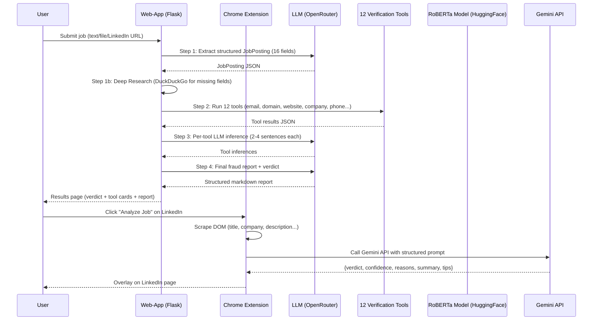

# System Overview

**Project:** FraudGuard — Fake Job Listing Detection using Deep Learning and Agentic AI
**Course:** DS & AI Lab Project
**Team:** Group 9 (Arun Dutta, Hritik Roshan Maurya, Vivek Bajaj, Vishwas Mehta)

---

## 1. Problem Statement

Online recruitment platforms such as LinkedIn, Indeed, and Naukri host millions of job postings, and an estimated 3–5% of these are fraudulent. Fake job listings are designed to collect personal information, charge advance fees, or conduct phishing attacks against job seekers. Traditional keyword-based filters fail because modern fraud postings are linguistically sophisticated — they mimic legitimate job ads with high precision.

**Objective:** Build an end-to-end AI system that can:
1. Classify any job posting text as **Legitimate** or **Fraudulent** with high confidence.
2. Provide structured, human-readable reasoning for the decision.
3. Verify suspicious attributes (company domain, email, phone, salary) using external sources.
4. Deliver results through both a web application and a browser extension.

---

## 2. Final System Architecture Summary

The system comprises three major layers:

### Layer 1: ML Fraud Classifier (RoBERTa)
A fine-tuned **RoBERTa-base** transformer (125M parameters) trained on 17,880 labeled job postings from the EMSCAD dataset. It receives a concatenated text representation of all job fields (title, description, requirements, metadata) and outputs a fraud probability score. An Optuna-tuned threshold (0.87) converts this to a binary label.

### Layer 2: Agentic Verification Pipeline (Web-App Backend)
An LLM-orchestrated agent (via LangChain + OpenRouter) that runs **12 investigative tools** in parallel against each job posting. Tools check domain reputation, email validity, company Wikipedia presence, news articles, social profiles, job board cross-listings, and phone numbers. Results are synthesized by an LLM into a structured fraud investigation report.

### Layer 3: User Interfaces
- **Web-App** (Flask): Accepts text paste, file upload (.pdf/.docx/.txt/.html), or LinkedIn URL. Returns a full investigation report with verdict (SAFE / SUSPICIOUS / LIKELY_FAKE) and per-tool evidence.
- **Chrome Extension**: Injects directly into LinkedIn job pages. Scrapes the listing, sends it to Google Gemini AI, and displays a color-coded verdict overlay in the browser.

---

## 3. What Is Deployed

| Component | Technology | Where |
|---|---|---|
| **RoBERTa Model** | HuggingFace Transformers | [HuggingFace Hub: aditya963/fraud-job-classifier](https://huggingface.co/aditya963/fraud-job-classifier) |
| **Web-App Backend** | Flask + LangChain + 12 tools | Local (run `python web-app/app.py`) |
| **Chrome Extension** | Vanilla JS + Gemini API | Load unpacked in Chrome (`web-extension/`) |
| **Training Notebooks** | PyTorch + HuggingFace on Google Colab T4 | Google Colab (T4 GPU) |

---

## 4. Full Data Flow Diagram



---

## 5. Component Interaction Map

```
┌────────────────────────────────────────────────────────────────────┐
│                         USER INTERFACES                           │
│                                                                    │
│   ┌─────────────────────┐         ┌──────────────────────────┐    │
│   │   Flask Web-App      │         │   Chrome Extension        │    │
│   │   localhost:5000      │         │   (LinkedIn only)         │    │
│   │                       │         │                           │    │
│   │  3 input tabs:        │         │  - Inject button on page  │    │
│   │  • Paste text         │         │  - Scrape job DOM         │    │
│   │  • Upload file        │         │  - Send to Gemini         │    │
│   │  • LinkedIn URL       │         │  - Show overlay verdict   │    │
│   └────────┬────────────┘         └──────────────────────────┘    │
└────────────┼───────────────────────────────────────────────────────┘
             │
             ▼
┌────────────────────────────────────────────────────────────────────┐
│                    WEB-APP ANALYSIS PIPELINE                       │
│                                                                    │
│  ┌──────────────────┐  ┌───────────────────────┐                 │
│  │  Job Extractor   │  │  Deep Research        │                 │
│  │  (LLM → Pydantic)│  │  (DuckDuckGo)         │                 │
│  └──────────────────┘  └───────────────────────┘                 │
│                                                                    │
│  ┌───────────────────────────────────────────────────────────┐   │
│  │                 12 Verification Tools                      │   │
│  │  scam_signals  email_verify  domain_reputation             │   │
│  │  website_verify  website_content  company_wikipedia        │   │
│  │  company_web_search  company_news  social_profiles         │   │
│  │  job_boards  phone_check  company_registry(stub)          │   │
│  └───────────────────────────────────────────────────────────┘   │
│                                                                    │
│  ┌──────────────────────┐  ┌────────────────────────────────┐    │
│  │  Per-Tool LLM Infer  │  │  Final Fraud Report (LLM)      │    │
│  │  (2-4 sentences each)│  │  + Web Search (DuckDuckGo)     │    │
│  └──────────────────────┘  └────────────────────────────────┘    │
└────────────────────────────────────────────────────────────────────┘
             │
             ▼
┌────────────────────────────────────────────────────────────────────┐
│                     ML MODEL LAYER                                 │
│                                                                    │
│   RoBERTa-base (125M params)                                       │
│   • Trained on 17,880 EMSCAD job postings                         │
│   • Focal Loss (γ=1.69) + Optuna HPO (25 trials)                  │
│   • Inference threshold: 0.87                                      │
│   • Hosted: HuggingFace Hub (aditya963/fraud-job-classifier)      │
│                                                                    │
│   Performance:  F1=0.907  |  Precision=0.957  |  AUC=0.993       │
└────────────────────────────────────────────────────────────────────┘
```

---

## 6. Key Design Decisions

| Decision | Rationale |
|---|---|
| **RoBERTa over BERT** | RoBERTa uses dynamic masking and more pre-training data, yielding better contextual understanding for fraud text |
| **Full fine-tuning over LoRA** | The small dataset size (~17K samples, 866 fraud) benefits from all 125M parameters adapting to domain-specific signals |
| **Focal Loss** | Directly addresses the 20:1 class imbalance by down-weighting easy negatives, improving fraud recall by ~15-20 percentage points |
| **Threshold calibration (0.87)** | Moving from default 0.5 to 0.87 achieves high precision (0.957), minimizing false alarms for users |
| **Agentic pipeline over single model** | No single model can verify external facts (domain age, company registration, email deliverability). Multi-tool agents provide evidence-backed decisions |
| **LLM explanation layer** | LIME/SHAP produce feature weights, not narratives. Job seekers need actionable, human-readable reports |
