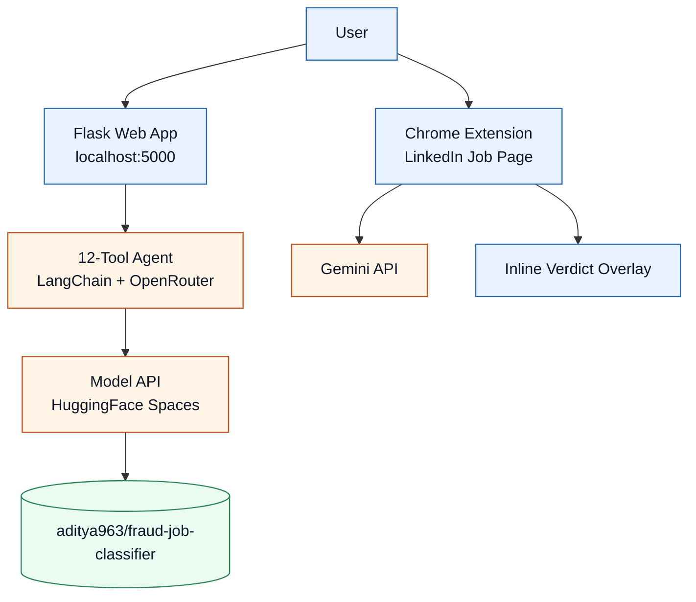
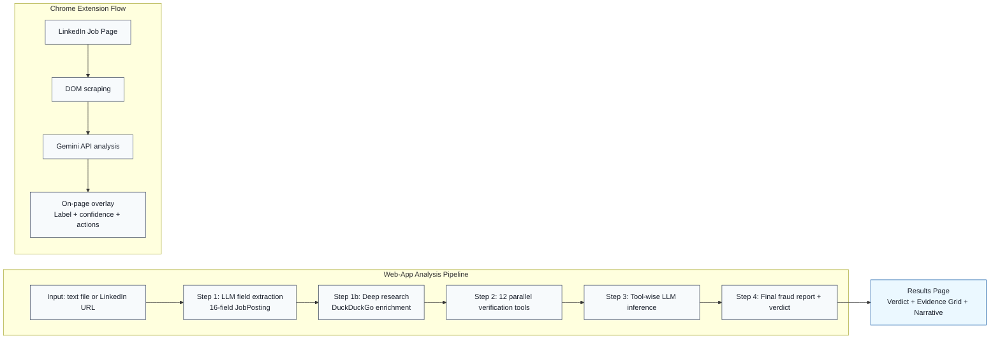
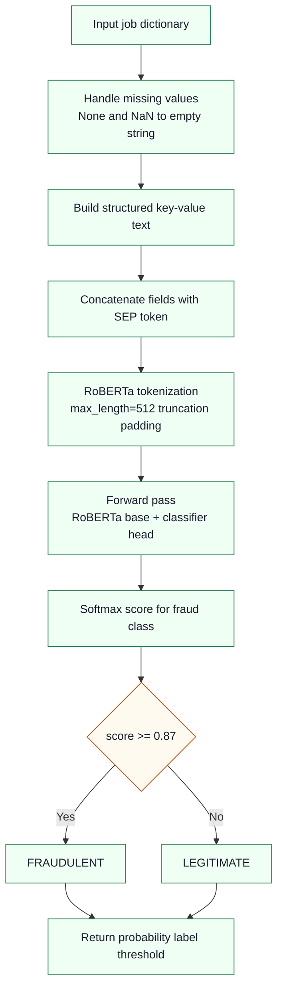
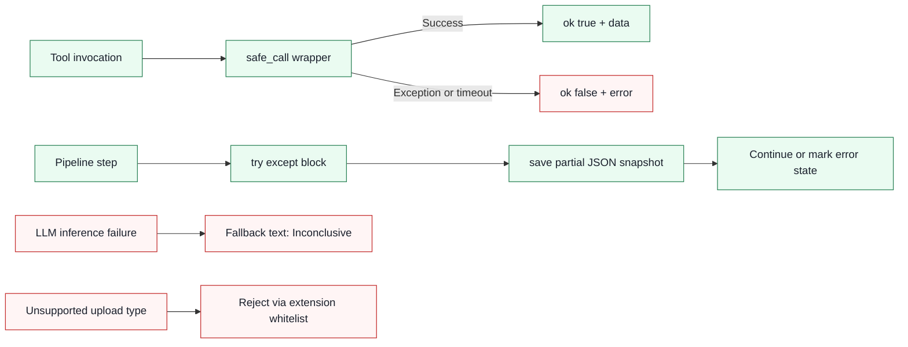

# DSAI PROJECT — MILESTONE 6

## Deployment & Documentation

**Project:** FraudGuard — Fake Job Listing Detection using Deep Learning and Agentic AI

**Team:** Group 9 — Arun Dutta · Hritik Roshan Maurya · Vivek Bajaj · Vishwas Mehta

**Course:** DS & AI Lab Project

**Submission Date:** April 2026

---

## Table of Contents

1. [Overview](#overview)
2. [Deployment](#1-deployment)
3. [Comprehensive Documentation](#2-comprehensive-documentation)
4. [Individual Contributions](#3-individual-contributions)

---

# Overview

Milestone 6 turns FraudGuard from a research notebook into a working, documented, and reproducible product. This report covers three key deliverables as specified in the Milestone 6 structure:

1. **Deployment** — live model API, local web-app, and browser extension
2. **Comprehensive Documentation** — technical, user-facing, and API documentation
3. **Final Project Report** — academic summary covering all milestone

---

# 1. Deployment

## 1.1 What Is Deployed

| Component | Technology | Platform | Access |
|---|---|---|---|
| RoBERTa fraud classifier (weights) | HuggingFace Transformers | HuggingFace Hub | `from_pretrained("aditya963/fraud-job-classifier")` |
| Model REST API | FastAPI + Docker | HuggingFace Spaces | `https://hrmhrmhrm-roberta-model.hf.space` |
| Flask web application | Flask + LangChain | Local dev server | `python web-app/app.py` → `http://localhost:5000` |
| Chrome extension | Vanilla JS + Gemini API | Browser (load unpacked) | `chrome://extensions` → Load unpacked → `web-extension/` |
| Training notebooks | PyTorch + HuggingFace | Google Colab (T4 GPU) | `notebook/` |

## 1.2 Deployment Architecture



## 1.3 How to Run Locally

```bash
# 1. Clone the repository
git clone https://github.com/hrmiitm/Group-9-DS-and-AI-Lab-Project.git
cd Group-9-DS-and-AI-Lab-Project

# 2. Create and activate a virtual environment
python -m venv .venv
source .venv/bin/activate   # Windows: .venv\Scripts\activate

# 3. Install dependencies
pip install -r requirements.txt

# 4. Set environment variables
export OPENAI_API_KEY="your-key-here"
export OPENAI_BASE_URL="https://aipipe.org/openrouter/v1"
export LLM_MODEL="openai/gpt-4o-mini"

# 5. Run the Flask web-app
python web-app/app.py
# Open: http://localhost:5000
```

**Chrome Extension:**
1. Open `chrome://extensions` in Google Chrome
2. Enable Developer Mode (top-right toggle)
3. Click "Load unpacked" → select the `web-extension/` folder
4. Add your Gemini API key via the extension popup

## 1.4 Inputs and Outputs

### Web-App Inputs

| Input Type | Description |
|---|---|
| Paste Text | Copy-paste any job description from any source |
| File Upload | Upload `.pdf`, `.docx`, `.doc`, `.txt`, `.html`, or `.md` files |
| LinkedIn URL | Paste a direct LinkedIn job listing URL for automatic scraping |

### Web-App Output

A full fraud investigation report with:
- **Verdict banner:** `SAFE` / `SUSPICIOUS` / `LIKELY_FAKE`
- **Extracted job fields:** 16 structured fields parsed by the LLM
- **Deep Research section:** Additional company/contact details found online
- **12 tool evidence cards:** One per verification tool showing raw findings and LLM interpretation
- **Final narrative report:** LLM-written fraud investigation with red flags, supporting evidence, and recommended action

### Chrome Extension

- **Input:** Any LinkedIn job listing page (auto-scraped from DOM)
- **Output:** Color-coded overlay on the page (`✅ LEGITIMATE` / `⚠️ SUSPICIOUS` / `❌ FRAUDULENT`) with confidence score, key findings, and actionable tip

---

# 2. Comprehensive Documentation

## A. Overview — Problem Statement and Architecture

### Problem Statement

Online recruitment platforms such as LinkedIn, Indeed, and Naukri host millions of job postings, and an estimated 3–5% of these are fraudulent. Fake job listings are designed to collect personal information, charge advance fees, or conduct phishing attacks against job seekers. Traditional keyword-based filters fail because modern fraud postings are linguistically sophisticated — they mimic legitimate job ads with high precision.

**Objective:** Build an end-to-end AI system that can:
1. Classify any job posting text as **Legitimate** or **Fraudulent** with high confidence.
2. Provide structured, human-readable reasoning for the decision.
3. Verify suspicious attributes (company domain, email, phone, salary) using external sources.
4. Deliver results through both a web application and a browser extension.

### Final System Architecture

The system comprises three major layers:

**Layer 1: ML Fraud Classifier (RoBERTa)**
A fine-tuned RoBERTa-base transformer (125M parameters) trained on 17,880 labeled job postings from the EMSCAD dataset. It receives a concatenated text representation of all job fields and outputs a fraud probability score. An Optuna-tuned threshold (0.87) converts this to a binary label.

**Layer 2: Agentic Verification Pipeline (Web-App Backend)**
An LLM-orchestrated agent (via LangChain + OpenRouter) that runs 12 investigative tools in parallel against each job posting. Tools check domain reputation, email validity, company Wikipedia presence, news articles, social profiles, job board cross-listings, and phone numbers. Results are synthesized by an LLM into a structured fraud investigation report.

**Layer 3: User Interfaces**
- **Web-App** (Flask): Accepts text paste, file upload, or LinkedIn URL.
- **Chrome Extension**: Injects into LinkedIn job pages; uses Google Gemini AI directly.

### Full Data Flow Diagram



### Key Design Decisions

| Decision | Rationale |
|---|---|
| RoBERTa over BERT | RoBERTa uses dynamic masking and more pre-training data, yielding better contextual understanding for fraud text |
| Full fine-tuning over LoRA | Small dataset (~17K samples, 866 fraud) benefits from all 125M parameters adapting to domain-specific signals |
| Focal Loss | Directly addresses the 20:1 class imbalance by down-weighting easy negatives, improving fraud recall significantly |
| Threshold calibration (0.87) | Moving from default 0.5 to 0.87 achieves high precision (0.957), minimizing false alarms for users |
| Agentic pipeline over single model | No single model can verify external facts; multi-tool agents provide evidence-backed decisions |
| LLM explanation layer | Job seekers need actionable, human-readable reports — LIME/SHAP produce weights, not narratives |

---

## B. Technical Documentation

### B.1 Environment Setup

#### Python and OS Requirements

| Requirement | Value |
|---|---|
| Python version | 3.11+ |
| Operating system | Linux (Ubuntu 20.04+ recommended); macOS supported for inference |
| GPU (training) | CUDA-capable GPU, minimum 16GB VRAM (tested on Google Colab T4) |
| GPU (inference) | Optional — CPU inference supported |
| RAM | 16GB minimum; 32GB recommended for full training run |

#### Core Dependencies

```
torch==2.11.0
transformers==5.5.4
datasets==4.8.4
scikit-learn==1.8.0
optuna==4.8.0
flask==3.1.3
langchain-openai==1.1.12
langchain-community==0.4.1
pydantic==2.12.5
requests==2.33.1
beautifulsoup4==4.14.3
ddgs==9.12.0
trafilatura==2.0.0
python-whois==0.9.6
email-validator==2.3.0
phonenumbers==9.0.27
pandas==3.0.2
numpy==2.4.4
```

Install with: `pip install -r requirements.txt`

#### Environment Variables

| Variable | Required | Default | Description |
|---|---|---|---|
| `OPENAI_API_KEY` | Yes | `""` | LLM API key (set to AIPipe token for OpenRouter proxy) |
| `OPENAI_BASE_URL` | No | `https://aipipe.org/openrouter/v1` | LLM base URL |
| `LLM_MODEL` | No | `openai/gpt-4o-mini` | Any OpenRouter model slug |
| `FLASK_SECRET_KEY` | No | `dev-change-in-prod` | Flask session secret |

---

### B.2 Data Pipeline

#### Dataset Source

| Attribute | Value |
|---|---|
| Name | Fake Job Postings (EMSCAD) |
| Source | Kaggle: `shivamb/real-or-fake-fake-jobposting-prediction` |
| Total samples | 17,880 |
| Legitimate | 17,014 (95.16%) |
| Fraudulent | 866 (4.84%) |
| Imbalance ratio | ~20:1 |
| Feature count | 18 columns (5 free-text, 9 structured, 3 binary/categorical) |
| License | CC BY-SA 4.0 |

**Deduplication:** Text-based duplicates (same title + description) were removed, reducing training data from 17,880 to 15,787 unique samples.

#### Preprocessing Steps

**Step 1 — Missing Value Handling**
All `NaN` values in text fields are replaced with empty strings. Absence is deliberately preserved as a fraud signal (e.g., empty `company_profile` strongly correlates with fraud).

**Step 2 — Structured Field Formatting**
Metadata fields are converted to key-value pairs:
```
"Location: US, NY, New York"
"Employment Type: Full-time"
"Has Company Logo: 1"
```

**Step 3 — Text Concatenation**
All fields joined using `[SEP]` as delimiter. Structured metadata is placed first to protect it from sequence truncation:
```
Location: US, NY, New York [SEP] Employment Type: Full-time [SEP]
Has Company Logo: 1 [SEP] Software Engineer [SEP] We are seeking...
```

**Step 4 — Tokenization**
- Tokenizer: RoBERTa BPE tokenizer
- `max_length = 512`, `truncation = True`, `padding = 'max_length'`
- ~11% of samples exceed 512 tokens and are truncated

**Step 5 — Data Splits**

| Split | Proportion | Samples | Fraud Samples |
|---|---|---|---|
| Training | 70% | 12,516 | ~606 |
| Validation | 15% | 2,682 | ~130 |
| Test | 15% | 2,682 | ~130 |

Split uses `stratify=df['label']` and `random_state=42`.

#### Features Used

| Type | Fields |
|---|---|
| Free-text | `title`, `description`, `requirements`, `company_profile`, `benefits` |
| Structured | `location`, `department`, `salary_range`, `employment_type`, `required_experience`, `required_education`, `industry`, `function` |
| Binary/categorical | `telecommuting`, `has_company_logo`, `has_questions` |

---

### B.3 Model Architecture

The final model (`v3_1`) is a fully fine-tuned **RoBERTa-base** transformer with a linear binary classification head.

| Component | Description |
|---|---|
| Backbone | `roberta-base` (HuggingFace) |
| Task | Binary sequence classification (Legitimate=0, Fraudulent=1) |
| Parameters | ~125.5M (all trainable) |
| Fine-tuning | Full fine-tuning (no LoRA/adapters) |

#### Layer-by-Layer Breakdown

| Layer | Detail | Output Shape | Parameters |
|---|---|---|---|
| Token & Position Embeddings | BPE vocab (50,265 tokens) | Seq × 768 | ~38.6M |
| Transformer Encoder (×12) | 12 self-attention heads, head_dim=64 | Seq × 768 | ~84.9M |
| Feed-Forward (per block) | 768 → 3,072 → 768, GELU | Seq × 768 | ~4.7M/block |
| Pooler | Dense(768,768), tanh | 1 × 768 | ~590K |
| Dropout | 0.1 (hidden + attention) | — | — |
| Classification Head | Linear(768 → 2) | 1 × 2 | ~1.5K |
| **Total** | | | **~125.5M** |

**Focal Loss formula:**
```
FL(p_t) = -α_t · (1 - p_t)^γ · log(p_t)
```
Where `γ = 1.6920` (Optuna-tuned) and `α = [auto_legit_weight, 2.8251]`.

---

### B.4 Training Summary

#### Training Configuration

| Parameter | Value | Notes |
|---|---|---|
| Optimizer | AdamW | Weight decay on non-bias/LayerNorm params |
| Learning rate | ~2.59e-5 | Log-uniform Optuna search: 1e-5 to 5e-5 |
| LR Scheduler | Cosine annealing | Warmup ratio 0.1506 (Optuna) |
| Batch size | 16 | + gradient accumulation steps=2 (effective batch=32) |
| Max epochs | 9 (early stop at epoch 7) | Early stopping patience=5 |
| Max sequence length | 512 tokens | RoBERTa tokenizer |
| Hardware | Google Colab T4 GPU | Mixed precision FP16 |
| Gradient clipping | max_grad_norm=1.0 | Applied throughout |
| Weight decay | 0.0702 | L2 penalty |
| Focal gamma | 1.6920 | Optuna-tuned |
| Fraud class weight | 2.8251 | Optuna-tuned |
| HPO method | Optuna (25 trials) | Bayesian optimization |
| HPO objective | Max F1 s.t. Recall≥0.89, Precision≥0.93 | Hard floors enforced |

#### Version History

| Version | Loss | HPO | Key Change |
|---|---|---|---|
| v1 | Weighted CE | Manual | Baseline |
| v2 | Focal γ=2.0 | Manual | Focal loss introduced |
| v3 | Focal γ=2.0 | Optuna 15T | First automated HPO |
| **v3_1 (FINAL)** | **Focal γ=1.69** | **Optuna 25T** | **Dynamic γ + class weight via HPO** |
| v4 | Focal | Optuna | DeBERTa experiment (discontinued) |
| v5 | Focal γ=3.0 | Optuna 20T | Cosine LR, recall-targeted threshold |

#### Training Notebook

The training notebook is at `notebook/transformer_fraud_classifier_v3_1.ipynb`. It covers:
- Data loading and preprocessing pipeline
- Focal Loss implementation (`FocalLoss`, `FocalLossTrainer`)
- 25-trial Optuna HPO with hard recall/precision floors
- Training loop with early stopping
- Threshold calibration sweep on validation set
- Test-set evaluation and artifact export

---

### B.5 Evaluation Summary

#### Final Model Performance (v3_1, threshold=0.87)

| Metric | Target | Test Result | Status |
|---|---|---|---|
| F1 (fraud class) | ≥ 0.91 | **0.9069** | Narrow Miss (−0.003) |
| Recall (fraud class) | ≥ 0.89 | **0.8615** | Miss (−0.029) |
| Precision (fraud class) | ≥ 0.93 | **0.9573** | ✅ Met (+0.027) |
| ROC-AUC | ≥ 0.95 | **0.9930** | ✅ Met (+0.043) |
| MCC | Reported | **0.8917** | — |

#### Comparison Across Models

| Model | F1 (fraud) | Recall | Precision | ROC-AUC |
|---|---|---|---|---|
| TF-IDF + Logistic Regression | ~0.83 | ~0.80 | ~0.86 | ~0.94 |
| TF-IDF + Random Forest | ~0.82 | ~0.78 | ~0.85 | ~0.93 |
| RoBERTa v1 (Weighted CE) | 0.8745 | 0.8300 | 0.9200 | 0.9874 |
| **RoBERTa v3_1 (Final)** | **0.9069** | **0.8615** | **0.9573** | **0.9930** |

#### Key Insights

- **ROC-AUC 0.993** demonstrates near-perfect probabilistic separation between fraud and legitimate postings.
- **Precision over recall trade-off:** The model prioritizes precision (0.957) at the cost of recall (0.862). This is the correct trade-off for a user-facing tool — false alarms destroy user trust more than missed frauds.
- **Threshold effect:** Moving from default 0.5 to the optimized 0.87 threshold added ~2–4 percentage points of F1 without any retraining.
- **Confusion matrix:** At threshold 0.87, the model correctly identifies ~86% of all fraudulent postings while generating false fraud alerts for only ~4.3% of legitimate postings.

---

### B.6 Inference Pipeline



#### Inference Code Snippet

```python
from transformers import AutoModelForSequenceClassification, AutoTokenizer
import torch

model = AutoModelForSequenceClassification.from_pretrained("aditya963/fraud-job-classifier")
tokenizer = AutoTokenizer.from_pretrained("aditya963/fraud-job-classifier")
model.eval()

THRESHOLD = 0.87

def build_input_text(job: dict) -> str:
    structured = {
        "Location": job.get("location", ""),
        "Salary Range": job.get("salary_range", ""),
        "Employment Type": job.get("employment_type", ""),
        "Has Company Logo": str(job.get("has_company_logo", "")),
    }
    free_text = {
        "Job Title": job.get("title", ""),
        "Description": job.get("description", ""),
        "Requirements": job.get("requirements", ""),
    }
    parts = []
    for k, v in {**structured, **free_text}.items():
        if v and str(v).strip():
            parts.append(f"{k}: {str(v).strip()}")
    return " [SEP] ".join(parts)

def predict_fraud(job_posting: dict) -> dict:
    input_text = build_input_text(job_posting)
    inputs = tokenizer(input_text, return_tensors="pt",
                       truncation=True, max_length=512, padding="max_length")
    with torch.no_grad():
        logits = model(**inputs).logits
    prob_fraud = torch.softmax(logits, dim=-1)[0][1].item()
    prediction = "FRAUDULENT" if prob_fraud >= THRESHOLD else "LEGITIMATE"
    return {"fraud_probability": round(prob_fraud, 4),
            "prediction": prediction, "threshold_used": THRESHOLD}

# Example
result = predict_fraud({
    "title": "Work From Home Data Entry",
    "description": "Earn $500/day. No experience needed. Send bank details.",
    "location": "Remote", "has_company_logo": 0
})
# {'fraud_probability': 0.92, 'prediction': 'FRAUDULENT', 'threshold_used': 0.87}
```

---

### B.7 Deployment Details

#### Model Hosting (HuggingFace Hub)

The fine-tuned model is hosted on HuggingFace Hub at `aditya963/fraud-job-classifier`. It includes model weights, tokenizer, and `inference_config.json`.

Load for inference:
```python
from transformers import AutoModelForSequenceClassification, AutoTokenizer
model = AutoModelForSequenceClassification.from_pretrained("aditya963/fraud-job-classifier")
tokenizer = AutoTokenizer.from_pretrained("aditya963/fraud-job-classifier")
```

#### Model REST API (HuggingFace Spaces)

The `model-api/` folder contains a FastAPI service (`app.py`) wrapped in a Docker container and deployed to HuggingFace Spaces.

**Base URL:** `https://hrmhrmhrm-roberta-model.hf.space`

| Method | Endpoint | Description |
|---|---|---|
| `GET` | `/` | Health check — model status, device, threshold |
| `POST` | `/predict` | Single job posting → fraud probability + verdict |
| `POST` | `/predict/batch` | Up to 16 postings → list of predictions |
| `GET` | `/docs` | Swagger UI |

**Key files in `model-api/`:**

| File | Purpose |
|---|---|
| `app.py` | FastAPI service with 3 endpoints, Pydantic validation, CORS middleware |
| `Dockerfile` | HuggingFace Spaces compliant: `python:3.11-slim`, non-root UID 1000, port 7860 |
| `download_model.py` | Build-time weight pre-download script |
| `requirements.txt` | Pinned ML stack (`transformers==4.47.1`, `tokenizers==0.21.1`) |

#### Flask Web-App Deployment

```bash
export OPENAI_API_KEY="your-key"
python web-app/app.py
# → http://localhost:5000
```

**Web-App Endpoints:**

| Method | Path | Description |
|---|---|---|
| GET | `/` | Home page (3-tab input form) |
| POST | `/analyze` | Submit job for analysis |
| GET | `/results/<job_id>` | View analysis results |
| GET | `/results` | History of all analyses |
| GET | `/api/result/<job_id>` | Raw JSON result |
| GET/POST | `/api/settings` | LLM settings management |

#### Chrome Extension Deployment

1. Open `chrome://extensions`
2. Enable Developer Mode
3. Click "Load unpacked" → select `web-extension/` folder
4. Set Gemini API key via extension popup

The extension runs entirely in the browser — no server required.

---

### B.8 System Design Considerations

**Separation of concerns:** The web-app (`web-app/`) is fully self-contained. Each verification tool (`web-app/tools/`) is a pure function returning `{ok: bool, data: {...}}`. `safe_call()` wraps every tool invocation so exceptions in individual tools never crash the analysis pipeline.

**Incremental result writing:** `services/analyzer.py` writes progress to `results/<job_id>.json` after each pipeline step. If a step fails, the partial result is preserved.

**Web-App ↔ Extension independence:** The web-app and Chrome extension are independent systems. The web-app uses OpenRouter/AIPipe; the extension uses Gemini API directly. A future integration path would have the extension call the web-app `/analyze` endpoint, enabling full 12-tool analysis from the browser.

**Scalability path for production:**
- Use Gunicorn with worker processes: `gunicorn -w 4 web-app.app:app`
- Add Celery + Redis for async analysis queue
- Cache DuckDuckGo results to reduce latency

---

### B.9 Error Handling and Monitoring



**Edge Case Handling:**

| Edge Case | Handling |
|---|---|
| Missing company name | `infer_company_name()` extracts from description; tools skipped if still empty |
| Empty job description | Pipeline continues with available fields; report notes sparse input |
| LinkedIn URL blocked | Returns `None`; user shown error message |
| API key missing | 402 error from LLM; surfaced in results page |
| Tool timeout | `REQUEST_TIMEOUT=20s` per tool; returns `{ok: False, error: "timeout"}` |

**Latency:** A full analysis (12 tools + 12 LLM inferences + 1 final report) takes approximately **30–90 seconds** depending on LLM model speed and network conditions.

---

### B.10 Reproducibility Checklist

- [ ] Python 3.11 virtual environment: `python3.11 -m venv venv && source venv/bin/activate`
- [ ] Install dependencies: `pip install -r requirements.txt`
- [ ] Download dataset from Kaggle: `shivamb/real-or-fake-fake-jobposting-prediction`
- [ ] Place file at `data/raw/fake_job_postings.csv` (17,880 rows, 18 columns)
- [ ] Open `notebook/transformer_fraud_classifier_v3_1.ipynb` in Google Colab
- [ ] Select T4 GPU runtime (Runtime → Change runtime type → T4 GPU)
- [ ] Update `DATA_PATH` to point to uploaded dataset on Drive
- [ ] Update `OUTPUT_DIR` to desired model output path on Drive
- [ ] Set `random_state=42` (already set in notebook)
- [ ] Run all cells — expected training time: ~2–4 hours for 9 epochs with 25 Optuna trials
- [ ] Expected results: F1 ≈ 0.907, Precision ≈ 0.957, Recall ≈ 0.862, AUC ≈ 0.993

**Fixed Seeds:**

| Component | Seed |
|---|---|
| Train/val/test split | `random_state=42` |
| IsolationForest | `random_state=42` |
| Optuna sampler | Default (trials vary; results within ±0.005 of reported metrics) |

---

## C. User Documentation

### C.1 What FraudGuard Does and Why It Is Useful

FraudGuard is an AI-powered tool that helps you determine whether a job listing is real or fraudulent **before** you apply, share personal information, or pay any fees.

FraudGuard analyzes a job posting using:
- A trained AI model (RoBERTa) that has read thousands of real and fake job ads
- 12 real-time verification checks (company domain, email validity, website health, news, social media, job boards, and more)
- A final AI-written investigation report with a clear verdict: **SAFE**, **SUSPICIOUS**, or **LIKELY FAKE**

**When to use it:**
- Before applying to any job found online
- When a job offer looks too good to be true
- When a recruiter contacts you out of nowhere
- Before paying any "registration fee", "training fee", or "equipment deposit"

---

### C.2 How to Launch the Web-App

**Prerequisites:** Python 3.11+, an API key from AIPipe or OpenRouter.

```bash
# Step 1: Download the project
git clone https://github.com/hrmiitm/Group-9-DS-and-AI-Lab-Project.git
cd Group-9-DS-and-AI-Lab-Project

# Step 2: Install dependencies
pip install flask langchain-openai langchain-community pydantic requests \
            beautifulsoup4 ddgs trafilatura python-whois email-validator \
            phonenumbers markupsafe

# Step 3: Set your API key (Mac/Linux)
export OPENAI_API_KEY="paste-your-api-key-here"
export OPENAI_BASE_URL="https://aipipe.org/openrouter/v1"
export LLM_MODEL="openai/gpt-4o-mini"

# Step 4: Start the app
python web-app/app.py
```

Open your browser at **http://localhost:5000**. The home page shows three tabs: **Paste Text**, **Upload File**, and **LinkedIn URL**.

---

### C.3 How to Install the Chrome Extension

1. Get a Gemini API key from Google AI Studio
2. Open Chrome → `chrome://extensions` → enable Developer Mode
3. Click "Load unpacked" → select the `web-extension/` folder
4. Pin the extension (puzzle piece icon → pin "LinkedIn Job Predictor")
5. Click the extension icon → paste Gemini API key → click "Save Key"
6. Go to any LinkedIn job listing → click the **"🔍 Analyze Job"** floating button

---

### C.4 What Outputs to Expect

**Web-App Results Page:**

1. **Verdict Banner** — Large colored card at the top:
   - 🟢 **SAFE** — No significant red flags detected
   - 🟡 **SUSPICIOUS** — Some concerning signals, verify before applying
   - 🔴 **LIKELY FAKE** — Multiple strong fraud indicators detected
2. **Job Information Card** — 16 structured fields the AI extracted
3. **Deep Research Section** — Additional information found online
4. **Tool Evidence Grid** — 12 verification cards showing status and meaning
5. **Final Report** — Detailed AI-written investigation with recommended action

**Chrome Extension Overlay:**
- Color-coded verdict with confidence score
- Summary of the analysis
- Key findings (bullet points)
- Actionable tip

---

### C.5 Example Use Cases

**Use Case 1: Work-From-Home Scam**
```
Title: Data Entry Specialist (Work From Home)
Description: Earn $500 per day working from home. No experience needed.
Contact: dataentry.jobs2026@gmail.com
```
**Expected Output:** 🔴 LIKELY FAKE — No company name, unrealistic salary, Gmail contact, "send bank details" request.

---

**Use Case 2: Legitimate Software Engineering Role**
```
Title: Senior Software Engineer
Company: Infosys Technologies — Bengaluru, Karnataka
Requirements: 5+ years Python, B.Tech/M.Tech CS
Salary: 18-24 LPA | Website: www.infosys.com
```
**Expected Output:** 🟢 SAFE — Well-known company, verifiable website, realistic salary, complete job details.

---

**Use Case 3: Suspicious Overseas Opportunity**
```
Title: Customer Service Representative
Company: Global Trading Corp, Dubai
Description: Earn $5000/month. Pay $200 registration fee before interview.
```
**Expected Output:** 🔴 LIKELY FAKE — Request for upfront payment, unverifiable company, free email contact.

---

**Use Case 4: Ambiguous Startup Listing**
```
Title: Marketing Intern — StartupX (stealth mode)
Stipend: 5000-8000/month | Contact: hr@startupx.in
```
**Expected Output:** 🟡 SUSPICIOUS — Unverifiable company, new domain, but realistic salary and no upfront payment.

---

**Use Case 5: Government Job Scam**
```
Title: Clerk Grade B – State Public Service Commission
Fee: Pay ₹2,500 processing fee via UPI
Contact: psc.recruitment2026@gmail.com
```
**Expected Output:** 🔴 LIKELY FAKE — Government jobs never use Gmail, never require upfront fees, never offer "no exam" PSC recruitment.

---

### C.6 Troubleshooting

**Web-App Issues:**

| Problem | Solution |
|---|---|
| App won't start | Check `python --version` (must be 3.11+); check `OPENAI_API_KEY` is set |
| `ModuleNotFoundError` | Re-run the pip install command from §C.2 |
| Analysis shows "error" | API key wrong or expired; check and replace key |
| Analysis takes very long | Normal — can take 60–90 seconds. Do not refresh the page |
| "LinkedIn URL" returns empty | LinkedIn blocks scraping; paste the text manually instead |
| Error 402 from LLM | Insufficient credits; check account balance or use a different key |

**Chrome Extension Issues:**

| Problem | Solution |
|---|---|
| "🔍 Analyze Job" button doesn't appear | Must be on a specific LinkedIn job listing page (not the feed); refresh |
| "No API key" error | Click extension icon → paste Gemini API key → click "Save Key" |
| "Gemini API error (400)" | Invalid API key; generate a new one at Google AI Studio |
| "No job data found" | Click on a specific job title to open its full listing page |
| Extension disappeared after Chrome update | Go to `chrome://extensions` → "Load unpacked" → select `web-extension/` again |

---

## D. API Documentation

### D.1 RoBERTa Model API (HuggingFace Spaces)

**Base URL:** `https://hrmhrmhrm-roberta-model.hf.space`

This is a thin FastAPI wrapper around the fine-tuned `aditya963/fraud-job-classifier` model, deployed as a Docker container on HuggingFace Spaces. Source: `model-api/app.py`.

#### GET `/` — Health Check

```bash
curl https://hrmhrmhrm-roberta-model.hf.space/
```

Response `200`:
```json
{
  "status": "ok",
  "model_id": "aditya963/fraud-job-classifier",
  "threshold": 0.87,
  "device": "cpu",
  "version": "1.0.0"
}
```

#### POST `/predict` — Single Job Inference

**Content-Type:** `application/json`

**Request fields** (all optional):

| Field | Type | Description |
|---|---|---|
| `title` | string | Job title |
| `description` | string | Full job description |
| `requirements` | string | Required qualifications |
| `company_profile` | string | About the company |
| `benefits` | string | Benefits offered |
| `location` | string | Job location |
| `salary_range` | string | Salary band |
| `employment_type` | string | `"Full-time"`, `"Part-time"`, etc. |
| `has_company_logo` | int `0\|1` | Whether the posting has a company logo |

**Response fields:**

| Field | Type | Description |
|---|---|---|
| `fraud_probability` | float | Model score 0.0–1.0 |
| `fraud_percent` | float | Same score as percentage |
| `verdict` | string | `FRAUDULENT` or `LEGITIMATE` |
| `confidence` | string | `HIGH` / `MEDIUM` / `LOW` |
| `threshold` | float | Operating threshold (0.87) |
| `model_id` | string | HuggingFace model repo ID |
| `latency_ms` | float | Server-side inference time |

**Example — Fraudulent posting:**
```bash
curl -X POST https://hrmhrmhrm-roberta-model.hf.space/predict \
  -H "Content-Type: application/json" \
  -d '{
    "title": "Work From Home Data Entry Specialist",
    "description": "Earn $500/day. No experience needed. Send bank details to start.",
    "location": "Remote",
    "has_company_logo": 0
  }'
```
```json
{
  "fraud_probability": 0.9247,
  "fraud_percent": 92.5,
  "verdict": "FRAUDULENT",
  "confidence": "HIGH",
  "threshold": 0.87,
  "model_id": "aditya963/fraud-job-classifier",
  "latency_ms": 43.2
}
```

**Example — Legitimate posting:**
```bash
curl -X POST https://hrmhrmhrm-roberta-model.hf.space/predict \
  -H "Content-Type: application/json" \
  -d '{
    "title": "Senior Software Engineer",
    "description": "We are seeking an experienced engineer.",
    "requirements": "5+ years Python",
    "company_profile": "Infosys Technologies — global IT leader.",
    "location": "Bengaluru, Karnataka",
    "has_company_logo": 1
  }'
```
```json
{
  "fraud_probability": 0.0312,
  "fraud_percent": 3.1,
  "verdict": "LEGITIMATE",
  "confidence": "HIGH",
  "threshold": 0.87,
  "model_id": "aditya963/fraud-job-classifier",
  "latency_ms": 38.7
}
```

#### POST `/predict/batch` — Batch Inference (up to 16 postings)

```bash
curl -X POST https://hrmhrmhrm-roberta-model.hf.space/predict/batch \
  -H "Content-Type: application/json" \
  -d '{
    "postings": [
      {"title": "Senior Engineer", "description": "5 years Python", "has_company_logo": 1},
      {"title": "Easy money", "description": "No experience. Pay upfront.", "has_company_logo": 0}
    ]
  }'
```

Response: `{"results": [...], "count": 2, "latency_ms": 24.2}`

#### Python Client

```python
import requests

API_BASE = "https://hrmhrmhrm-roberta-model.hf.space"

def predict(job: dict) -> dict:
    resp = requests.post(f"{API_BASE}/predict", json=job, timeout=30)
    resp.raise_for_status()
    return resp.json()

result = predict({
    "title": "Work From Home Data Entry",
    "description": "Earn $500/day! No experience!",
    "has_company_logo": 0,
})
print(result["verdict"])           # FRAUDULENT
print(result["fraud_probability"]) # 0.9247
```

#### Error Codes (Model API)

| HTTP Status | Meaning |
|---|---|
| `200` | Success |
| `422` | Validation error — malformed body or batch too large |
| `500` | Server error — model inference failed |
| `503` | Model is loading (cold start) — retry after 10–30 seconds |

---

### D.2 Web-App API (Flask, `localhost:5000`)

**Base URL:** `http://localhost:5000`

#### POST `/analyze` — Submit Job for Analysis

**Content-Type:** `multipart/form-data`

| Parameter | Type | Required | Description |
|---|---|---|---|
| `input_type` | string | Yes | One of: `text`, `file`, `url` |
| `job_text` | string | If `text` | Raw job description |
| `job_file` | file | If `file` | PDF, DOCX, TXT, HTML, MD |
| `linkedin_url` | string | If `url` | Full LinkedIn job URL |

Response: HTTP 302 redirect to `/results/<job_id>`

**Example:**
```bash
curl -X POST http://localhost:5000/analyze \
  -F "input_type=text" \
  -F "job_text=Software Engineer at TechCorp. 5 years Python required."
```

#### GET `/api/result/<job_id>` — Raw JSON Result

```bash
curl http://localhost:5000/api/result/550e8400-e29b-41d4-a716-446655440000
```

**Response schema:**

| Field | Type | Description |
|---|---|---|
| `job_id` | string | UUID of the analysis |
| `status` | string | `processing`, `complete`, or `error` |
| `verdict` | string | `SAFE`, `SUSPICIOUS`, or `LIKELY_FAKE` |
| `job_posting` | object | Structured 16-field extraction |
| `tool_results` | object | Raw output from each of the 12 tools |
| `tool_inferences` | object | LLM-written summaries per tool |
| `final_report` | string | Full markdown fraud investigation report |
| `error` | string/null | Error message if status=error |

#### Tool Output Contracts

Each of the 12 tools in `tool_results` returns:
```json
{"ok": true, "data": { ... }}     // success
{"ok": false, "error": "..."}     // failure
```

| Tool Key | Key Output Fields |
|---|---|
| `scam_signals` | `scam_score` (0–100), `risk_level`, `signals_found` (list) |
| `email_verify` | `is_deliverable`, `is_disposable`, `overall_status` |
| `domain_reputation` | `domain_age_days`, `risk_level`, `is_live`, `registrar` |
| `website_verify` | `is_live`, `ssl_valid`, `status_code` |
| `company_wikipedia` | `title`, `extract`, `wikipedia_url` |
| `company_web_search` | searches across 5 angles (general, reviews, scam, glassdoor, linkedin) |
| `company_news` | `articles` list with date, title, url, source, snippet |
| `social_profiles` | `platforms_found` (0–7), per-platform found status |
| `job_boards` | `boards_found` (0–8), `verdict` (strong/moderate/not_found) |
| `phone_check` | `e164`, `is_valid`, `region_code`, `carrier` |

---

## E. Licensing and Dataset References

### Project License

This project is released under the **MIT License**.

```
MIT License

Copyright (c) 2026 Group 9 — DS & AI Lab Project
(Arun Dutta, Hritik Roshan Maurya, Vivek Bajaj, Vishwas Mehta)

Permission is hereby granted, free of charge, to any person obtaining a copy
of this software and associated documentation files (the "Software"), to deal
in the Software without restriction, including without limitation the rights
to use, copy, modify, merge, publish, distribute, sublicense, and/or sell
copies of the Software.
```

### Dataset License — EMSCAD

| Attribute | Value |
|---|---|
| Name | Fake Job Postings (EMSCAD) |
| Source | University of the Aegean |
| Kaggle Mirror | `shivamb/real-or-fake-fake-jobposting-prediction` |
| License | CC BY-SA 4.0 |
| Records | 17,880 job postings (866 fraudulent) |

**Citation:**
```
Vidros, S., Kolias, C., Kambourakis, G., & Maglaras, L. (2017).
Automatic Detection of Online Recruitment Frauds: Characteristics, Methods, and a Public Dataset.
Future Internet, 9(1), 6. https://doi.org/10.3390/fi9010006
```

### Pre-Trained Model License — RoBERTa-base

| Attribute | Value |
|---|---|
| Model | `roberta-base` |
| Organization | Facebook AI Research (Meta AI) |
| License | MIT License |
| Paper | Liu et al. (2019), "RoBERTa: A Robustly Optimized BERT Pretraining Approach" |

**Citation:**
```
Liu, Y., Ott, M., Goyal, N., et al. (2019).
RoBERTa: A Robustly Optimized BERT Pretraining Approach.
arXiv:1907.11692. https://arxiv.org/abs/1907.11692
```

### Fine-Tuned Model

| Attribute | Value |
|---|---|
| Model | `aditya963/fraud-job-classifier` |
| HuggingFace Hub | `huggingface.co/aditya963/fraud-job-classifier` |
| License | MIT License |
| Based On | `facebook/roberta-base` (MIT) |
| Training Data | EMSCAD dataset (CC BY-SA 4.0) |

### Third-Party Library Licenses

| Library | License | Usage |
|---|---|---|
| PyTorch | BSD-style | Deep learning framework |
| HuggingFace Transformers | Apache 2.0 | RoBERTa model + tokenizer |
| scikit-learn | BSD-3-Clause | Metrics, splitting |
| Optuna | MIT | Hyperparameter optimization |
| Flask | BSD-3-Clause | Web application framework |
| LangChain | MIT | LLM orchestration |
| Pydantic | MIT | Data validation |
| DuckDuckGo Search (`ddgs`) | MIT | Web search for verification |
| Trafilatura | Apache 2.0 | Website content extraction |
| python-whois | MIT | Domain WHOIS lookups |
| phonenumbers | Apache 2.0 | Phone number validation |
| BeautifulSoup4 | MIT | HTML parsing |

### AI Service Terms

| Service | Usage | Terms |
|---|---|---|
| OpenRouter (via AIPipe) | LLM calls for parsing, tool inference, fraud reports | openrouter.ai/terms |
| Google Gemini API | Chrome extension job analysis | ai.google.dev/terms |
| HuggingFace Hub | Model hosting and download | huggingface.co/terms-of-service |

---

## F. Future Work and Known Limitations

### F.1 Known Limitations

**Model:**

| Limitation | Severity |
|---|---|
| Recall miss (0.862 vs. target 0.89) — ~14% of fraudulent postings missed | Medium |
| 512-token sequence limit — ~11% of postings truncated | Medium |
| English-only — non-English fraud is undetected | High |
| EMSCAD dataset from 2014–2017 — newer fraud patterns may not be represented | Medium |

**Web-App:**

| Limitation | Severity |
|---|---|
| Company registry tool is a stub — always returns `{ok: false}` | Medium |
| Synchronous pipeline — 60–90s analyses block the server process | Medium |
| No automated test suite — regressions may go undetected | Medium |
| LinkedIn scraping blocked — URL input may silently return empty | Low |

**Chrome Extension:**

| Limitation | Severity |
|---|---|
| LinkedIn only — does not work on Indeed, Naukri, or other job boards | Medium |
| Only uses Gemini (single LLM call), not the full 12-tool pipeline | High |
| LinkedIn DOM fragility — UI changes may break scraping | Medium |

### F.2 Possible Extensions

**Model improvements:**
- Sliding window inference for long job descriptions (>512 tokens)
- Fine-tune `xlm-roberta-base` for multilingual fraud detection (Hindi, Bangla)
- Model ensembling: combine RoBERTa and DeBERTa-v3 predictions
- Continual learning pipeline for newer fraud patterns

**Agentic pipeline extensions:**
- Implement real company registry checks (Companies House API, MCA API, OpenCorporates)
- Integrate RoBERTa as a 13th verification tool within the web-app pipeline
- Expand scrapers to Indeed, Naukri, Glassdoor, Internshala
- Real-time alert system for saved analyses

**Chrome extension extensions:**
- Replace Gemini call with a call to the web-app `/analyze` endpoint for full 12-tool analysis
- Use HuggingFace Transformers.js (WebAssembly) for offline RoBERTa inference in the extension
- Support more job boards

**Infrastructure:**
- Docker container + cloud deployment (Render, Railway, Google Cloud Run) with HTTPS
- Celery + Redis task queue for async analysis
- Pytest test suite for tools, pipeline, and regression cases

### F.3 How to Retrain with New Data

1. Collect new labeled samples (minimum 500+ fraud samples); store in EMSCAD CSV format (18 columns)
2. Merge with existing dataset:
   ```python
   import pandas as pd
   old = pd.read_csv("data/raw/fake_job_postings.csv")
   new = pd.read_csv("data/raw/new_samples.csv")
   combined = pd.concat([old, new]).drop_duplicates(subset=["title", "description"])
   combined.to_csv("data/raw/fake_job_postings_v2.csv", index=False)
   ```
3. Update `DATA_PATH` in `notebook/transformer_fraud_classifier_v3_1.ipynb`
4. Re-run Optuna HPO (at least 15 trials) to recalibrate hyperparameters
5. Re-run threshold calibration sweep on the new validation set
6. Upload new model: `model.push_to_hub("your-username/fraud-job-classifier-v2")`

### F.4 Maintainer Contacts

- **Arun Dutta** — Documentation Lead
- **Hritik Roshan Maurya** — API & Deployment Documentation Lead
- **Vivek Bajaj** — Model API Engineering Lead
- **Vishwas Mehta** — User Documentation Lead

**GitHub:** `github.com/hrmiitm/Group-9-DS-and-AI-Lab-Project`

**HuggingFace Model:** `huggingface.co/aditya963/fraud-job-classifier`

---

# 3. Individual Contributions

### Arun Dutta — Documentation Lead & Report Author
- Authored the complete academic-style Final Project Report (~600 lines) with 20 Mermaid diagrams, abstract, all 8 body sections, 12 references, and 5 appendices
- Wrote `docs/licenses.md`, `docs/future_work.md`, `docs/contribution_summary.md`
- Co-led final README.md rewrite with badges, Quick Start, architecture diagram, and results table
- Coordinated repo audit and gap analysis

### Hritik Roshan Maurya — API & Deployment Documentation Lead
- Authored `docs/api_doc.md` — two-part structure covering RoBERTa Model API and Web-App API with ASCII architecture diagrams, full endpoint documentation, and Python/curl examples
- Authored `docs/overview.md` with system architecture narrative and Mermaid sequence diagram
- Authored `docs/technical_doc.md` covering all 10 required sections (environment setup through reproducibility checklist)

### Vivek Bajaj — Model API Engineering Lead
- Designed and implemented the complete `model-api/` deployment package: FastAPI service, Dockerfile (HuggingFace Spaces compliant), build-time model download script, and pinned requirements
- Fixed Dockerfile tokenizer compatibility bug (upgraded `tokenizers` from `0.19.1` to `0.21.1`)
- Deployed the model API to HuggingFace Spaces
- Co-authored technical documentation sections on model architecture, training, and evaluation

### Vishwas Mehta — User Documentation & Tooling Lead
- Authored `docs/user_guide.md` with 5-step web-app launch guide, Chrome extension install walkthrough, 5 annotated example use cases, and troubleshooting tables for both tools
- Wrote `create_google_doc.py` — Python script using Google Docs API to generate a styled submission document from the Final Project Report
- Wrote all Milestone 6 folder files

## Effort Distribution

| Member | Focus Area |
|---|---|
| Arun Dutta | Final Report, Licenses, Future Work, Contribution Summary |
| Hritik Roshan Maurya | API Docs, Technical Docs, Overview |
| Vivek Bajaj | Model API engineering, HuggingFace Spaces deployment |
| Vishwas Mehta | User Guide, Google Doc script, M6 folder files |

---

